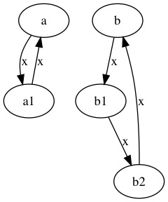
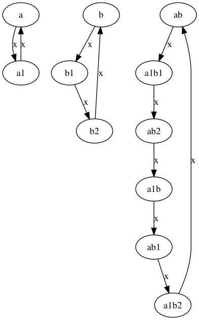

工作面试是个很有意思的过程,
面试经常是一个对未知领域初步了解的最好时机(对双方都是),
面试官和面试人通常也会尽力在最短的时间里表达/接受尽可能多的信息.

因此面试题一般也是比较有趣的:
它浓缩了日常工作中的典型和有挑战性的问题,
而又不会带有太多日常工作中的繁琐.

在技术面试中, 要哄好面试官, 最重要的无疑是能把一个问题解释的完善严谨.

于是打算收集一些 **有趣** 的问题, 跟大家分享.
本次先唠唠这个:


# 问题: 比较2个多级dict是否相同

2个多级`dict`可以看成2个树的对比, 此类问题应该在刷题网站上有不少了,
似乎用树的遍历就可以了, 然而可达鸭认为事情并不简单.
在深入答案之前, 我们先明确下问题的描述:

-   一个`dict`中有多个key, 每个key对应一个子`dict`.
    为了简化问题, 假设`dict`中的key对应的value都是`dict`, 没有其他类型.

-   如果能够用来访问`a`的所有的key也可以用来访问`b`, 就认为2个dict相同,
    例如:

    `a = {'foo':{'bar':{}}}; b = {'foo':{'bar':{}}}` 就是一对相同的dict:

    -   `a['foo']`和`b['foo']`都存在.
    -   `a['foo']['bar']`和`b['foo']['bar']`也都存在.


# 思路: 递归

比较2个`dict`同构的思路很直接:

-   对于2个`dict`: `a` 和 `b`, 先比较这2个`dict`各自的key的集合一致, 如果不一致肯定2个`dict`不一样.

-   再逐个对比每个key对应的子`dict`是否一样.
    直到遍历完所有的子`dict`.


```python
def eq(a, b):

    for k in set(a) | set(b):

        if k not in a or k not in b:
            return False

        if not eq(a[k], b[k]):
            return False

    return True

print eq({}, {'x':{}}) # False
print eq({'x':{}}, {'x':{}}) # True
```

上面的代码差不多可以把大部分面试官哄到6成满意度.

但在实际使用中, 上面的代码还不太完善, 因为`dict`构成的图的节点之间可能存在
**环形引用的情况**, 如果有环, 上面的代码就会出现调用栈溢出.
所以在上面的代码基础上, 还需要加入有对环的处理.

>   几乎所有的语言对函数的递归调用层数都有限制, 例如python的限制是1000.

## 处理有环的情况

用python来举例描述2个有环的`dict`结构, 如下:

```python
a = {}
b = {}

a['x'] = {}            # a1
a['x']['x'] = a

b['x'] = {}            # b1
b['x']['x'] = {}       # b2
b['x']['x']['x'] = b
```

画出上面2个图的引用关系是酱的(其中a1, b1, b2等用来表示a, b中其他的子table):



这里我们认为`a`和`b`是 **访问相等** 的:
因为对于访问者来说, 无法区分`a`和`b`的差别:
**能用来访问`a`的路径, 也可以用来访问`b`, 反之也一样**:

对于`a`和`b`来说:

```
a                和 b                都是合法的
a['x']           和 b['x']           都是合法的
a['x']['x']      和 b['x']['x']      都是合法的
a['x']['x']['x'] 和 b['x']['x']['x'] 都是合法的
```

在这个有环的例子中, 可以看出:

**肯定存在一些公共路径是无限长的**.

现在我们需要改进算法, 检查出环形的路径并及时终止递归遍历.

> - 如果某个路径在`a`中走到一个环上, 但在`b`中没有在一个环上, 就不用做特殊处理,
>   这种情况会自然的结束递归.
>
> - 需要处理的是一个路径p在`a`, `b`上都对应到一个环的情况.

还是拿上面的各自成环的`a`, `b`为例, 对于一个无限长的公共路径p,
`p = [x, x, x...]`, 它的每一步都通过`key=x`访问到下一个子`dict`.
这有, 它的每一步分别访问到的`a`, `b`上的 **节点** 如下
(`a0`和`b0`分别是a和b的根节点. `a1`, `b2`等是其他的节点:

```
a                ->   a0, b0  <- b
a['x']           ->   a1, b1  <- b['x']
a['x']['x']      ->   a0, b2  <- b['x']['x']
a['x']['x']['x'] ->   a1, b0  <- b['x']['x']['x']
...              ->   a0, b1  <- ...
                      a1, b2
                      a0, b0
                      ...
```

**观察下上面的步骤可以发现, 最后路径p又会回到`a0, b0`的位置**.

因为节点对的数量是有限的, 最多不超过 `|a| * |b|`个(`|a|`是a中的节点数),
那么如果一个路径p是无限长的,
那最终一定会在再次回到一个已经访问过的 **节点对**(上例中的`a0, b0`).

找到这个规律, 我们就有了剔除无限长路径的思路:

# 比较2个(可能有环型引用的)dict的算法:

-   遍历(广度优先/深度优先都可以), 枚举出所有查询路径p

-   对一个路径p, 检查它的一步`p[i]`是否都能在`a`和`b`中走通,
    如果不能, 则`a`和`b`存在一个不一致的路径, 失败退出.

-   过滤出无限长的路径:

    记录路径p在图`a`, `b`中经过的 **节点对**, 如果`p[i]`访问到一个已经经过的 **节点对**,
    则认为这个路径是环的, 不需要继续检查了, 回溯去检查其他路径.


##  python实现

```python
def eq(a, b, walked=None):

    walked = walked or {}

    if (id(a), id(b)) in walked:
        return True

    walked[(id(a), id(b))] = True

    for k in set(a) | set(b):

        if k not in a or k not in b:
            return False

        if not eq(a[k], b[k], walked):
            return False

    return True

print eq({}, {'x':{}}) # False
print eq({'x': {}}, {'x':{}}) # True

a = {}
b = {}

a['x'] = a

b['x'] = {}
b['x']['x'] = b
print eq(a, b) # True
```

上面代码中, `id()` 用来取得一个对象的唯一id(原始类型的int, string等, 引用类型的dict,
list object都可以使用), 可以理解为c语言中的指针的角色.


#   效率分析

假设`a`, `b`的节点数分别是m和n,
那么, 因为整个遍历过程最多经一个 **节点对** 一次, 并且最多也需要记录所有的
**节点对** 的被访问的历史, 在上面的递归实现中,
最差情况是遇到一个经过了所有 **节点对** 的环, 因此:

-   时间效率: `O(n*m)`.

-   空间效率: `O(n*m)` (节点对记录的空间和递归调用栈的空间, 都是同样的级别).


#   更多

到此为止, 在这个问题上我希望我已经尽我所能把面试官哄好了.

如果还没哄够,
关于这个问题有一些相关的方面可以继续扩展下:

-   上面提到的 **访问相等** 是一个直观的说法, 在大学里学过的编译原理中,
    它有更严谨的定义.

    2个`dict` 各自组成的图可以认为是两个[自动机][dfa],
    而1个图中所有的路径就是这个自动机表达的语言.
    这个题目的本质也就是判断2个自动机表达的语言是否等价.

    在有些场合, 这个问题也会表达成判断2个正则表达式是否等价.

    关于2个自动机是否等价的比较, 网上直接可以搜到非常成熟的算法.

-   如果把所有路径经过的 **节点对** 合起来看做1个节点,
    那么这个组合的节点对和节点对之间的关联关系会组成一个新的图.

    这个新的图是2个图的[张量积][tensor-product].
    如果2个图是 **访问相等** 的, 那么他们跟这个新的张量积的图也是 **访问相等** 的.

    而这个问题的解法, 也可以看成对这个张量积图的一次遍历(虽然实际上没有生成这个图).

    张量积的图中:

    -   点集是:

        `a`和`b`的点集的笛卡尔积: `{ (a[i], b[j]) }`

    -   边集的定义:

        如果 ai 到 aj 有一条名为k的路径,
        bk 到 bl 也有一条名为k的路径,
        则(ai, bk) 到 (aj, bl) 有一条名为k的路径.

    


上面2个分支也是有趣话题, 值得深入,
相信对技术人的职业生涯或业余兴趣都会有不少帮助:)


[dfa]: https://zh.wikipedia.org/wiki/%E7%A1%AE%E5%AE%9A%E6%9C%89%E9%99%90%E7%8A%B6%E6%80%81%E8%87%AA%E5%8A%A8%E6%9C%BA
[rooted-graph]: https://en.wikipedia.org/wiki/Rooted_graph
[tensor-product]: https://en.wikipedia.org/wiki/Tensor_product_of_graphs
