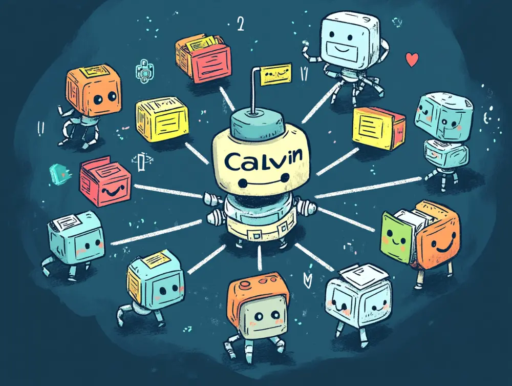
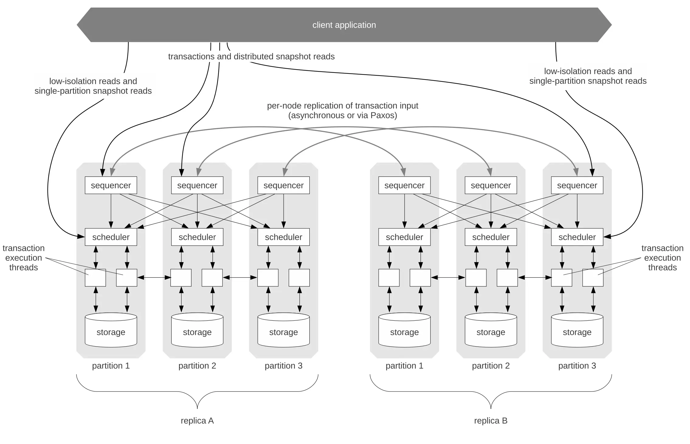

# 理解 Calvin - Fast Distributed Transactions for Partitioned Database Systems

本文目的: 旨在提供一个直观的视角，帮助读者更好地理解 Calvin 的架构设计与工作原理。

## Calvin 设计目标与核心机制简介

Calvin 是一个针对分区式数据库系统设计的分布式 transaction 调度与复制层，其目标是在保证线性可扩展性和高可用性的同时提供完整的 ACID transaction 。为了解决传统分布式 transaction 高开销、低性能的问题，Calvin 引入了确定性 transaction 调度的理念：在 transaction 执行前，先确定并记录 transaction 的全局顺序，这样各节点就可以按统一顺序执行 transaction ，从而避免了在执行过程中再进行跨节点协调。这一机制的核心优势是消除分布式原子提交协议（如两阶段提交 2PC）的需要。

## Calvin 整体架构与组件关系图

图中展示了 Calvin 的整体架构。架构中，数据库被水平划分为多个分区，每个分区都有自己的 Sequencer、Scheduler 和 Storage 等组件。为了保证高可用性，每个分区被复制到多个副本节点上（图中 Replica A 和 Replica B 表示两组副本）——这些副本共同组成一个 Paxos 复制组，通过共识算法来同步 transaction 输入日志，实现分区的数据一致复制。

transaction 定序（Sequencer）层：Calvin 的所有分区的 Sequencer 进程共同协作完成全局 transaction 序列的确定。各 Sequencer 以固定的物理时间节奏（墙上时钟）推进：系统将时间划分为长度固定的 epoch（例如 10 毫秒一个周期），每个 Sequencer 在各自的 epoch 窗口内收集收到的 transaction 请求。Epoch 结束时，全局开始一次分布式调度：每个分区的 Sequencer 将本 epoch 收集到的 transaction ，通过共识在其复制组内达成一致，生成该分区的已提交 transaction 日志。接下来，各分区的 Sequencer 将自己的 transaction 广播给整个系统中所有分区的 Scheduler。这样，所有分区的调度层都收到了同一组来自各 Sequencer 的 transaction 信息。由于 Calvin 预先设定了确定性的排序规则，每个节点都能独立地将这些合并出完全相同的全局 transaction 序列。

值得注意的是，Calvin 利用实际的时间驱动（墙上时钟触发每轮调度）来同步各分区的定序过程，而不是依赖传统分布式协议维护的"逻辑时钟"。在传统系统中，可能需要通过 2PC 或分布式共识来确定跨分区 transaction 的先后次序，而 Calvin 直接使用物理时间段划分结合一次性的信息交换来完成这一点，从而省去了逐 transaction 的两阶段提交协调。每轮 epoch 周期结束时一次性完成所有新 transaction 的全局排序和提交决定。

## Transaction 流程分解：预定序、复制、执行

Calvin 的 transaction 执行流程分为三个阶段：**Transaction 预定序**、**日志复制**和**Transaction 执行**。

- **Transaction 预定序**：客户端将 transaction 请求（通常是存储过程形式）提交给系统。各分区的 Sequencer 接收 transaction 请求，并将其按照当前 epoch 进行归集。每个 transaction 需要声明其读写集合。在一个 10ms 的 epoch 内，所有到达的 transaction 请求都会被暂存。Epoch 结束时，各 Sequencer 对收到的 transaction 赋予序号并打包。

- **Transaction 日志复制**：每个分区内部通过 Paxos 共识将该 transaction 日志复制到分区的各个副本节点。这确保即使某个副本故障，其他副本也有相同的 transaction 输入日志。一旦某分区的 transaction 在其复制组内被确定，该分区的 Sequencer 就会向本地和其他分区的 Scheduler 发送该 transaction 的信息。所有 Scheduler 收集来自所有分区的 transaction 后，根据约定规则将不同分区的 transaction 全局排序，得到一致的全局 transaction 序列。

- **Transaction 执行与调度**：各节点的 Scheduler 面对同样的全局 transaction 序列开始执行调度。Calvin 采用确定性两阶段锁定协议：系统按全局顺序依次为 transaction 的所有读写项请求锁。由于全局日志顺序已确定，如果两个 transaction 涉及同一数据项，先出现在日志中的 transaction 其锁请求会先被调度，从而保证锁获取顺序与全局 transaction 顺序一致。这种机制避免了死锁，且不需要回滚重试。

- **Transaction 执行**：获得所需锁后， transaction 会被交给工作线程执行。

Calvin 预先定序，使执行阶段有序，无需跨节点协调，从而避免了两阶段提交的复杂交互；若节点故障， transaction 请求已在全局日志中，其他副本可继续执行。

## Calvin 架构的简化视角

Calvin 的架构描述并不很直观, 换个以共识为中心的视角, 对 Calvin 架构的一种更易于理解的解释是:

我们在划分系统的模块时，不再把 Replica 看做最小的组织单位，而是把同一个 Partition 的几个 Replica 看做最小单位。这样一个 Partition 中，3 个 Replica 的数据完全一样，组成一个 High Available 单位。而不同的 Partition 之间的数据不同，Partition 可以看做系统第二级的划分，作为数据 sharding 的单位。

在这个视角下，一个 Partition 可以被看做一个永不宕机的节点，因为它们之间通过 Paxos 形成 HA。这样问题就被大大简化了，因为不考虑宕机问题，那么分布式的共识就是一个 trivial 的问题。

这也是 Calvin 接下来做的事情，将时间划分成多个 epoch(例如 10ms)，在每个 epoch 时间片内:

- 通过 Paxos 确定每个 Partition 中收到的 Transaction，作为要执行的对象。因为一个 Partition 是永不宕机的，那么这些跨多个节点的 Transaction 就可以认为一定能送达到目标节点(Scheduler)。
- 接下来，Sequencer 层把要执行的 Transaction 发给对应 sharding 的节点，也就是自己 Partition 的 Scheduler 和/或 其他 Partition 的 Scheduler。
- 因为系统认为一个 Partition 永不宕机，所以 Scheduler 可以直接等到收到了所有 Partition 在当前 epoch 的 Transaction 后才开始执行。
- 最后 Scheduler 收到所有 Partition 的 Transaction 后，进行确定性的排序再执行，写到本地 storage。

例如在图中，一个 epoch 中的 Transaction 的执行分几步:

- (1) 一个 Partition 的 Sequencer 之间通过 Paxos 对要执行的 Transaction 有哪些达成一致。
- (2) 确保一个 Partition 的每个 Sequencer 都收到已达成一致的 Transaction 列表。
- (3) Sequencer 将当前 epoch 的每个 Transaction 发给它涉及到的 Partition 中对应的 Scheduler，图中假设 tx1 跨 Partition 1 和 Partition 2，而 tx2 只需要在 Partition 2 中执行。
- 当 Scheduler 收到了一个 epoch 中所有 Partition 发来的 Transaction list 后，就可以对它们排序然后执行。

注意 Calvin 设计上的一个优势就是只有步骤(1)是阻塞的，步骤(1)达成一致后既可以认为这些 Transaction 一定会被执行。

## Calvin 与传统分布式 transaction 协议的比较（2PC + Paxos）

Calvin 的设计与传统的 “2PC + Paxos” 分布式 transaction 处理方案截然不同，下面从几个方面进行比较：

- **transaction 定序方式**：传统分布式数据库（例如早期的 NewSQL 系统或 Spanner 等）通常将数据按 Partition 复制，每个 Partition 内部通过 Paxos/Raft 保证强一致复制，但跨 Partition 的 transaction 需要使用两阶段提交 (2PC) 来协调顺序和原子性。 在这种模式下，每笔跨 Partition transaction 在执行完业务逻辑后，必须由协调者发起投票请求各 Partition 准备提交，然后再发出提交指令。这实际形成了一个**逐 transaction 的共识**过程：各 Partition 就该 transaction 是否提交达成一致。这种做法的代价是高昂的—— transaction 在整个 2PC 过程中必须持有锁不释放，直到所有 Partition 都确认提交，导致**锁的持有时间远超实际执行时间**，严重降低并发性能 。特别是当 transaction 需要同步复制（Paxos）数据到多个副本时， transaction 的**争用窗口**还包括了复制的网络延迟 。

- **Calvin 的无 2PC 创新**：Calvin 最大的创新在于**通过全局确定性预定序彻底移除了 2PC 提交协议**。在 Calvin 中， transaction 在执行之前就已经被放入全局日志并确定了顺序，事实上**提交的决议在调度阶段已完成**——一旦 transaction 出现在全局序列中，就相当于各 Partition 已经“同意”了其提交。 因此，Calvin 不再需要 transaction 结束后的两阶段协调，也无需在执行后再运行 Paxos 来提交结果。各 Partition 只要按照既定顺序执行 transaction 并应用更新即可。当一个 transaction 涉及多个 Partition 时，Calvin 通过在所有相关 Partition 预先记录该 transaction （作为输入日志的一部分）实现原子性：要么所有 Partition 都按序执行它，要么（在故障情况下）都可以通过日志重放来补上它，从而保证**跨 Partition transaction 要么整体提交、要么整体不生效**。这种方式等价于一种**状态机复制**：全局 transaction 日志作为状态机的指令序列，每个 Partition 都应用相同序列的指令，确保最终一致。

- **性能与开销对比**：传统 2PC 协议在 Partition 数目增加和跨 Partition transaction 频繁时性能会急剧下降，因为每个 transaction 的提交都触发跨所有参与 Partition 的同步交互。而 Calvin 将系统的同步点固定为每个 epoch 一次，不论该 epoch 内有多少 transaction ，**只需一次全局批处理通信来确定顺序** 。这样做显著降低了消息交互频率，提高了吞吐量。研究表明，在 10ms 批次下，Calvin 每秒可处理 **50 万+ transaction**，远高于典型互联网应用所需 。相比之下，传统方案即使单 Partition transaction 可以较快提交，但一旦遇到多 Partition transaction ，其 2PC 延迟和复杂性都会降低整体吞吐。此外，Calvin 将数据复制的开销前置融合进了定序阶段（复制 transaction 输入而非执行结果），这避免了在 transaction 提交时再执行一遍 Paxos，同样减少了额外的等待。综上，Calvin 用较大的**计划开销**（批处理定序）换取了执行阶段的**轻量快速**，适合高负载下涉及多 Partition 的 transaction 场景。

- **复杂性与应用限制**：Calvin 为了实现确定性，需要 transaction 在提交时就声明所有将访问的数据，这对应用提出了要求。传统 2PC 可以支持事中计算后决定访问哪些数据，而 Calvin 更适合**预定义的 transaction （Stored Procedure）**模型。在这一点上，是用交易弹性换取性能的权衡。另外，Calvin 的全局顺序使得哪怕是只访问单 Partition 的数据，也必须经过定序层处理，这相比本地直接提交稍有额外开销；而传统方案下单 Partition transaction 可以直接在本地提交（不经过全局协议）。因此，当绝大多数 transaction 都是单 Partition 且几乎不存在分布式 transaction 时，Calvin 的优势不明显甚至可能不如简单的单 Partition 提交+弱同步方案。不过，在需要强一致性且存在大量跨 Partition 操作的系统中，Calvin 提供了一种极具创新性的解决方案，使分布式 transaction 性能达到实用水平。

## Calvin 无法完全替代 2PC 的原因

Calvin 虽然高效，但并不能在所有场景下替代 2PC，主要有以下限制：

1. **等待所有 Partition 的约束**：Calvin 要求 Scheduler 必须收到所有 Partition 在当前 epoch 的完整 Transaction 列表后才能开始执行。相比之下，2PC 更灵活，它通过一次通信（phase-1 锁定阶段）就能确定 transaction 需要等待哪些特定的 Partition，而不必等待所有 Partition 。

2. **通信模式差异**：Calvin 通过牺牲一定的灵活性，换取了省去一次 RPC 通信的效率，使整个 transaction 提交过程能够无阻塞执行。

3. **Calvin 的系统限制**：
   - 每个 epoch 必须与所有 Partition 通信，即使某些 Partition 与当前 transaction 无关.
   - 系统拓扑变更复杂：无法直接增删 Partition。若要变更 Partition 结构，需要在所有 Partition 之间达成共识，防止增加新 Partition 时遗漏等待对象，或删除 Partition 时等待不存在的节点.
     当然解决方案并不复杂：在增删 Partition 时，可以通过一次 2PC 协议在所有 Partition 间同步拓扑变更信息。

## O(n²) 通信成本分析及设计合理性

Calvin 的全局定序采用所有 Partition 广播 transaction 批次的方式，带来了近乎 O(n²) 级别的通信开销（n 个 Partition 之间两两通信）。这种全网广播模式看似难以扩展，但在实践中是可行的，主要基于以下几个因素：

Calvin 通过固定周期（epoch）批处理显著降低了通信成本。系统不是为每个 transaction 单独触发广播，而是将一个周期内的所有 transaction 打包一次性发送。测试表明，10ms 的 epoch 可以汇集大量 transaction，使整体吞吐量非常可观。

此外，Calvin 假定 Partition 数量适度，通常在几十到上百范围内，这个规模下全网广播仍可接受。Calvin 的通信开销均匀分摊到所有节点，每个节点每轮处理约 O(n) 的消息，避免了单点瓶颈。与传统 2PC 中协调者需要为每个 transaction 单独通信不同，Calvin 将这种通信变成了系统的周期性任务，使节点负载更稳定。

最后，Calvin 将扩展性问题转变为"单次全局共识能覆盖多少 transaction"。实验显示，Calvin 单组共识的吞吐能力可达数十万 TPS，足以应对高并发场景。只有在 Partition 数特别巨大时才需要考虑分层定序。

综上，Calvin 的通信模型体现了以时间换空间、以批处理换并发的思路，通过低频大批量通信提高效率，避免了复杂的分布式协调协议，在追求严格一致性的同时取得了工程上的良好平衡。

## 总结

Calvin 通过在执行前达成全局共识，实现了分布式 transaction 的串行化，颠覆了传统处理流程。其核心思想是预先协商，后并发执行，使分布式系统能像单机一样简单地执行 transaction，无需频繁通信确认。

Calvin 对 2PC 协议的替代是其重要创新。传统 2PC 虽能保证分布式 transaction 原子性，但复杂且代价高。Calvin 利用全局日志和确定性锁调度绕过了 2PC，通过"一次写入日志，处处执行"来保证原子性，特别适合预定义业务逻辑的场景。

与 Google Spanner 不同，Spanner 依赖精确同步的物理时钟，而 Calvin 通过软件协议确定顺序，不需特殊硬件，依靠批处理获得吞吐优势。即使在时钟不精确、网络延迟的环境下，Calvin 也能保证全局严格序列化和良好性能。

Calvin 通过全局批处理共识简化了复杂的运行时协调，适合多分区高冲突 transaction 场景。它将复杂性留给系统内部，用户只需提交 transaction，系统高效完成。这种思想在 FaunaDB 中得到验证，也启发了其他分布式协议的设计，强调提前处理非确定因素，前移关键决策。

然而，Calvin 也有局限性：

1. 对时钟同步的依赖可能在时钟偏差较大的环境中影响性能
2. 要求 transaction 在提交时就声明所有将访问的数据，对动态 transaction 场景不够灵活
3. 全局顺序处理可能导致单分区 transaction 的额外开销

总之，Calvin 作为分布式 transaction 处理的创新方案，展示了通过巧妙架构和时间划分来提升性能的可能性。其核心理念是：通过提前确定 transaction 计划，简化分布式执行的复杂性，实现高效又健壮的 transaction 处理。

[Calvin - Fast Distributed Transactions for Partitioned Database Systems](https://cs.yale.edu/homes/thomson/publications/calvin-sigmod12.pdf)
