# 前言(客套话, 但会增加仪式感)

- [paxos的直观解释][post-paxos] , 在协议层面, 用直观的语言给 paxos 做了一个介绍和推导;
- [abstract-paxos][post-abstract-paxos], 从信息定义的角度出发, 逐步推导出一个统一 paxos 和 raft 的分布式一致性算法, 它已经很解决一致性问题的根源了, 我们也在文中看到了 paxos 和 raft 之间的差别几乎可以忽略不计;

今天我们用一个直接且直观的方式来讨论一致性问题, 解释一致性提出了什么问题, 一个准确的问题已经可以算是完成了一半的回答, 然后我们将看到回答这个问题的过程中, 自然而然的得到一个一致性算法, 将包含所有的一致性算法, 同时它也回答了为何我们的世界需要有 **时间** 的概念, 以及看到时间/空间相对性的在一个及其简单的模型中就会显现出来.

我给你翻译翻译, 什么叫一致.

分布式系统中的一致(consensus), 不是指各个副本的数据都相同, 虽然保证每个副本数据相同是达成consensus的一种常见方式. consensus是指: 总是有一个确定的方法读出唯一的结果.

# 何为 一致

从常识上来说, 一个系统, 达到一致可以定义为:
已经 **发生的事件**(即committed) 总是能通过确定的方式被 **观测** 到.

在单机系统(单核单线程), **一致** 是一个基本的特性, 即, 更改了一个变量, 那么后续对它的读, 总等读到修改后的值. 这就是最简单的一致的行为.

- 例如在一个 paxos 系统中, 它要求已经 committed 的值(被多数派accept的值) 一定能被更大 rnd 的 proposer 看到.
- 又如在 raft 中, 已经committed的值也一定必须被 后续的 leader 看到(term更大的leader).

多核或多线程的单机系统中的一致性跟分布式一致性本质上是同一个问题, 但因为cpu已经提供了一些方便的元语, 例如rust 中 atomic的store和load, 配合memory order的spec就可以模拟出单核单线程中的一致性保证. 但分布式系统中本身不存在atomic load store的元语支持, 所以它更加彻底的将一致性问题暴露到开发者面前.


# 一致性暗示了时间的存在

在常识上, 我们对一致性的定义可以描述为: 

已经 **发生的事件**(即我们常识中的committed的概念) 总是能通过确定的方式被 **观测** 到.

这个**常识上**的定义其实并不完整, 因为它假设了一个公认的概念: **已经**.

**已经** 指在时间上的之前, **总是** 暗示了时间上的之后.

到这里我们发现, 所有的一致性都是基于某个时间定义来描述的. 分布式一致性算法的复杂, 其实来自于分布式中的时间的定义改变了.

## 时间的定义

**时间(time: `T`) 是用来确定事件(event: `e`)先后顺序的概念.** 

给一组事件定一个顺序, 就定义了一个时间, 用另一种方法定义顺序, 就定义了另一个时间. 在下图中, 引入时间, 即给每个event定出先后顺序, 每个event就有了个一个在这个时间上的位置, 即: `T(e)`.

例如下图中可以给每个e定义一个时间: `T(e₁) = 1, T(e₂) = 3, T(e₃) = 5`


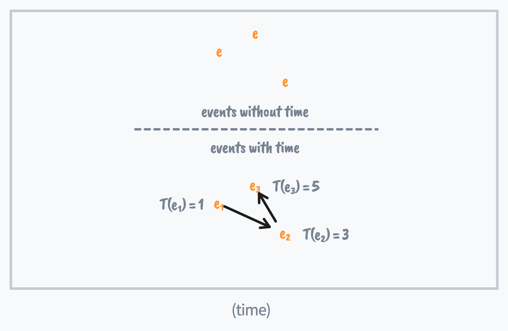

### 任意事件时间不同

另外我们还约束了: 任意2个不同的event, T不能相等. 即没有**绝对同时**发生的2个事件: 

例如单线程中, 2个操作同时修改一个变量, 最终读到的是其中一个变量的修改结果, 说明2个操作总是有先后的. 如果允许**同时**发生的事件存在, 事情反倒变得麻烦: 这两个**同时**发生的操作结果应该是什么样子? 难道是能读到2个操作的结果?

但是可能存在两个event, **互相没有先后关系**,即 e₁ 没有发生在e₂之前,也没有发生在e₂之后, 这是我们平常说的**相对的同时**的概念:
$$
T(e_i) \not< T(e_j)
\and
T(e_i) \not> T(e_j)
$$

例如如果我们定义了一个二维的时间, 通过向量比较确定大小, 即如果`tx > tx'` 且 `ty > ty'`,  `(tx, ty) > (tx', ty')`, 那么这是一个偏序的时间, 那么就可以允许**相对同时**的2个event存在. 

例如下图的两个event a和b: 假设 `t(a).x > t(b).x`, `t(a).y < t(b).y`.

当然我们可以把它投影到某个一维的时间上来比较大小, 就像现实中我们在不同的参考系观察会得到不同事件先后顺序类似的道理, 我们可以通过选择参考系(投影的向量)得到a在b之前或a在b之后的观测结果. 

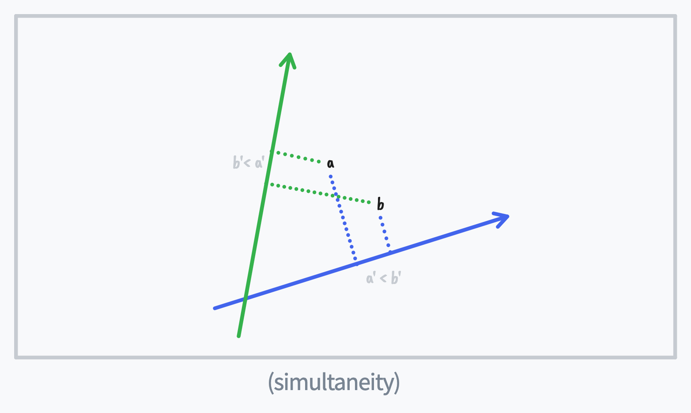

所以我们约定任意2个T(e)的值都不同.


## 观测

有了时间定义后我们就可以讨论一致性.

根据 [香浓信息定义][todo], 信息是用来消除随机不定性的东西.

但没有时间定义时, 信息的确定性是无法讨论的, 因为不确定本身就在暗示多次读某个对象时得到的不同结果.

要定义什么是一致, 还需要一个**观测**的行为. 定义为在一个Ti 时得到的系统的状态.

$$
S(T) \tag{observe}
$$


事件(event)对应到时间上的一个位置. 一致性就是指观测到的S的一致.

在一个给定的一个时间定义T上, 观测行为的一致表示, 

系统中已被观测到的event在之后的时间总是能观测到, 即:

## 一致性的定义

$$
T_i < T_j \implies S(T_i) \subseteq S(T_j) \tag{history}
$$

它是一个满足  [香浓信息定义][todo] 的定义.

从这个定义也可以看出T需要是一个  [偏序关系][wiki-偏序关系] 的值

>  而现实中一个变量的一致性中, 使用的是wall clock, `t`是一个[全序关系][todo]的值
>
> 当引入多个变量的时候, 一致性就不是那么显然的了, 因为2个变量上发生的事件构成了一个向量时间, 破坏了时间的大小比较的定义.
>
> todo: 加图: 交错的时间
>
> todo: move到分布式一节?

## 一致性的定义2

例如在图(time)中,  `T(e₁)` 的时间, `e₁`观测到的系统中的event集合 `S(e₁) = {e₁}`, 那么在之后的时间上, 另一个观测行为也必须能观测到`{e₁}`, 才满足对一致的要求. 

一个最简单的S的定义是一个event的集合, 那么对于给定的时间定义`T`, 观测到的S就是定义为:
$$
S(e_i) = \{ e_j | T(e_j) <=  T(e_i) \}
$$

不论是单机上的一致性, 还是分布式中的一致性, 都是以这个前提推演出来的.

### 一致性在单线程程序中的例子

在单核系统中, 对一个变量的写(e_i是一个写操作,例如`set x = 5`, 总是一致的, 这时的时间定义就是是墙上时钟(wall clock), 每次更新一个变量, 在之后的wall clock的时间点, 总能读到 $ S(e) $ ,即之前所有写操作, 当然得到的是这些所有event应用后的最终结果, 也就是最后被更新的值. 而一个读操作可以看做是一个不更新变量的操作, 当然对最终 $ S(e) $没有任何影响.

todo: 图


于是我们再对定义中的时间概念加以明确:

- 假设一个系统中有各种事件`event` 在发生(`e`),  任何一个 `event`都对应一个 **时间点**: `t`,

- 并且`t`的值是 [全序的][wiki-全序关系], 即任意2个时间可以比较大小: `t1 <= t2` `t2 <= t1`

即, 一个系统中只要有了线性时间的定义, 那么一致性就是一个非常简单的问题了.
分布式consensus 之所以显得比单机一致性复杂, 就是因为缺少一个在分布式环境中的**线性时间**的定义. 分布式一致性协议, 本质上就是寻找一个分布式**线性时间**的定义.


实现一个分布式一致性协议的条件:

- `event` 不能丢失. 即总能通过某种方式读取到一个已经 **committed** 的event.
- 

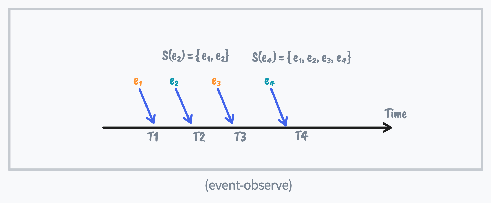

- 

这个定义在任何一个时间定义上都成立. 分布式中也成立. 现在看看分布式中的时间.


# 分布式

分布式中的一致性也遵从上面的定义, 即(history). 我们从定义出发看看分布式中的一致性有哪些不同, 当然唯一的不同就是时间的定义.


# 分布式系统的要求

先来看看分布式是什么:

## 允许宕机

-   一个可靠的 **分布式** 也意味着它必须 **允许宕机**:
    它必须能容忍部分节点宕机还能正常工作.
    
    
    
    所以分布式系统是多副本(replica)的(这里的副本是广义的, 副本之间不一定具有相同的数据, 副本之间满足的要求只需要是通过已有副本能恢复原始数据就可以, 例如在三个副本上分别存储2个变量以及它们的和: `a,b,a+b`那么任意一个副本丢失都可以恢复出a和b的值). 
    
    且 S 的必须能只需部分节点就能工作.
    
    quorum: 能让系统正常工作的一个节点集合: todo 放后面?


当向一个分布式的存储写入一条数据时, 这个写入的发起者(proposer) 必须向其中几个副本发起请求, 也就是一个event, 这个event在每个replica上被处理的wall clock的时间, 组成了一个wall clock的向量 $ \vec t $. 

但这个向量时间$ \vec t $ 无法用来实现一致性:

# 分布式中的时间

## 原始向量时间无法实现分布式一致性.

在分布式中, 一个event e需要复制到多个副本上. e在不同副本上发生的wall clock时间是不同的.

所以在分布式系统中, 每个e对应的时间是一个vector clock: `t(e) = [t₁, t₂...]`, 其中t_i 是wall clock时间戳.

因为 **允许宕机**的要求存在, 我们必须要求向量时间在无法得到全部分量的情况下也能工作.

例如下图中, proposer 只收到了 event-a 和 event-b 在第1,2个节点的应答, 要求系统在第3个时间分量缺失时, 只根据`[t₁(a), t₂(a), ?]` , `[t₁(b), t₂(b), ?]` 和 `[t₁(c), t₂(c), ?]` 就能决定大小.

因为允许宕机, event-a 可能只能看到b的部分时间分量, 要确定a,b之间的大小, 就只能依赖公共分量, 在图vector-clock中就是 t₂(a) 和 t₂(b);

结论: **要求只比较公共分量**


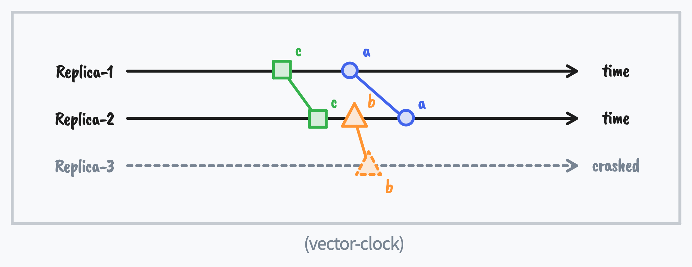


而这种只能依赖部分分量的比较方式.无法满足偏序关系中的传递性:


## vector clock的大小比较

如果使用一个event在多个replica上真实发生的时间作为vector clock的时间分量, 这个vector time不满足[偏序关系]的集合, 所以不能用来实现一致性, 这是因为每个时间分量是任意值, 总是能构造出 `a < b < c < a` 这样的不遵循传递性的例子, **所以它不能构造偏序时间而无法达成一致性, 或者能读到全部节点上的时间**.

本文对此不做详细证明, 给出一个例子作为参考:

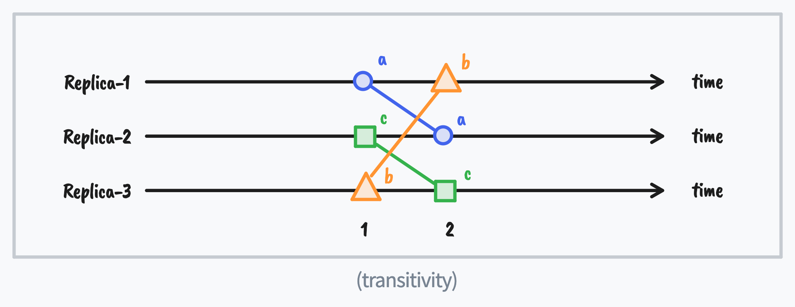

因为对3个vector time比较公共分量, 所以:
$$
\vec t_a = [1, 2, 0] \\
\vec t_b = [0, 1, 2] \\
\vec t_c = [2, 0, 1] \\
\vec t_a < \vec t_a < \vec t_a < \vec t_a
$$


### 虚拟时间

所以要让T(e) 在分布式环境中可以比较大小, 就需要用全部时间分量来比较大小.

进而就需要允许一个vector time 没有读到所有时间分量时也能得到完整的值.

这表示这些个时间分量之间不能是**独立的**, 即知道其中几个分量就可以知道其他的

因为墙上时间无法控制. 所以在分布式中必须用一个虚拟时间, 一个常见的方式是要求分布式系统中的时间T的所有分量都是相同的值 = [t₁, t₂...] 中t₁=t₂...

而是由这个e自己分配一个时间, 并找出一个方法使之满足(history).

e在若干个副本上时, 它的虚拟时间是e所在副本的向量时间 T(e) = [t1,t1...],


### 向量时间的大小比较

todo 加图

公共分量比较


# 分布式中的observe


## 1 quorum要有交集

因为分布式中多副本, 假设S(e)的定义是e在每个副本上的S:
$$
S(\vec T) = g(S(T_i), S(T_j), ...)
\\
s(\vec T) = g(s(T_i), s(T_j), ...)
$$


todo 加图: 分布式T 和 S


最小用于恢复状态的S的集合:
$$
r = \{S(T_i), S(T_j),...\}
$$

- 一般多副本系统中, S(T_i) == S(T_j) == .... 所以r就是任一S(T), quorum就是任一majority节点集合.
- 4节点系统中写2条数据: a, b, a+b, a+2b中, r为任意2个节点, 即可求出a,b的值. 而quorum为任意3节点, 因为任意3节点的交集为2.


要满足(history), 就要求下一个T能看到上一个S, 所以要求:

- 相邻2个成功提交的event之间的quorum交集必须为r.

例如下图中 e₁ 使用的quorum的节点集合是 {R1,R2}, e₂ 使用的quorum节点集合是{R2,R3}, 可以满足(history):
$$
T(e_1) < T(e_2) \implies \{e_1\} \sub \{e_1, e_2\}
$$


T(e)之间的大小比较, 通过比较**公共**分量的大小, 例如下图中, `T(e₁) < T(e₂) < T(e₃)`, 但`T(e₁) < T(e₃)`不成立, 因为他们没有公共时间分量. 

不满足(history)约束: 

✅ S(e₁) (( S(e₂) => T(e₁) < T(e₂); 

🔘S(e₂) 和 S(e₃) 没有包含关系; S(e₁) 和 S(e₃) 也没有包含关系; 不影响一致性.

❌ T(e₃) > T(e₂), 但S(e₂) 不是 S(e₃) 的子集.


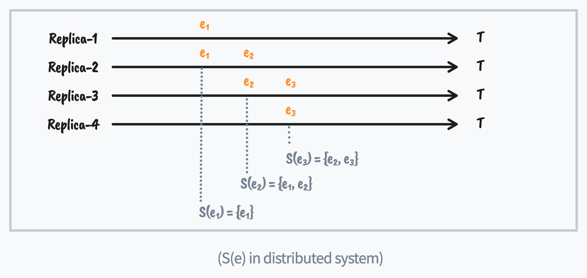


## 1.要保证(history), 观测必须改变状态


(history) 要求被观测到的状态必须出现在后面的观测中, 例如上图中在e₂观测到e₁, 那么e₃也必须观测到e₁. 这就要求:

- 相邻2个成功提交的event的quorum交集中必须包含上一次成功观测的S.

例如下图中, e₂的观测复制e₁, e₃的观测复制e₂观测到的S.

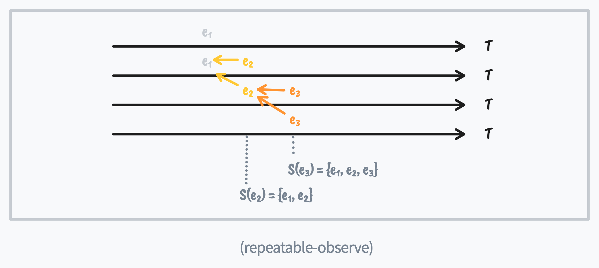


如果没能满足这个约束, 就不能认为这个e成功提交到系统中了, 这时系统处于一个不确定的状态, 例如e₂ 如果只写入一个quorum成员R3, R2没能收到, 那么下一个event e₃ 选择不同的quorum {R1, R2} 或 {R3,R4}, 就会得到一个不同的State, 所以

- 成功提交的event必须写入到一个quorum中.


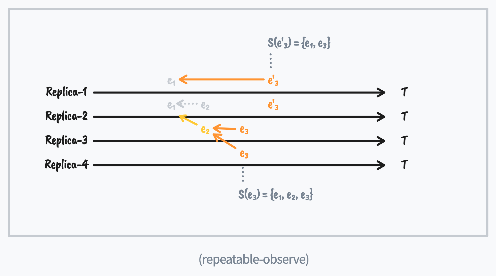


所以一个成功的观测必须是从一个quorum中读, 再写. 

而一个新的e, 必须使用它看到的最大T(e)的S(e), 以保证之前观测到的S(e), 即历史, 保留到新的S(e)中.

**因此, paxos的协议中需要先在一个quorum上运行phase-1,得到最新S,再将读到的最新状态通过phase-2写入,以保证后续proposer都能读到一致的状态.**


也就是说:如果要提供一致性, **一个观测就改变系统的状态.**


### 写状态前先写时间, 否则无法保证能完成指定向量时间上的写入


### S(T)的状态: 已committed的, 没有committed


### 写之前先设置时间, 因为时间不可回退, 保证读到的结果...todo


## 与现实中时间的同步

到这一步, 我们在虚拟的vector time $ \vec{T} $ 上建立了一致性. 但S(e)与现实中的时间还没能保证一致. 

这个key-value存储在我们定义的**虚拟时间** T() 上实现了分布式一致性. 但并没有在我们现实的时间上实现分布式一致性:

- 如果在wall clock = 1 时, 发event请求 `e20, T(e20) = 20`
- 再在wall clock = 2 时, 发observe请求 `e10, T(e10) = 10`,

这时proposer在wall clock 的时间上先观测到`e10`, 再观测时没有看到e10, 只看到了`e5`, 产生了不一致.

这是因为, 这个协议只在我们创建的虚拟时间上一致, 跟现实中的墙上时钟是完全独立的2个时间系统, 因此它无法提供在wall clock上的一致性.

要避免在wall clock更大时不会观测到较小的T, 就需要在wall clock变大时, 不允许观测到变小的虚拟时间T:
$$
t(e_i) < t(e_j) \implies T(e_i) \not> T(e_j) \tag{mono}
$$


这样就保证了在wall clock 上不会观测到回退的状态, 因为我们上述定义的T(e)是全序的, 而2个T(e)不会相等, 那么不大于就等同小于, 于是观测到的状态在t(e)上也能保持一致:
$$
t(e_i) < t(e_j) \implies T(e_i) < T(e_j) \implies S(e_i) \sub S(e_j)
$$
也就是说, 要达成一致, 需要求墙上时间和虚拟时间的对应关系必须是**单调的**.

要达成这个目标, 我们对(mono)两边取个反, 得到:
$$
T(e_i) < T(e_j) \implies  t(e_i) \not> t(e_j) \tag{mono2}
$$
即, 在现实中的wall clock的视角, 较小的T(e)不能发生在较大的T(e)之后, 这就要求在**每个replica上**: 如果收到了较大的T(ej)的event, 就必须拒绝较小的T(ei)的event. 

现在我们将这两分开讨论, 会发现每个步骤都很简单, 而且可以直接看出分布式算法的内在联系:

- Paxos: 虚拟时间: round nubmer(AKA ballot number)

这里也就是paxos中ballot number只能增大的原因.


虚拟时间上的一致性和wall clock, 在很多分布式一致性算法描述上并没有区分开, 导致将问题复杂化.


图: 例子: 读到2个不同的S(), 互相合并

# event的状态

- 能被下个event读到
- 不一定能被读到

# protocol

---

此时我们已经可以"实现"一个分布式一致性协议了:

- `event` 定义为 `struct update{ key: String, value: String }`
- 为每个`event`分配一个分布式时间 `T(e) = [T1, T2, T3]`.
- 为每个`observe` 分配一个分布式时间 `t(o)`.

### Write operation
写操作就是向一个quorum 写 `e, t(e)`; 而一个副本(`replica`) 收到请求后就将其记录到本地存储:
假设replica上用一个 btreemap来存储所有发生的 事件:

```rust
trait Time: PartialOrd {}

struct Replica<T: Time, E> {
    events: BTreeMap<T, Option<Event>>,
}

impl Replica {
    fn save(self, e: Option<Event>) -> { self.events.insert(e.time, e) }
}
```


### Read operation

读操作`observe`就是从一个quorum 读`t(o)` 时刻的所有event:

```rust
impl Replica {
    fn observe(self, t: Time) -> { self.events.values().filter(|e| e.time < t) }
}
```

- 当然这个模型跟现实中的一个key-value存储不太一样. 我们只需要把event定义为每一个key-value操作, 例如:
  `e1 = set: x=3`
  `e2 = set: y=4`
  ...
  再让observe返回所有event被appy之后的结果, 就可以看做一个传统的kv存储了.

  当然, 通常只读取一个key, observe函数只需合并操作了某个key的event就可以.


 

# 因果一致 比 线性一致 更接近问题的本质


Raft: 一个event由多个command组成, 并要求一个event内的command是全序排列的, 并作为虚拟时间T的一个精度存在.


# 本文结构
- 提出问题
- 协议推导
    - 定义 commit
    - 定义 系统状态(State)
- 协议描述
- 工程实践
- 成员变更
- 使用 abstract-paxos 描述 paxos
- 使用 abstract-paxos 描述 raft

# 问题

从我们要解决的问题出发: 实现一个 **分布式** 的, 强一致的 **存储** 系统.
存储系统是存储信息的, 我们首先给出**信息**和**分布式存储**的定义:

## 香农信息定义

香农信息理论定义:
**信息是用来消除随机不定性的东西**.

具体来说, 对某个信息的`读`操作, 每次得到的内容应该都是唯一的,确定的.
这个定义将贯穿本文, 作为我们设计一致性协议的最根本的公理.

## 分布式存储

-   **存储系统**可以看做一个可以根据外部命令(Cmd) 改变系统状态(State) 的东西.
    例如一个 key-value 存储, `set x=1` 或 `set x=y+1` 都可以看做一个 Cmd.

-   而 **分布式** 则表示 **存储系统** 由多个节点(node)组成(一个node可以简单的认为是一个进程), 存储系统的操作者是多个并发的写入者(writer)和读取者(reader).

-   而一个可靠的 **分布式** 也意味着它必须 **允许宕机**:
    它必须能容忍部分节点宕机还能正常工作.

    所以它必须有 **冗余**, 即: 每个节点存储一个 State 的副本, 而我们需要的分布式一致性协议的目的, 就是保证对外界观察者(reader)能够提供保证 **香农信息定义**   的 State 的信息.

    系统要提供在 writer 或 reader 只能访问到**部分**节点时系统也能工作, 这里的 **部分**节点在分布式领域一般定义为一个 **quorum**:

# Quorum

一个 quorum 定义为一个节点(node)集合. e.g. `HashSet<NodeId>`.

在这个系统中, **分布式** 的特性要求 writer 只需能联系到一个 quorum 就可以完成一个**信息**的写入, 即, 实现 **quorum-write**.
而 reader 只需要联系到一个 quorum 就可以确定的读取到 **信息**, 即实现 **quorum-read**.

因为 writer 写入的信息 reader 必须能读到, 所以任意2个 quorum 必须有交集:

$$
q_i \cap q_j \ne \emptyset
$$

> 大部分时候, 一个 quorum 都是指 **majority**, 也就是多于半数个node的集合.
> 例如`{a,b}, {b,c}, {c,a}` 是集合`{a,b,c}`的3个 quorum.

如果 任何一个 reader 都能通过访问一个 quorum 来读到某个数据, 那么这条数据就满足了  **香农信息定义** , 我们称这条数据为  commit  的.

# Commit

根据 **香农信息定义**,
**如果写入的数据一定能通过某种方法读取到, 则认为它是 committed**.

如果某个数据有时能读到有时不能, 它就不是一个 **信息**.

## 不确定读的例子

### 例子1:  读到不确定的结果

例如下面3个 node `N1,N2,N3` 的 **例子1**,
- `N1` 存储了`[x,y]`,
- `N3` 存储了 `[z]`,
使用 **quorum-read** 去读的时候, 有时能得到 `[x,y]` (访问 `N1,N2` ),有时能得到 `[z]` (访问 `N2,N3`).

所以 `[x,y]` 和 `[z]` 在这个系统中都 **不是信息**, 都不是 commit 完成的状态.

```
N1: [x,y]  | [x,y]
N2: []     |           |
N3: [z]                | [z]

--- 例子1 ---
```

### 例子2:  总能读到的结果

而像以下这个 **例子2**, 一次 **quorum-read** 不论落到哪2个 node 上, 都能看到 `[z]`.

所以 `[z]` 在这个系统中有机会成为一个 **信息**.

这时还不能确定 `[z]` 是一个信息, 因为这里如果 reader 访问 `N1,N2`, 还涉及到是选 `[x,y]` 还是选 `[z]` 作为系统当前的状态的问题, 也就是说读取的结果还不能保证 **唯一**. 后面继续讨论.

```
N1: [x,y]  | [x,y] or [z]
N2: [z]    |              |
N3: [z]                   | [z]

--- 例子2 ---
```

因此, 我们就得到了在一个多副本的存储系统中 commit 完成的条件:

-   **commit-写quorum**: 以保证任何 reader 都可读到.
-   **commit-唯一**: 以保证多个 reader 返回相同的结果.
-   **commit后不能修改**: 以保证多次读返回同样的结果.

我们先解释这几个条件, 接着讨论如何设计一个 commit 的协议来满足这几个条件, 从而达到一致性.

## commit-写quorum

一个数据必须有机会被 reader 见到: 即一个数据已经写到一个  **quorum**  中: **commit-写quorum**.

## commit-唯一

这里 `唯一` 是指, 在 `可见` 的基础上, 增加一个 **唯一确定** 的要求:

例如在上面的 **例子2** 中, 如果 reader 一次读操作访问到 `N1, N2` 这2个 node, 那么它收到的看到的2个 State 的副本分别是 `[x,y]` 和 `[z]`, 这2个 State 的副本都是 `可见` 的, 但作为一个存储系统, 任何一个 reader 都必须选择同样的 State 作为当前系统的 State (否则违反 **香农信息定义** 的消除不确定性的原则).

所以我们对`读` 操作还要求 reader 能有办法在所有 `可见` 的副本中唯一确定的选择一个 State, 作为 `读` 操作的结果.

## commit后不能修改

**香农信息定义** 要求一个 commit 完成的 State 必须永远可被读到: 即要求 commit 的 State 不能被覆盖和修改, 只能 **增加**.

> State 不能被修改有点反直觉, 因为一般的存储系统, 先存储了 `x=1`, 还可以修改为 `x=2`. 看起来是允许修改的.
>
> 这里可以这样理解:
>
> 经历了 `x=1`,再到 `x=2` 的一个 State (`[x=1, x=2]`), 跟直接到 `x=2` 的 State (`[x=2]`)是不同的.
> 这个不同之处体现在: 可能有个时间点, 可以从第一个 State 读出 `x=1` 的信息, 而第二个 State 不行.

常见的 State 定义是: **一个 Cmd 为元素的, 只允许 append 的 list**: `Vec<Cmd>`.

这也就是一个记录变更操作(Cmd)的日志(log), 或称为 write-ahead-log(WAL). 而系统的 State 也由 WAL 唯一定义的.
在一个典型的 WAL + State Machine 的系统中(例如 [leveldb][repo-leveldb] ), WAL 决定了系统状态(State), 如这3条log: `[set x=1, set x=2, set y=3]`. 而平常人们口中的 State Machine, 仅仅是负责最终将整个系统的状态呈现为一个 application 方便使用的形式, 即一般的HashMap的形式: `{x=2, y=3}`.

所以在本文中, WAL 是真实的 State,
我们这里说的不能修改, 只能追加, 就是指 WAL 不能修改, 只能追加. 本文中我们不讨论 State Machine 的实现.

如果把存储系统的 State 看做是一个集合, **那么它必须是一个只增的集合**:

# State

本文的目的仅仅是来统一 paxos 和 raft, 不需要太复杂, 只需把 State 定义为一个只能追加的操作日志:

```rust
struct State {
    log: Vec<Cmd>,
}
```

log 中的每个 entry 是一个改变系统状态的命令(Cmd).

> 这是 State 的初步设计, 为了实现这个一致性协议, 后面我们将对 State 增加更多的信息来满足我们的要求.

根据 **commit-写quorum** 的要求, 最终 State 会写到一个 quorum 中以完成 commit,
我们将这个过程暂时称作 **phase-2**. 它是最后一步, 在执行这一步之前, 我们需要设计一个协议, 让整个 commit 的过程也遵守:
-   **commit-唯一**,
-   **commit后不能修改**
的约束.

首先看如何让 commit 后的数据 **唯一**, 这涉及到 reader 如何从 quorum 中多个node返回的不同的 State 副本中选择一个作为`读`操作的最终结果:

# reader: 找出没有完成 commit 的 State 副本

根据 **香农信息定义** , 已经 commit 的 State 要求一定能被读到,
但多个 writer 可能会(在互不知晓的情况下)并发的向多个 node 写入 **不同** 的 State.

> 写入了 **不同** 的 State 指, 两个 State: s₁, s₂,  如果 `s₁ ⊆ s₂` 和 `s₂ ⊆ s₁` 都不满足, 那么只有一个是可能被 commit 的. 否则就产生了信息的丢失.

而当 reader 在不同的 node 上读到2个不同的 State 时, reader 必须能排除其中一个肯定没有 commit 的 State, 如 **例子2** 中描述问题.

即, **commit-唯一** 要求: 两个 **非包含关系** 的 State 最多只有一个是可能 commit 状态的. 并要求2个 State 可以通过互相对比, 来排除掉其中一个肯定不是 commit 的 State, 这表示 State 之间存在一个**全序关系**:
即任意2个 State 是可以比较大小的, 在这个大小关系中:

- **较大的是可能 commit 的**,
- **较小的一定不是 commit 的**.

# State 的全序关系

State 的 **全序关系** 来表示 commit 的有效性,
但到目前为止, State 本身是一个操作日志, 也就是一个 list, list 之间只有一个**[偏序关系][wiki-偏序关系]**,
即包含关系. 互不包含的2个 list 无法确定大小关系.

> 例如, 如果在2个节点上分别读到2个log: `[x, y, z]` 和 `[x, y, w]`, 无法确认哪个是可能 commit 的, 哪个是一定没有 commit 的:
>
> ```
> x --> y --> z
>        `--> w
> ```

所以 State 必须具备更多的信息让它能形成全序关系.

并且这个全序关系是可控的:
即, **对任意一个 State, 可以使它变得比任何已知 State 大**.
否则, writer 在试图 commit 新的数据到系统里时将无法产生一个足够大的 State 让 reader 去选它, 导致 writer 无法完成 commit.

## 给 State 添加用于排序的信息

例如下面 **例子3** 中, 如果每个 node 都为其 State 增加一个序号(在例子中的角标位置),
那么reader 不论联系到哪2个节点, 都可以确定选择序号更大的`[y]` 作为读取结果, 这时就可以认为`[y]` 是一个信息了.

```
N1: [x,y]₂
N2: [y]₅
N3: [y]₅

--- 例子3 ---
```

而 **commit后不能修改** 的原则要求系统所有的修改, 都要基于已 commit 的 State,
所以当系统中再次 commit 一个数据后可能是在`[y]₅` 之上追加`[z,w]`:

```
N1: [x,y]₂
N2: [[y]₅,z,w]₇
N3: [[y]₅,z,w]₇

--- 例子4 ---
```

为了实现上述逻辑, 一个简单的实现是 **让最后一个 log 节点决定2个 State 之间的大小关系**.

于是我们可以对 State 的每个 log 节点都需要加入一个 [偏序关系][wiki-偏序关系] 的属性 `commit_index` (本文为了简化描述, 使用一个整数)来确定 State 的全序关系:

```rust
struct State {
    log: Vec<{
        commit_index: u64,
        cmd: Cmd
    }>,
}
```

在后面的例子中, 我们将 `commit_index` 写成每条 log 的下标的形式, 例如
```rust
vec![
    {commit_index: 3, cmd: x},
    {commit_index: 5, cmd: y},
]
```
将表示为:
```
[x₃, y₅]
```

同时定义一个 method 用来取得一个 State 用于比较大小的 commit_index:

```rust
impl State {
    pub fn commit_index(&self) -> u64 {
        self.log.last().commit_index
    }
}
```

`commit_index` 的值是由 writer 写入 State 时决定. 即 writer 决定它写入的 State 的大小.

如果两个 State 不是包含关系, 那么大小关系由 `commit_index` 决定.
writer 通过 quorum-write 写入一个足够大的 State, 就能保证一定被 reader 选择, 就完成了 commit.

这也暗示了:

-   非包含关系的2个 State 的 `commit_index` 不能相同. 否则 State 之间无法确定全序关系. 即, 任意2个 writer 不允许产生相同的 `commit_index`.

- 同一个 writer 产生的 State 一定是包含关系, 不需要使用 `commit_index` 去决定大小:

  对于2个包含关系的 State: sₐ ⊆ sᵦ, 显然对于 reader 来说, 应该选择更大的 sᵦ, 无需 `commit_index` 来确定 State 的大小.
  因此一个 writer 产生的 State, 允许多个 log 的 `commit_index` 相同. 并用 log 的长度确定大小关系.

这样我们就得到了State的大小关系的定义:

## State-全序定义

两个 State 的顺序关系: 通过 `commit_index`和 log 长度确定, 即 比较2个 State 的: `(s.commit_index(), s.log.len())`.

> 上面提到, `commit_index` 是一个具有偏序关系的值, 不同类型的 `commit_index` 会将 [abstract-paxos][repo-abstract-paxos] 具体化为某种协议或协议族, 例如:
> 
> - 如果 `commit_index` 是一个整数, 那就是类似 paxos 的 rnd.
> - 而 raft 中, 与 `commit_index` 对应的概念是 `[term, Option<NodeId>]`, 它是一个偏序关系的值, 也是它造成了 raft 中选举容易出现冲突.
>
> > 关于 [abstract-paxos][repo-abstract-paxos] 如何映射为 paxos 或 raft, 在本文的最后讨论.
> 
> 另一方面, 从 writer 的角度来说:
> - 如果一个 writer 可以生成一个 `commit_index` 使之大于任何一个已知的 `commit_index`, 那么这时 [abstract-paxos][repo-abstract-paxos] 就是一个**活锁**的系统: 它永远不会阻塞, 但有可能永远都不会成功提交. 例如 paxos 或 raft
> - 如果一个 writer 无法生成任意大的 `commit_index`, 那么它就是一个 **死锁** 的系统, 例如 [2pc][wiki-2pc]
> 
> 当然也可以构造 `commit_index` 使 [abstract-paxos][repo-abstract-paxos] 既活锁又死锁, 那么可以认为它是一个结合了 paxos 和 2pc 的协议. 

有了 State 之间的全序关系,
然后再让 writer 保证 **phase-2** 写到 quorum 里的 State 一定是最大的,
进而让 reader 读取时都可以选择这个 State, 达到 **香农信息定义** 要求的信息确定性要求, 即**commit-唯一** 的要求, 完成 commit:

下面来设计协议, 完成这一保证:

# 协议设计

现在我们来设计整个协议, 首先 有一个 writer `w`,
`w` 最终 commit 的操作是在 **phase-2** 将 State 写到一个quorum.
writer 的数据结构定义为一个它选择的 quorum, 以及它决定使用的 `commit_index`:

```rust
struct Writer {
    quorum: BTreeSet<NodeId>,
    commit_index: u64,
}
```

因为 reader 读取时, 只选它看到的最大的 State 而忽略较小的.
所以如果一个较大的 State 已经 commit, 那么整个系统就不能再允许 commit 一个较小的 State,
否则会造成较小的 State 认为自己 commit 完成, 但永远不会被读到, 这就造成了信息丢失.

> 例如下面 **例子5** 中描述的场景, 如果最终写入 State 前不做防御, 那么是无法完成 commit 的:
> 假设有2个 writer `w₁`, `w₂` 同时在写它们自己的 State 到自己的 quorum:
>
> -   t1 时间 `w₁` 将 `[y₅]` 写到 `N2, N3`,
> -   t2 时间 `w₂` 将 `[x₁,y₇]` 写到了 `N1`.
>
> 那么当一个 reader 联系到 `N1, N2` 进行读操作时,
> 它会认为 `[x₁,y₇]` 是 commit 完成的, 而真正由 `w₁` commit 的数据就丢失了, 违背了 **香农信息定义**.
>
> ```
> N1:         [x₁,y₇]
> N2: [y₅]
> N3: [y₅]
> ----+-------+-----------------------------------------> time
>     t1      t2
>
> --- 例子5 ---
> ```

所以: **writer 在 commit 一个 State 前, 必须阻止更小的 State 被 commit**.
这就是 **phase-1** 要做的第一件事:

## Phase-1.1 阻止更小的 State 被 commit

假设 writer `w₁` 要写入的 State 是 `s₁`,
在 `w₁` 将 `s₁` 写到一个quorum 前, 整个系统必须阻止小于 `s₁` 的 State 被 commit.

因为不同的 writer 不会产生同样的 `commit_index` .
所以整个系统只需阻止更小的 `commit_index` 的 State 被 commit:

为达到这个目的, 在这一步,
首先通知 `w₁.quorum` 中的每个节点: 拒绝所有其他 `commit_index` 小于 `w₁.commit_index` 的 **phase-2** 请求.

于是我们基本上可以确定 node 的数据结构, 它需要存储 **phase-2** 中真正写入的 State,
以及 **phase-1.1** 中要拒绝的 `commit_index`:

```rust
struct Node {
    commit_index: u64,
    state: State,
}
```

> 在后面的例子中, 我们将用一个数字前缀表示 node 中的 `commit_index`, 例如:
>
> ```rust
> Node{
>     commit_index: 7,
>     state: State{
>         log: vec![
>             {commit_index: 3, cmd: x},
>             {commit_index: 5, cmd: y},
>         ]
>     }
> }
> ```
> 将表示为:
> ```
> 7,[x₃, y₅]
> ```


一个直接的推论是, 一个 node 如果记录了一个 `commit_index` , 就不能接受更小的 `commit_index` ,
否则意味着它的防御失效了: **Node.commit_index 单调增**.

如果 writer 的 **phase-1.1** 请求没有被 quorum 中全部成员认可,
那么它无法安全的进行 **phase-2**, 这时只能终止.

最后我们整理下 **phase-1.1** 的流程:

```rust
struct P1Req {
    // The commit_index under which a node should refuse.
    commit_index: u64,
}

struct P1Reply {
    // The commit_index of a node
    commit_index: u64,
}
```


```
        w.commit_index
w ------------------------> N1, N2, N3
                            ------

w <------------------------ N1, N2, N3
       N1.commit_index      ------
       N2.commit_index

```

每个 node 在 `P1Reply` 中返回自己之前保存的 `commit_index`, writer 拿到 reply 后跟自己的`commit_index` 对比, 如果 `w.commit_index >= P1Reply.commit_index`, 表示 **phase-1.1** 成功.

完成 **phase-1.1**  后, 可以保证没有更小的 State 可以被 commit 了.

然后, 为了满足 **commit后不能修改** 的原则,
还要求 `s₁` 必须包含所有已提交的, `commit_index` 小于 `s₁.commit_index()` 的所有 State:


## Phase-1.2 读已完成 commit 的 State

因为 commit 的条件之一是将 State 写入一个 **quorum** ,
所以 `w₁` 询问 `w₁.quorum`, 就一定能看到小于 `w₁.commit_index` 的, 已 commit 的其他 State.
这时 writer 是一个 reader 的角色(如果遇到大于 `w₁.commit_index` 的 State, 则当前 writer 是可能无法完成提交的, 应终止).

且读过某个 node 之后, 就不允许这个 node 再接受来自其他 writer 的, 小于 `w₁.commit_index` 的 **phase-2** 的写入.
以避免读后又有新的 State 被 commit, 这样就无法保证 `w₁` 写入的State能包含所有已 commit 的 State.

`w₁` 在不同的节点上会读到不同的 State , 根据 State 的全序的定义, 只有最大的 State 才可能是已 commit 的(也可能不是, 但更小的一定不是).
所以 `w₁` 只要选最大的 State 就能保证它包含了所有已 commit 的 State.

在最大 State 的基础上, 增加 `w₁` 自己要写的内容.
最后进行 **phase-2** 完成 commit .

**phase-1.1** 跟 **phase-1.2** 一般在实现上会合并成一个 RPC, 即 **phase-1**.

## Phase-1

### Phase-1: Data

```rust
struct P1Req {
    // The commit_index under which a node should refuse.
    commit_index: u64,
}

struct P1Reply {
    // The commit_index of a node
    commit_index: u64,
    state: State,
}
```

### Phase-1: Req

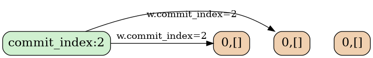

### Phase-1: Reply

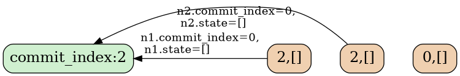

### Phase-1: Handler

```rust
impl Node {
    fn handle_phase_1(&mut self, p1_req: P1Req) {
        let p1_reply = P1Reply{
            commit_index: self.commit_index
            state: self.state,
        };

        self.commit_index = max(self.commit_index, p1_req.commit_index());
        return p1_reply;
    }
}
```


## Phase-2

最后, 保证了 `s₁` 当前最大, 和 **commit后不能修改** 这两个条件后, 第2阶段, writer 就可以安全的写入一个 `s₁` 完成 commit.

如果 **phase-2** 完成了, 则表示 commit 一定成功了, 任何一个 reader 都能读到唯一确定的 State `s₁`(除非有更大的 State 被写入了).

反之, 如果有其他 writer 通过 **phase-1** 阻止了 `w₁.commit_index` 的写入,
那么 w₁ 的 **phase-2** 就可能失败, 这时就退出 commit 过程并终止.

> 这里有一个学习分布式系统时经常提出的问题:
>
> ### Q:
>
> 因为在 **phase-1** 中 w 已经阻止了所有小于 `w.commit_index` 的 State 的提交,
> **phase-2** 是否可以写入一个小于 `w.commit_index` 的 State?
>
> ### A:
>
> 不可以, **phase-2** 写入的 State 的`commit_index()` 跟 `w.commit_index` 相等时才能保证安全, 简单分析下:
>
> -   显然要写的 `s₁.commit_index()` 不能大于 `w₁.commit_index`, 因为 **phase-1.1** 没有保护大于 `w₁.commit_index` 的 State 的写入.
>
> -   虽然在 **phase-1** 阶段, 系统已经阻止了所有小于 `s₁.commit_index()` 的其他 State 的 **phase-2** 写入,
>     如果 `w₁` 写的 State 的 `s_1.commit_index()` 小于`w.commit_index`,
>     那么系统中可能存在另一个稍大一点的 State (但没有 commit , 导致 reader 不认为 `s₁` 是 commit 的.
>
> 例如,
> - 一个 writer w₅ 在 t1 时间完成了 **phase-1**, 在 t2 时间 **phase-2** 只写入了 `N1`;
> - 然后另一个 writer w₆ 在 t3 时间完成了 **phase-1**, **phase-2** 只写入了一个较小的 `commit_index=4` 的 State.
>
> 那么某个 reader 如果通过访问 `N1,N2` 读取数据, 会认为 `N1` 上的 `[x₅]` 是 commit 的, 破坏了 **香农信息定义** .
>
> ```
> N1: 5,[]    5,[x₅]
> N2: 5,[]              6,[]       6,[y₄]
> N3:                   6,[]       6,[y₄]
> ----+-------+---------+----------+---------> time
>     t1      t2        t3         t4
>
> --- 例子6 ---
> ```

所以必须满足: `s₁.commit_index() == w₁.commit_index`

这时, 只要将 State 写入到 `w₁.quorum`, 就可以认为提交.

对应每个 node 的行为是:
在每个收到 **phase-2** 请求的节点上, 如果 node 上没有记录拒绝 `commit_index` 以下的 **phase-2** 请求, 就可以接受这笔写入.

一个推论: 一个节点如果接受了 `commit_index` 的写入,
那么同时它应该拒绝小于 `commit_index` 的写入了. 因为较小的 State 一定不是 commit 的, 如果接受, 会造成信息丢失.

### Phase-2: data

```rust
struct P2Req {
    // The commit_index under which a node should refuse.
    commit_index: u64,
    state: State,
}

struct P2Reply {
    // The commit_index of a node
    commit_index: u64,
}
```

- 和 **phase-1** 类似, 一个 node 返回它自己的 `commit_index` 来表示它是否接受了 writer 的 **phase-2** 请求.

- 在 `P2Req` 中, 如果 `state` 是完整的, `commit_index` 总是与 `state.commit_index()` 一样, 可以去掉; 这里保留是因为之后将会讨论到的分段传输: 每个请求只传输 `State` 的一部分, 这时就需要额外的 `P2Req.commit_index`.


### Phase-2: Req

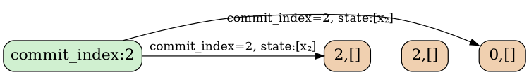

### Phase-2: Reply

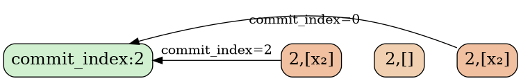

### Phase-2: Handler

```rust
impl Node {
    fn handle_phase_2(&mut self, p2_req: P2Req) {
        let p2_reply = P2Reply{
            commit_index: self.commit_index
        };
        if p2_req.commit_index >= self.commit_index {
            self.state.update(p2_req.state);
            self.commit_index = max(self.commit_index, p2_req.commit_index);
        }
        return p2_reply;
    }
}
```

也就是说 **phase-2** 不止可能修改 `Node.state`, 同时也会修改 `Node.commit_index`.

> 这里也是一个学习分布式容易产生误解的地方, 例如很多人曾经以为的一个paxos的bug: [paxos-bug][repo-consensus-bug-paxos].

这里也很容易看出为何在 raft 中必须当前 term 复制到 quorum 才认为是 commit 了.

## 可重复的 phase-2

要保证写入的数据是 commit 的, 只需保证写入一个 quorum 的 State 是最大的即可.
所以 writer 可以不断追加新的日志, 不停的重复 **phase-2**.

# Writer 协议描述

最后将整个协议组装起来的是 writer 的逻辑, 如前所讲, 它需要先在一个 quorum 上完成 **phase-1** 来阻止更小的 State 被 commit, 然后在 quorum 上完成 **phase-2** 完成一条日志的提交.

```rust
impl Writer {
    write(&mut self, cmd: &Cmd) {
        self.commit_index = next_unique();

        let p1_replies: Vec<P1Reply> = send_p1(P1Req{
            commit_index: self.commit_index
        });
        if !is_accepted_by_a_quorum(p1_replies) {
            return error;
        }

        let max_state = p1_replies.iter().max();

        let state = max_state.append_log(cmd);
        state.log.last().commit_index = self.commit_index;

        let p2_replies: Vec<P2Reply> = send_p2(state);
        let committed = is_accepted_by_a_quorum(p2_replies);
        return committed;
    }
}
```

# 工程实现

## Phase-2: 增量复制

这个算法的正确性
还需考虑工程上的方便,

到目前为止, 算法中对 State 的写都假设是原子的.
但在工程实现上, State 是一个很大的数据结构, 很多条 log

所以在 **phase-2** 传输 State 的过程中, 我们还需要一个正确的分段写的机制:

原则还是保证 **香农信息定义** , 即: commit 的数据不丢失.

-   State 不能留空洞: 有空洞的 State 跟没空洞的 State 不同, 不能通过最后一条日志来确定其所在的 State 大小.


- writer 在 **phase-1** 完成后可以保证一定包含所有已经 commit 的 State .
所以在一个接受 **phase-2** 的node 上, 它 Node.state 中任何跟 Writer.State 不同的部分都可以删除, 因为不一致的部分一定没有被 commit.

以下是 **phase-2** 过程中删除 `N3` 上不一致数据的过程:

```
W:             p1[x₅,z₅,w₆]  p2         p2         p2
N1: 5,[x₃,z₅]  6,[x₅,z₅]     |          |          |
N2: 5,[]       6,[]          v          v          v
N3: 4,[x₃,y₄]                4,[x₃,y₄]  5,[x₅,z₅]  6,[x₅,z₅,w₆]
----+----------+-------------+----------+----------+------------->
    t0         t1            t2         t3         t4

--- 例子7 ---
```

-   t1 时刻, writer W联系到N1, N2完成phase-1,, 读到最大的State `[x₃,z₅]`, 添加自己的日志到最大State上: `[x₃,z₅,w₆]`.
    这时系统中没有任何一个node的State是commit完成状态的, 一个reader可能选择 `[x₃,z₅]` 作为读取结果(访问N1,N2), 可能选择 `[x₃,y₄]`作为读取结果(访问N2,N3).

    但这时一个State的子集: `[x₃]` 是commit完成的状态.

-   t2 时刻, W向N3 复制了一段State: `[x₃]`, 它是N3本地日志的子集, 不做变化.

    这时reader还是可能读到不同的结果, 同样 `[x₃]` 是commit完成的状态.

-   t3 时刻, W向N3 复制了另一段State `z₅`, 它跟N3本地State冲突, 于是N3放弃本地的一段与writer不一致的State`y₄`, 将本地State更新为: `[x₅,z₅]`

    这时`[x₅,z₅]`是commit完成状态.

-   t4 时刻, W继续复制 `w_6` 到N3, 这是 `[x₅,z₅,w_4]` 是commit完成状态.

## Snapshot 复制

snapshot 复制跟 State 分段复制没有本质区别, 将 State 中的 log 从0到某一范围以压缩后的形式传输的到其他 node.

# 成员变更

为支持成员变更, 我们先加入下面这几个行为来支持成员变更操作:
- State 中某些日志(config日志)表示集群中的成员配置.
- State 中最后一个成员配置(config) 日志出现就开始生效.
- config日志与普通的日志写入没有区别.

`config` 定义一个集群的 node 有哪些, 以及定义了哪些 node 集合是一个 quorum.

> 例如一个普通的3成员集群的 config `[{a,b,c}]`, 它定义的 quorum 有
> 
> ```
> {a,b}
> {b,c}
> {c,a}
> ```
> 
> 再如一个由2个配置组成的 joint config `[{a,b,c}, {x,y,z}]`.
> 它定义的 quorum 集合是`{a,b,c}` 的 quorum 集合跟 `{x,y,z}`的 guorum 集合的笛卡尔积:
> ```
> {a,b, x,y}
> {a,b, y,z}
> {a,b, z,x}
> {b,c, x,y}
> {b,c, y,z}
> {b,c, z,x}
> {c,a, x,y}
> {c,a, y,z}
> {c,a, z,x}
> ```

然后, 我们对成员变更增加约束, 让成员变更的过程同样保证 **香农信息定** 的要求:


## 成员变更约束-1

首先, 显然有 **2个相邻 config 的 quorum 必须有交集**. 否则新配置启用后就立即会产生脑裂.
即:

$$
\forall q \in c_i,
\forall p \in c_j,
q \cap p \ne \empty
$$

在后面的讨论中我们将满足以上约束的2个 config 的关系表示为: **cᵢ ~ cᵢ₊₁**.

例如: 假设 State 中某条日志定义了一个 joint config: `[{a,b,c}, {x,y,z}]`,
那么,

- 下一个合法的 config 可以是:
    - uniform config `[{a,b,c}]`,
    - 或另一个 joint config `[{x,y,z}, {o,p,q}]`.

- 但不能是 `[{a,x,p}]`, 因为它的一个 quorum `{a,x}` 与 上一个 config 的 quorum `[{b,c}, {y,z}]` 没有交集.


## 成员变更Lemma-1

对2个 config `cᵢ ~ cⱼ`,
以及2个 State `Sᵢ` 和 `Sⱼ` 如果 `Sᵢ` 和 `Sⱼ` 互相不是子集关系,
**Sᵢ 在 cᵢ 上 commit 跟 Sⱼ 在 cⱼ 上 commit 不能同时发生**.


## 成员变更约束-2

因为2个不同 writer 提出(propose)的 config **不一定** 有交集,
所以为了满足 **commit-唯一** 的条件,
**包含新 config 的日志要提交到一个新, 旧配置的 joint config 上**.
即, `cᵢ₊₁` 必须在 `[cᵢ, cᵢ₊₁]` 上 commit.
`cᵢ₊₁` 之后的 State, 只需使用 `cᵢ₊₁` 进行 commit.

但是, 当 writer 中断, 另一个 writer 看到 `cᵢ₊₁` 时,
它不知道 `cᵢ₊₁` 处于变更中间, 也就是说新的 writer 不知道现在的 commit 应该使用 `[cᵢ, cᵢ₊₁]`, 它只使用 `[cᵢ₊₁]`.

所以对 config 日志向 joint config 的 commit 分为两步:
- **先在旧配置上拒绝更小的 State 的提交, 再 propose 新配置.**
  根据 **成员变更Lemma-1**, 即, 至少将一个与 `w.commit_index` 相同的 State commit 到 `cᵢ` 上.
- 再 propose `cᵢ₊₁`, 从日志 `cᵢ₊₁` 之后的日志开始, 都只需 commit 到 `cᵢ₊₁` 上.

最后总结:

## 成员变更的约束条件

-   上一个 config 在当前 `commit_index` 上提交后才允许 propose 下一个配置.
-   下一个配置必须跟最后一个已提交的配置有交集.


## 成员变更举例

-   raft 只支持以下的成员变更方式

    `c1` → `c1c2` → `c2` → `c2c3` → `c3` ...

    其中 `c1c2` 指 `c1` 跟 `c2` 的 joint config, 例如:

    -   `cᵢ` : `{a, b, c}`;
    -   `cᵢcⱼ`:  `[{a, b, c}, {x, y, z}]`.

-   [abstract-paxos][repo-abstract-paxos] 可以支持更灵活的变更:

    `c1` → `c1c2c3` → `c3c4` → `c4`.

    或回退到上一个 config:

    `c1c2c3` → `c1`.


## 合法变更状态转换图示

下面的图示中简单列出了至多2个配置的 joint config 跟 uniform config 之间可转换的关系:

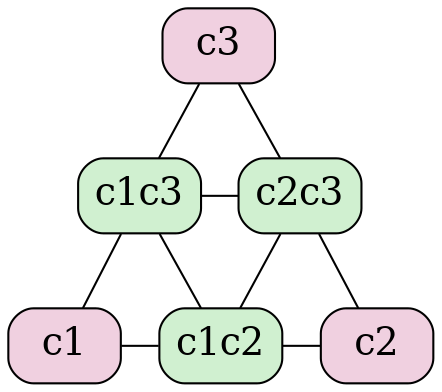

# Variants

以上为 [abastract-paxos][repo-abstract-paxos] 的算法描述部分. 接下来我们将看它是如何通过增加一些限制条件, [absract-paxos][repo-abstract-paxos] 将其变成 classic-paxos 或 raft 的.

## 秒变 Paxos

- 限制 State 中的日志只能有一条, 那么它就变成 paxos.
- 不支持成员变更.

其中概念对应关系为:

| abstract-paxos | classic-paxos |
| :-- | :-- |
| writer | proposer |
| node | acceptor |
| Writer.commit_index | rnd/ballot |
| State.commit_index() | vrnd/vbal |


## 秒变 Raft

Raft为了简化实现(而不是证明), 有一些刻意的阉割:

`commit_index` 在 raft 里是 一个 [偏序关系][wiki-偏序关系] 的 tuple, 包括:
- term
- 和是否投票给了某个 Candidate:

```rust
struct RaftCommitIndex {
    term: u64,
    voted_for: VotedFor,
}

type VotedFor = Option<NodeId>;
```

其中 VotedFor 的大小关系(即覆盖关系: 大的可以覆盖小的) 定义是:

```rust
let a: VotedFor;
let b: VotedFor;

a > b iff
      a.is_some() && b.is_none()
```

即, VotedFor 只能从 None 变化到 Some, 不能修改.
或者说, `Some(A)` 和 `Some(B)` 没有大小关系, 这限制了raft 选主时的成功几率. 导致了更多的选主失败冲突.

```rust
let a: RaftCommitIndex;
let b: RaftCommitIndex;

a > b iff
        a.term > b.term
    || (a.term == b.term && a.voted_for > b.voted_for)
```

commit_index 在每条日志中的存储也做了简化, 先看直接嵌入后的结构如下:

```rust
struct RaftState {
    log: Vec<{
        commit_index: (Term, Option<NodeId>),
        cmd: Cmd,
    }>,
}
```

raft 中, 因为 VotedFor 的特殊的偏序关系的设计, 日志中 Term 相同则 voted_for 一定相同,
所以最终日志里并不需要记录voted_for, 也能用来唯一标识日志, State, 及用于比较 State 的大小. 最终记录为:

```rust
struct RaftState {
    log: Vec<(Term, Cmd)>,
}
```

> 这样的确让 raft 少记录一个字段, 但使得其含义变得更加隐晦, 工程上也引入了一些问题, xp并不欣赏这样的作法.
> 
> 但不否认 raft 的设计在出现时是一个非常漂亮的抽象, 主要在于它对 multi-paxos 没有明确定义的问题, 即多条日志之间的关系到底应该是怎样的, 给出了一个确定的答案.

概念对应关系:

| abstract-Paxos       | raft            |
| :------------------- | :-------------- |
| writer at phase-1    | Candidate       |
| writer at phase-2    | Leader          |
| node                 | node            |
| Writer.commit_index  | (Term,VotedFor) |
| State.commit_index() | Term            |


成员变更方面, raft 的 **joint 成员变更** 算法将条件限制为只允许 uniform 和 joint 交替的变更: `c0 -> c0c1 -> c1 -> c1c2 -> c2 ...`.

不难看出, raft 的 **单步变更** 算法也容易看出是本文的成员变更算法的一个特例.

### Raft 的优化

[abstract-paxos][repo-abstract-paxos] 通过推导的方式, 得出的一致性算法可以说是最抽象最通用的. 不像 raft 那样先给出设计再进行证明, 现在从上向下看 raft 的设计, 就很容易看出 raft 丢弃了哪些东西和给自己设置了哪些限制, 也就是 raft 可能的优化的点:

- 1, **一个term允许选出多个 leader**: 将 `commit_index` 改为 [字典序][wiki-字典序], 允许一个 term 中先后选出多个 leader.
- 2, **提前commit**: raft 中 commit 的标准是复制本 term 的一条日志到 quorum. 这样在新 leader 刚刚选出后可能会延后 commit 的确认, 如果有较多的较小 term 的日志需要复制的话. 因此一个可以较快 commit 的做法是复制一段 State 时(raft 的 log), 也带上 writer 的 `commit_index` 信息(即 raft leader 的 `term`) 到每个 node, 同时, 对 State 的比较(即raft 的 log 的比较) 改为比较 `[writer.commit_index, last_log_commit_index, log.len()]`, 在raft 中, 对应的是比较 `[leader_term, last_log_term, log.len()]`.
- 3, **成员变更允许更灵活的变化**: 例如 `c0c1 -> c1c2`.

其中1,3已经在 [openraft][repo-openraft] 中实现(朋友说它是披着raft皮的paxos`/:-)`).

