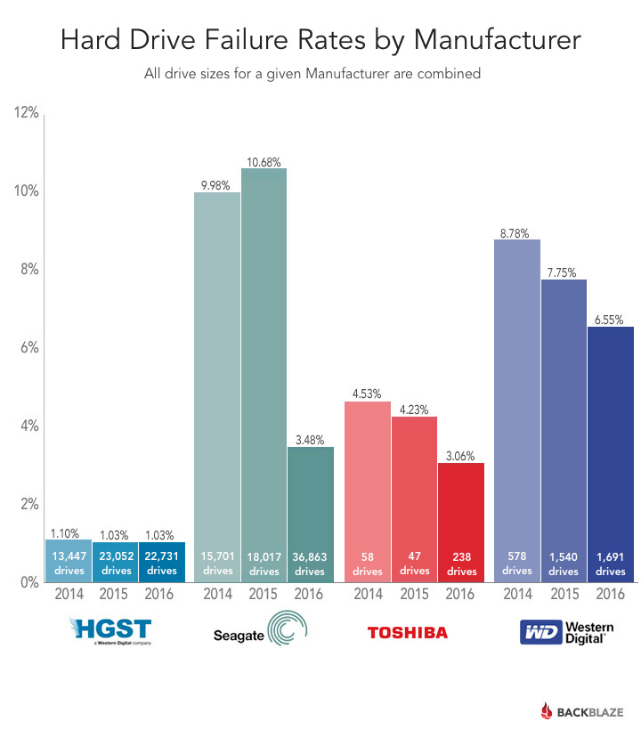
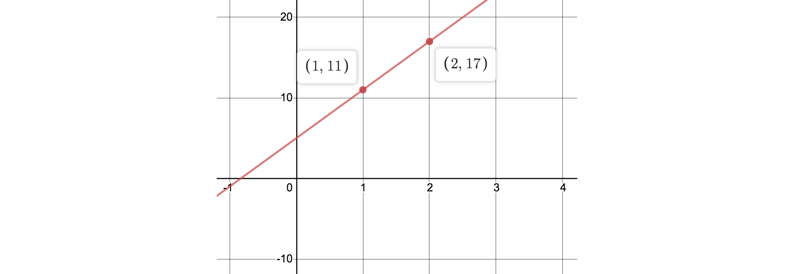
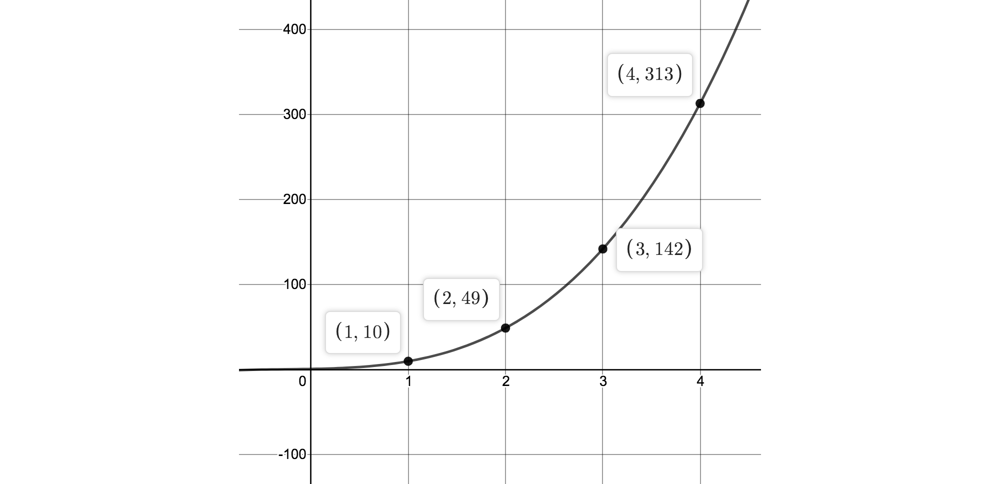

# 前言

做分布式存储的同学, 一定都知道一个了不地的冗余算法叫作擦除码([Erasure-Code]), 
它让存储以多副本**几分之一**的成本来达到同样高的可靠性.

虽然web上有很多介绍EC的文字,
但几乎所有这些文字都为了严(bi)谨(ge)而搞的像牛津词典一样难读,
懂的人不需要看, 不懂的人看不懂. 

能把事情给人讲明白, 文字才有用.
于是准备了这3篇介绍EC的文字, 我敢肯定, 你没看过这样**通(di)俗(diao)易(she)懂(hua)**的EC教程.
看完这3篇文字! 保你可以徒手写出一个EC存储系统, 本文是第一部分:

- [第一篇:原理]
- [第二篇:实现]
- [第三篇:极限]

# 问题

**分布式系统的第一个问题是可靠**

解决了数据可靠性的问题之后,
数据的其他问题如**一致性**, **性能**, **可用性**等的讨论才有意义.

然而现实残酷, 存储的硬件设备总是不够可靠. 下图摘自 [backblaze发布的硬盘故障率统计][failure-rate]

此外, 服务器还会宕机,磁盘会掉,光纤会被挖掘机铲断, 机房会被大雨淹没.
因此数据的存储必须要做到在部分硬件故障时还能保证正常读(或读写), 才可以达到工业可用的可靠性.

而提高可靠性最直接最简单的方法, 就是 **对一份数据存储多个副本**
(副本数一般选择3).

> 结合目前经验上的磁盘的损坏率(大约是年损坏率7%),
> 3个副本可以达到一个工业可接受的可靠性,
> 这个可靠性的预期大约是11个9以上(99.999999999%的概率不丢数据).
>
> 有些时候为了降低成本, 只存储2个副本, 也可以达到8个9的可靠性.

3副本的方式虽然简单容易实现, 但要额外浪费2倍的存储空间,
因此存储领域中一直都希望用一种较少的冗余的存储方式, 来实现同样较高的可靠性.

不论是单机上的[RAID]技术, 还是今天要提到的EC([Erasure-Code], 擦除码, 纠删码)
都是用来解决这个问题的. 接下来, 我们通过几个例子, 来逐步展示 EC 的工作原理.

> RAID 本质上跟EC没有区别, 它是单机系统时代被广泛使用的成熟实现.
> EC可以认为是分布式系统发展起来后, RAID算法在多机系统上的重新实现:
>
> - RAID-0 相当于单副本;
> - RAID-1 相当于2副本;
> - RAID-5 相当于EC的k+1模式, k个数据块+1个校验块;
> - RAID-6 相当于EC的k+2模式, k个数据块+2个校验块;

#  EC的基本原理

EC的目标可以简单的理解为: 对k个同样大小的数据块,
额外增加m个校验块,
以使得这k+m个数据中任意丢失m个数据块/校验块时都能把丢失的数据找回.

## 栗子1: 实现k+1的冗余策略

🌰

**Q: 有3个自然数, 能否做到再记录第4个数字,
让任何一个数字丢失的时候都可以将其找回**?

这个问题很简单, 记录这3个数字的和:
假设3个数字是: `d₁, d₂, d₃` ;
再存储一个 `y₁ = d₁ + d₂ + d₃` 就可以了.

于是:

- 存储过程:

    就是存储这4个数字: `d₁, d₂, d₃, y₁`.

-   恢复过程:

    -   如果 `d₁, d₂, d₃` 任意一个丢失, 例如 `d₁` 丢失了,
        我们都可以通过 `d₁ = y₁ - d₂ - d₃` 来得到 `d₁` .

    -   如果 `y₁` 丢失, 则再次取 `d₁ + d₂ + d₃` 的和就可以将 `y₁` 找回.

这种**求和冗余**策略, 就是 EC 算法的核心.

在上面这个简单的系统中, 总共存储了4份数据, 有效的数据是3份. 冗余是**133%**,
它的可靠性和2副本的**200%**冗余的存储策略**差不多**: 最多允许丢失1份数据.

| 策略        | 冗余度 | 可靠性                          | 存储策略示意                              |
| :---------- | :----- | :------------------------------ | :---------------------------------------- |
| 2副本       | 200%   | 允许丢1块: 1 X 10⁻⁸             | (d₁,d₁), (d₂,d₂), (d₃,d₃)                 |
| 3+1求和冗余 | 133%   | 允许丢1块: 6 X 10⁻⁸             | (d₁, d₂, d₃, y₁)                          |

> 这里还只是**差不多**, 虽然都是允许丢失1块数据, 但还并不是完全一样,
> 后面详细讨论可靠性的计算.
> 在讨论可靠性的时候, 一般数据丢失风险没有量级的差异, 就可以认为是比较接近的.

> 上面这个k+1的例子是和我们平时使用的 [RAID-5] 是类似的.
> [RAID-5] 通过对k个(可能是11个左右)数据块求出1份**校验和**的数据块.
> 存储这份校验块, 并允许1块(数据或校验)丢失后可以找回.
>
> 但在工程上, [RAID-5] 的计算并不是自然数的求和, 而是用bit-AND操作代替加法的. 后面细聊.

## 栗子2: 实现k+2的冗余策略

🌰🌰

现在我们在k+1的冗余策略基础上, 尝试增加更多的校验块, 来实现任意k+2的冗余策略.

**Q: 有3块数据:  `d₁, d₂, d₃`
可否另外再存储2个冗余的校验块(共5块), 让整个系统任意丢失2份数据时都能找回**?

在**k+1求和**的策略里, 我们给数据块和校验块建立了一个方程, 把它们关联起来了:
`y₁ = d₁ + d₂ + d₃`.

现在, 如果要增加可丢失的块数, 简单的把 `y₁` 存2次是**不够的**.

> 例如我们存储了2个校验块:
>
> $$
> \begin{cases}
> d_1 + d_2 + d_3 = y_1 \\
> d_1 + d_2 + d_3 = y_2
> \end{cases}
> $$
>
> -   存储过程:
>
>     存储 `d₁, d₂, d₃, y₁, y₂` 这5个数字.
>
> -   恢复过程:
>
>     如果 `d₁`, `d₂` 都丢失了(用 `u₁`, `u₂` 表示丢失的数据),
>     下面这个关于 u₁, u₂ 的线性方程是有无穷多解的:
>
>     $$
>     \begin{cases}
>     u_1 + u_2 = y_1 - d_3 \\
>     u_1 + u_2 = y_2 - d_3
>     \end{cases}
>     $$
>
>     我们没有办法从这个方程组里解出 `u₁`, `u₂` 的值, 因为第2个方程跟第1个一毛一样,
>     没有提供更多的信息.
>

所以我们现在需要做的是, 对第2个校验块 `y₂`, 设计一个新的计算方法, 使之跟3个数据块之间建立一个**不同**的关联,
**使得当 `d₁, d₂` 丢失时方程组有解**:

我们采用的方式是, 在计算 `y₂`  时, 给每个数据 `dⱼ` 设置不同的系数:
- 计算 `y₁` 时, 对每个数字乘以1, 1, 1, 1 ...
- 计算 `y₂` 时, 对每个数字乘以1, 2, 4, 8 ...

$$
\begin{aligned}
y_1 & = d_1 +   d_2 +   d_3 \\
y_2 & = d_1 + 2 d_2 + 4 d_3
\end{aligned}
$$

按照此方案, 我们就可以建议一个k+2的存储系统:

-   存储过程:

    存储 `d₁, d₂, d₃, y₁, y₂` 这5个数字.

-   数据恢复:

    如果 `d₁` 或 `d₂` 之一丢失,恢复的过程跟k+1策略一样;

    如果 `d₁, d₂` 丢失(同样用 `u₁, u₂` 表示),
    我们可以使用剩下的3个数字 `d₃, y₁, y₂`
    来建里1个关于 `u₁, u₂` 的二元一次方程组:

$$
\begin{cases}
\begin{aligned}
u_1 + u_2   & = y_1 - d_3 \\
u_1 + 2 u_2 & = y_2 - 4 d_3
\end{aligned}
\end{cases}
$$

解出上面这个方程组, 就找回了丢失的 `u₁, u₂` .

> 以上这种**加系数**计算校验块的方式, 就是[RAID-6]的基本工作方式:
>
> [RAID-6]为k个数据块(例如k=10)之外再多存储2个校验数据,
> 当整个系统丢失2块数据时, 都可以找回.

> 为什么计算 `y₂` 的系数是1, 2, 4, 8...? 系数的选择有很多种方法, 1, 2, 4, 8是其中一个.
> 只要保证最终丢失2个数字构成的方程组有唯一解就可以.
> 在k+2的场景中, 选择1, 2, 3, 4...作为系数也可以.

到这里我们就得到了k+2的EC的算法:
通过166%的冗余, 实现**差不多**和三副本300%冗余一样的可靠性.

## 栗子3: 实现k+m的冗余策略

🌰🌰🌰

如果要增加更多的冗余,让EC来实现相当于4副本差不多的可靠性: k+3,
我们需要给上面的策略再增加一个校验块 `y₃` ,

而 `y₃` 的计算我们需要再为所有的 `dⱼ` 选择1组不同的系数,
例如1,3,9,27...来保证后面数据丢失时,得到的1个3元一次方程组是可解的:

$$
\begin{cases}
\begin{aligned}
d_1 +   d_2 +   d_3 & = y_1 \\
d_1 + 2 d_2 + 4 d_3 & = y_2 \\
d_1 + 3 d_2 + 9 d_3 & = y_2
\end{aligned}
\end{cases}
$$

这样我们通过不断的增加不同的系数, 就可以得到任意的k+m的EC冗余存储策略的实现.

到此为止, 就是EC算法的核心思想了.
接下来, 我们再深入1点, 从另外1个角度来解释下为什么要选择这样1组系数.

> 现实中使用的[RAID-5]和[RAID-6]都是 EC 算法的子集.
> EC 是更具通用性的算法. 但因为实现的成本(主要是恢复数据时的计算开销), [RAID-5] 和
> [RAID-6]在单机的可靠性实现中还是占主流地位.
>
> 但随着存储量的不断增大, 百PB的存储已经不算是很极端场景了.
> [RAID-6] 在单机环境下不算高的数据丢失风险在大数据量的场景中显示的越来越明显.
> 于是在云存储(大规模存储)领域, 能支持更多的冗余校验块的EC成为了主流.

#  EC的几何解释

上面介绍了如何选择 EC 生成校验块(编码过程)的系数,
我们隐约可以感觉到它的系数选择可能有某种内涵,
接下来我们回到最初的问题, 思索下为什么要使用这样1组系数.

我们从比较简单的情况开始, 看下2个数据块计算(多个)校验块的方法:

## 2+m的冗余的本质: 两点确定一条直线

假设 现在我们有2个数据块 `d₁, d₂`. 要做2个校验块.

**我们使用1个直线的方程, 把 `d₁, d₂` 作为系数, 来实现数据的冗余备份和恢复**:

$$
y = d_1 + d_2 x
$$

这条直线具备这样的特点:

-   **这条直线包含的所有数据块 `dⱼ` 的信息**:
    - 任何1对 `d₁, d₂` 的值就确定一条不同的直线.
    - 同样, 任意1条直线也唯一对应1对 `d₁, d₂` 的值.

数据可靠性的问题就转化成了:

-   **我们要保存足够多的关于这条直线的信息, 能够在需要的时候找回这条直线.  然后再提取直线方程的系数来找回最初存储的数据块** `d₁, d₂`.

要保存足够多的信息, **最直观的方法就是记录这条直线上的几个点的坐标**.

> 例如假设要存储的数据`d₁ d₂` 分别是5, 6, 则直线方程是: `y = 5 + 6x`.
> 记录直线上`x=1, 2` 时y的值, 如下图:
> 
> 

因为2点可以确定一条直线, 只要拿到直线上2个点的坐标, 就能确定直线方程,
从而确定它的系数 `d₁, d₂` .
按照这样的思路, 我们重新用直线方程的方式描述数据冗余生成和数据恢复的过程:

-   存储过程:

    以 `d₁, d₂` 作为系数建立一个直线方程,
    再在直线上取2个点,
    记录点的坐标(这里我们总是取x = [1, 2, 3...]的自然数的值,
    所以只记录y的值就可以了): `d₁, d₂, (1, y₁), (2, y₂)`.

- 恢复过程:

   已知过直线2点 `(1, y₁), (2, y₂)` 来确定直线方程, 再提取方程的系数.

在这个校验块跟数据块的关系中:

$$
\begin{cases}
y_1 = d_1 + d_2 \\
y_2 = d_1 + 2d_2
\end{cases}
$$

丢失1个数据块时只用 `y₁` 的方程就够了.
丢失2个数据块时才需要解二元一次方程组. 如果 `y₁` 或 `y₂` 丢失, 则通过重新取点的方式恢复.

> 我们可以在直线上取任意多个点, 但恢复时最多也只需要2个点就够了.

## k+m的冗余的本质: 高次曲线

现在我们把它再推广到更一般的情况:
直线方程只有2个系数  `d₁, d₂` , 只能用于对2块数据做冗余,
如果要用描点方式来为更多的数据块生成冗余数据,
我们就需要有更多系数的方程, 也就是使用高次的曲线.

> 例如:
> 二次曲线抛物线 y = a x² + b x + c 需要3个系数来确定(可用来存储3块数据),
> 同时也需要知道抛物线上的3个点的坐标来找回这条抛物线.

如果有k个数据块, 我们把k个数据作为系数, 来定义1条关于x的高次曲线,
再通过记录曲线上的点的坐标来实现冗余:

$$
y = d_1 + d_2 x + d_3 x^2 + ... + d_k x^{k-1}
$$

> 例如要存储4个数据`1, 2, 3, 4`, 则曲线方程是: `y = 1 + 2x + 3x² + 4x³`.
> 记录曲线上`x=1, 2, 3, 4` 时y的值, 如下图:
> 
> 

-   存储过程:

    取m个不同的x的值(1, 2, 3...m), 记录这条曲线上m个不同点的坐标:

    $$ (1, y₁), (2, y₂) ... (m, y_m) $$

    存储所有k个数据块 `d₁, d₂ ...`.
    和所有m个校验块 `y₁, y₂ ...`.

-   恢复过程:

    平面上m个点可以唯一确定1条 m-1
    次幂的曲线(或通过m个点跟k-m个已知系数确定一条k-1次幂的曲线).
    确定了这条关于x的曲线,就找回了它的系数,也就是数据块

    $$ d_1, d_2 ... d_k $$

以上就是 EC存储跟恢复的几何本质:
**一条k-1次曲线可以通过k个系数或曲线上的点来确定**.

## 从曲线方程到生成矩阵

从EC的几何本质出发, 我们再系统的描述下生成校验块的过程:
为x取自然数的值(1,2,3...)来计算 y 的值:

$$
\begin{aligned}
y_1 = d_1 + 1 d_2  + 1^2 d_3  + \dots  1^{k-1} d_k \\
y_2 = d_1 + 2 d_2  + 2^2 d_3  + \dots  2^{k-1} d_k \\
y_3 = d_1 + 3 d_2  + 3^2 d_3  + \dots  3^{k-1} d_k \\
...
\end{aligned}
$$

把上面等式写成矩阵的形式, 就得到了EC校验块的 **生成矩阵** [Generator-Matrix]:

$$
\begin{bmatrix}
y_1 \\
y_2 \\
y_3 \\
... \\
y_m
\end{bmatrix} =
\begin{bmatrix}
1   & 1   & 1^2 & ... & 1^{k-1} \\
1   & 2   & 2^2 & ... & 2^{k-1} \\
1   & 3   & 3^2 & ... & 3^{k-1} \\
... & ... & ... & ... & ...     \\
1   & m   & m^2 & ... & m^{k-1}
\end{bmatrix}
\times
\begin{bmatrix}
d_1 \\
d_2 \\
d_3 \\
... \\
d_k
\end{bmatrix}
$$

这里 `y₁, y₂ ...` 就是校验块的数据,
因此, 上面[栗子3](#栗子3-实现km的冗余策略)中选择的系数, 就是从这里来的.

**而这个矩阵, 就是著名的 [Vandermonde] 矩阵**.

> [Vandermonde] 矩阵只是 EC 其中1种系数的选择方式.
> 其他常用的系数矩阵还有 [Cauchy] 矩阵等.

#  EC的解码: 求解n元一次方程组

EC生成校验块的过程称之为EC的**编码**,
也就是用[Vandermonde]矩阵去乘所有的数据块.

而当数据丢失需要找回的时候,
使用的是EC的**解码**过程.

既然EC的编码过程是**编码矩阵**([Vandermonde])和数据块列相乘:

$$
\begin{bmatrix}
1 & 1 & 1 & ... & 1 \\
1 & 2 & 4 & ... & 2^{k-1} \\
1 & 3 & 9 & ... & 3^{k-1} \\
... \\
1 & m & m^1 & ... & m^{k-1}
\end{bmatrix}
\times
\begin{bmatrix}
d_1 \\
d_2 \\
d_3 \\
... \\
d_k
\end{bmatrix} =
\begin{bmatrix}
y_1 \\
y_2 \\
y_3 \\
... \\
y_m
\end{bmatrix}
$$

那么解码的过程就可以描述如下:

假设有q个数字丢失了, `q <= m`.
从上面的**编码矩阵**中选择q行,
组成的一次方程组, 求解方程组算出丢失的数据.

例如 `d₂, d₃` 丢失了, 下面用 `u₂, u₃` 表示
(只丢失了2块数据, 不需要所有的m个校验块参与, 只需要2个校验块来恢复数据)

$$
\begin{bmatrix}
1 & 1 & 1 & ... & 1 \\
1 & 2 & 4 & ... & 2^{k-1} \\
\end{bmatrix}

\times

\begin{bmatrix}
d_1 \\
u_2 \\
u_3 \\
... \\
d_k
\end{bmatrix} =

\begin{bmatrix}
y_1 \\
y_2 \\
\end{bmatrix}
$$

这个矩阵表示的方程组里有2个未知数 `u₂, u₃` ,
解方程即可得到 `u₂, u₃` 这2块丢失的数据.

##  [Vandermonde] 矩阵保证方程组有解

对于k+m的EC来说, 任意丢失m个数据块都可以将其找回.
因为我们选择的[Vandermonde] 矩阵保证了任意`m`行`m`列组成的子矩阵都是线性无关的,
构成的方程肯定有确定解. 例如:

$$
V=\begin{bmatrix}
1      & x_1    & x_1^2  & \dots  & x_1^{n-1} \\
1      & x_2    & x_2^2  & \dots  & x_2^{n-1} \\
1      & x_3    & x_3^2  & \dots  & x_3^{n-1} \\
\vdots & \vdots & \vdots & \ddots & \vdots    \\
1      & x_m    & x_m^2  & \dots  & x_m^{n-1}
\end{bmatrix}
$$

- [Vandermonde] 的 行列式的值为:

    $$
    \det(V)=\prod_{1 \leq i \lt j \leq n}(x_j - x_i)
    $$

    只要 xᵢ 都不同, 则 [Vandermonde] 矩阵的行列式就不为0, 矩阵可逆, 表示方程有唯一解.

- [Vandermonde] 矩阵的任意 `m x m` 的子矩阵, 是一个Generalized Vandermonde Matrix,
  它在 xᵢ 都为正数时可以保证永远有唯一解.

  因此在**实数**领域, 我们总能保证上面这个冗余策略很好的工作.

好了, 到此为止我们讨论了EC在实数范围内的全部内容.
相信大家根据以上原理很容易写出一个简单但可靠的EC的实现.

但这套理论还不能直接应用到线上产品中.
因为计算机中还要考虑数字大小限制, 例如k个32位整数作为数据,
通过[Vandermonde]矩阵生成校验块, 那校验块的数值几乎确定会溢出.

下一篇 Erasure-Code-擦除码-2-实现篇 中,
我们会展示出算数和计算机算法之间的差异,
以及我们将通过什么样的手段来解决这些问题, 将EC真正应用到生产环境中.

> EC擦除码系列:
> - [第一篇:原理]
> - [第二篇:实现]
> - [第三篇:极限]


