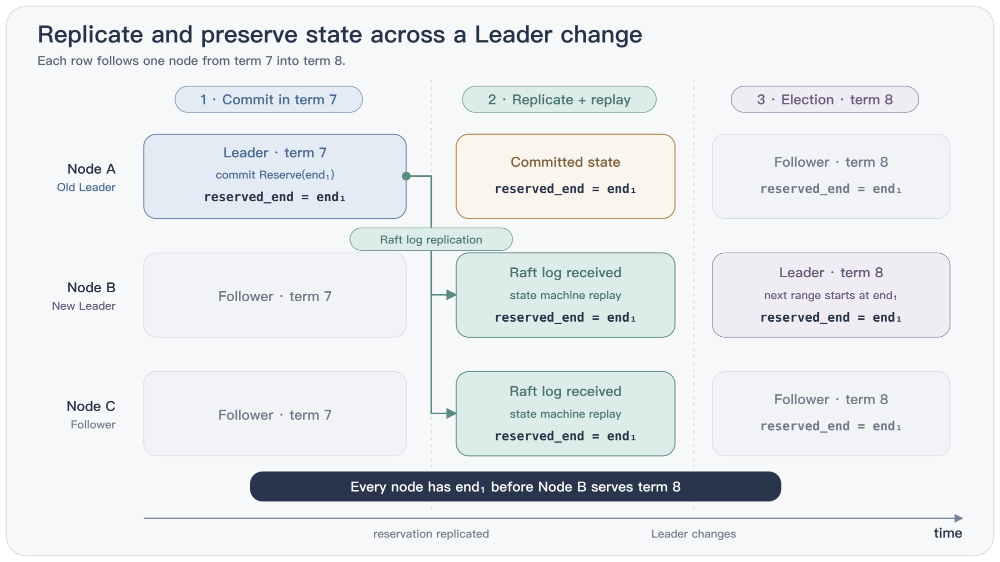

[上一章][post-ezraft-cn]我们介绍了 [EzRaft][repo-ezraft], 它是基于 [OpenRaft][repo-openraft] 搭建的一套简化框架, 可以让用户快速上手就能实现一个自己的分布式 HA 服务, 无需了解不必要的 [Raft][raft-website], [Rust][rust-lang] 或 OpenRaft 相关知识.

今天我们来用 200 行代码写一个同样很常见的 server: 分布式授时服务: [timestamp_oracle][repo-ezraft-timestamp-oracle]. 它通过一个冗余的 3-node cluster, 生成全局单调增的 timestamp.

这个例子展示了几项由 EzRaft 提供的功能:

- `EzRaft::write()` 将预留上界写入 Raft log, 并 apply 到 state machine, 让 Leader 用它来申请新的 timestamp;
- `EzRaft::wait_metrics()` 让 async task 等待当前 node 成为 Leader;
- `EzRaft::linearizable(ReadPolicy::LeaseRead)` 通过 lease 确认 Leader 有效性, 并返回包含 term 的 log ID, 阻止预留 cache 被跨 term 复用.

这个服务提供两个 feature:

- 挂掉一个 node, 服务不中断;
- 每个 `next_timestamp` 请求都在 Leader 本地完成, 不需要等待一次 Raft 写入.


## Timestamp oracle

服务接口: 客户端发出一个 `next_timestamp` request, 服务返回一个 timestamp.

最典型的用途是 distributed transaction ordering. [Percolator][ref-percolator] 这类基于 [MVCC][wiki-mvcc] 的事务模型, 给每个事务分配一个开始时间戳和一个提交时间戳, 事务之间谁先谁后, 完全由这两个 timestamp 决定; TiDB 里的 [TSO (Timestamp Oracle)][doc-tidb-tso] 就是这样一个组件.

timestamp oracle 要满足三个要求:

1. Monotonicity: 按照 wall-clock time 的先后顺序发出的 timestamp 严格递增, 任何情况下都不重复或回退. Leader failover 之后也一样: 新 Leader 发出的每一个 timestamp, 都必须大于旧 Leader 发出过的所有 timestamp.

2. Fault tolerance: 这由底层的 OpenRaft 保证: 少数 node 挂掉, 服务不中断. 3-node cluster 中, 挂掉任意一个 node 仍能继续生成 timestamp.

3. 够快: 一次 `next_timestamp` 请求的延迟尽可能小.

还有一条不那么硬的要求: timestamp 要贴近 wall-clock time.

## 核心逻辑: 写 Raft log 来分配可用的 timestamp

对于 timestamp oracle 服务来说, state machine 只需要记录 timestamp range 的预留上界, 也就是不能再用于分配的最大值.
EzRaft 将这个值存入它的 state machine (`TimeState`), 确保下一次 Leader failover 后不会重复分配已经预留过的 timestamp range.

最直接的做法: 每次 `next_timestamp` 请求都写一条 Raft log entry 来申请一个新位置. 占掉位置后, 等待 state machine 返回被占用的 timestamp, 返回给 client.

下面是 `timestamp_oracle` 核心部分 (主要是 state machine) 的定义. 它只存储一个值 `reserved_end`, 表示已经分配到哪个位置; 此前的 timestamp 都不能再次分配.

```rust
struct Reserve {
    reserve_upto_us: u64,
}

struct Interval {
    start: u64,
    end: u64,
}

struct TimeState {
    reserved_end: u64,
}

impl EzApp for TimeState {
    type Request = Reserve;
    type Response = Interval;

    async fn apply(&mut self, req: Reserve) -> Interval {
        let start = self.reserved_end;
        let end = start.max(req.reserve_upto_us);
        self.reserved_end = end;
        Interval { start, end }
    }
}
```

`Reserve` 是申请新的 timestamp 的请求, 它只有一个字段 `reserve_upto_us`, 表示 Leader 希望分配到的上界;
`Interval` 是分配完成后的返回值, 表示一个区间 `[start, end)`. 以上是 [`EzApp`][docs-ezraft-ezapp] 要求 app 定义的全部信息. 见 [timestamp_oracle.rs:66-112][code-ezapp].

`apply()` 负责把复制成功并提交的 Raft log entry 应用到 state machine 中, 其中 `let end = start.max(req.reserve_upto_us)` 保证 `Reserve` 请求的处理是幂等的. 因此, 同一条 `Reserve` log entry 重复提交也没有影响, 超时后可以安全重试.

以上是核心的 timestamp 分配流程, 但这样做非常低效, 因为每个 `next_timestamp` 请求都要完成 replication, 再等待这条 log 被 apply 到 state machine 后返回.

## 高效做法: 一次 Raft 写入预留一段 timestamp range

所以我们采用的模型是: 通过一次 Raft log entry 写入, 预留一个较长的 timestamp range, 示例中默认是一秒.

成功预留这个 timestamp range 的 Leader, 后续可以从中连续分配 timestamp. 新的 `next_timestamp` 请求到来时, 直接在内存中完成分配.

> 注意: Leader 内部已经预留的整段 timestamp range 不会持久化.
> Leader 宕机后, 这段预留的 timestamp range 相当于已经被消耗.
> 新 Leader 启动后, 必须重新写一条 Raft log entry, 申请新的 timestamp range.

所以在这个 timestamp oracle 服务里, 我们 spawn 一个 reservation task 专门负责不停地申请更多预留的 timestamp range, 再放入预留 cache `Reserved` 供 Leader 使用.

预留的 cache `Reserved` 结构有三个字段:
这个 timestamp range 由哪个 term 的 Leader 预留, 下一个可以分配的 timestamp, 以及可分配的上界.

```rust
struct Reserved {
    term: u64,
    next: u64,
    end: u64,
}
```

reservation task 在循环中阻塞等待, 直到成为 Leader, 再调用 `refill()` 申请 timestamp range: [timestamp_oracle.rs:170-186][code-run-reserver]:

```rust
struct TimeService {
    // ...
    reserved: Mutex<Reserved>,
}

impl TimeService {
    async fn run_reserver(&self) {
        let refresh_interval = Duration::from_micros(self.reservation_width.get() / 2);
        loop {
            let leads = self.raft.wait_metrics(None, |m| m.state == ServerState::Leader, "reserve timestamps");
            if let Err(error) = leads.await {
                return;
            }
            if let Err(error) = self.refill().await {
                warn!("{error}");
            }
            tokio::time::sleep(refresh_interval).await;
        }
    }
}
```

`self.refill()` 很简单, 它写一条 Raft log entry 来申请 timestamp range, 再将返回的结果放入 cache: `TimeService.reserved` (源码: [timestamp_oracle.rs:188-205][code-refill]):

```rust
async fn refill(&self) -> io::Result<()> {
    // ensure leader lease and get leader term.
    let term = self.leader_term().await?;
    let now = unix_timestamp_micros();
    let width = self.reservation_width.get();
    let upto = now.saturating_add(width);

    let interval = self.raft.write(Reserve { reserve_upto_us: upto }).await?;

    self.reserved.lock().await.install(term, interval);
    Ok(())
}
```

这个后台运行的 reservation task 让 Raft 提交次数与 `next_timestamp` 请求数量脱钩.
假设每次预留的 timestamp range 是 `width`, 那么它每隔 `width / 2` 提交一次; 一次 Raft log entry 的分布式提交可以支持十万个 `next_timestamp` 请求.

## Leader failover safety

Leader failover 后, 有可能是另一个 node 上的 Leader 继续提供服务, 这时必须保证已经分配出去的 timestamp 不会再被分配.
Raft 的运行机制已经可以在数据层面防止重分配, 保证新的 Leader 一定知道上个 Leader
最后分配出去的 timestamp:



但还有一个问题: 如果当前 Leader 在不知情的情况下被新 Leader 取代, 就必须停止服务, 不能再为客户端申请或分配 timestamp range.

这是因为新 Leader 已经持有更新的 timestamp range. 如果新 Leader 已经分配了更大的 timestamp, 旧 Leader 就必须退出服务; 否则旧 Leader 分配出的 timestamp 就是回退了.


## 用 lease 挡住旧 Leader

所以 `timestamp_oracle` 展示了一个使用 `LeaseRead` 的 [linearizable][post-linearizable] read 操作, 用于隔离新旧 2 个 Leader.

为客户端分配 timestamp 时, 首先要检查当前 Leader 的 lease 是否仍然有效. OpenRaft 内部自动通过 Leader 到其他 node 的 heartbeat 自动维护 lease: 收到 heartbeat 的 node, 在一定时间内不会发起新的 election.

如果当前 Leader 收到一个 [quorum][post-quorum] 返回的 heartbeat ack, 就能确定在 lease 超时前不会选出新的 Leader. 在此期间, 可以安全地由这个 Leader 为客户端分配 timestamp.

但如果 Leader 发出的 heartbeat 直到 lease 超时仍未联系到一个完整的 quorum, 那么就必须认为当前 Leader 的 lease 失效, 即无法保证集群中没有其他更新的 Leader, lease 失效后, `linearizable()` 返回一个错误, 保证 `next_timestamp()` 请求的处理终止.


这些操作通过 [`EzRaft::linearizable(ReadPolicy::LeaseRead)`][code-ezraft-linearizable] 完成.
它不走网络, 只在内存中检查 Leader lease 是否超时, 这个检查依赖最近一次 heartbeat 的结果.
`linearizable()` 在内部调用 OpenRaft 的 [`Raft::ensure_linearizable()`][docs-openraft-ensure-linearizable], 并返回 `(term, index)`, 其中 term 是当前未超时的 Leader 所在的 term, 后面讲它用于检查 Leader 的预留 cache 是否仍然有效:

```rust
async fn leader_term(&self) -> io::Result<u64> {
    let (term, _index) = self.raft.linearizable(ReadPolicy::LeaseRead).await?;
    Ok(term)
}
```


## `next_timestamp` 请求的处理流程

整个 timestamp oracle 的 `next_timestamp` 请求处理如下:

- 用 `leader_term()` 确认 Leader 有效,
- 从 cache 中分配一个 timestamp, 推进 cursor,
- 最后返回给 client (源码: [timestamp_oracle.rs:162-168][code-next-timestamp]).

内存 cache 中的 timestamp 分配的在 `take()` 中 (源码: [timestamp_oracle.rs:124-133][code-take]):

```rust
async fn get_time(service: web::Data<TimeService>) -> Result<web::Json<String>, actix_web::Error> {
    let micros = service.next_timestamp().await.map_err(actix_web::error::ErrorServiceUnavailable)?;
    Ok(web::Json(format_timestamp(micros)))
}

async fn next_timestamp(&self) -> io::Result<u64> {
    let mut reserved = self.reserved.lock().await;
    let term = self.leader_term().await?;
    let timestamp = reserved.take(term, unix_timestamp_micros());
    timestamp.ok_or_else(|| io::Error::other("no reserved timestamp is currently available"))
}

fn take(&mut self, leader_term: u64, now: u64) -> Option<u64> {
    let timestamp = now.max(self.next);
    if self.term != leader_term || timestamp >= self.end {
        return None;
    }
    self.next = timestamp + 1;
    Some(timestamp)
}
```

`leader_term()` 从 `linearizable()` 返回 `(term, index)` (源码: [timestamp_oracle.rs:207-210][code-leader-term]). `ReadPolicy` 的其他取值见 [OpenRaft 文档][docs-openraft-readpolicy];
OpenRaft 对这类 read 的优化, 我在 [OpenRaft 对 ReadIndex 的优化][post-openraft-read] 中写过.

## 预留 cache 必须关联 Leader term

预留 cache 里存储了 Leader 的 term, 是因为这里可能出现一种情况: 当前 Leader 可能变成 Follower, 随后又变回 Leader. 虽然是同一个 node, 但中间已经发生过一次 Leader failover, 此时继续使用原来预留的 timestamp range 不再安全.

举个例子:

假设当前 Leader 的 term 是 1, 并且预留 cache 中有一段待分配的 timestamp range. 当下一个 `next_timestamp` 请求到来时, 这个 Leader 的 term 已经变成 3.

term 变成 3, 意味着 cluster 可能在 term 2 中通过 election 选出过另一个 Leader, 并且那个 Leader 可能已经分配了一些 timestamp. 即使无法确定这是否真的发生, 也必须按这种可能性处理.

因此, term 1 Leader 留下的预留 cache 必须失效. term 3 Leader 需要重新向 Raft cluster 申请预留的 timestamp range, 才能继续分配 timestamp.


落到代码上, 就是 `take()` 中的判断: cache 记录它是了为哪个 `term` 的 Leader 做的预留, `take()` 传入的 term 不匹配就直接拒绝, 等待 reservation task 重新申请预留.
`timestamp >= self.end` 是另一种情况, 表示预留 cache 中已经没有可用的 timestamp.

```rust
if self.term != leader_term || timestamp >= self.end {
    return None;
}
```

到此为止整个服务介绍完了, 现在跑起来测试下


## 跑起来

### 启动 3-node cluster

三个终端各运行一条命令. 第一条创建 cluster, 后两条用 `--seed` 指向已经运行的 node 并加入:

```bash
cargo run --example timestamp_oracle -- --addr 127.0.0.1:8090
cargo run --example timestamp_oracle -- --addr 127.0.0.1:8091 --seed 127.0.0.1:8090
cargo run --example timestamp_oracle -- --addr 127.0.0.1:8092 --seed 127.0.0.1:8090
```

Node ID 不用手动指定: node 加入时, cluster 会写入一条 blank log entry; 这个 entry 的 index 就是它的 ID, 因此会出现 0, 8, 17 这样不连续的值. `/api/metrics` 可以看到 cluster 已经有三个 voter, Leader 是 node 0:

```json
{"id":0,"current_term":1,"state":"Leader","current_leader":0,
 "membership_config":{"membership":{"configs":[[0,8,17]], ...}}}
```

### Send `next_timestamp` requests

```bash
curl -X POST 127.0.0.1:8090/time
```

连续发送三个 `next_timestamp` request, 返回三个 JSON 字符串:

```
"2026-08-11T14:43:16.966734Z"
"2026-08-11T14:43:16.973216Z"
"2026-08-11T14:43:16.979556Z"
```

三个 timestamp 之间相差 6 到 7 毫秒, 这是 curl 启动进程的开销; timestamp 分配发生在 Leader 内存中, 没有网络调用, 也没有 disk write.

同一条命令发给 Follower 会被拒绝, 因为 `/time` 只能由 Leader 处理. response 中会带上当前 Leader:

```
$ curl -s -X POST 127.0.0.1:8091/time
has to forward request to: Some(0), Some(BasicNode { addr: "127.0.0.1:8090" })   [HTTP 503]
```

### 杀掉 Leader

在运行 node 0 的终端中按 Ctrl-C, 然后持续向剩下两个 node 发送 `next_timestamp` request, 过程如下:

```
14:43:28.998  curl 8090  ->  "2026-08-11T14:43:28.998630Z"                        [200]
14:43:29      kill node 0
14:43:29.3    curl 8091  ->  has to forward request to: Some(0), ...:8090          [503]
   ...        (持续约 5 秒, 8091 和 8092 都是同样的 503)
14:43:34.8    curl 8091  ->  has to forward request to: Some(17), ...:8092         [503]
14:43:34.8    curl 8092  ->  no reserved timestamp is currently available          [503]
14:43:35.169  curl 8092  ->  "2026-08-11T14:43:35.169756Z"                        [200]
```

这里先发生了 Leader failover, 并出现 `forward to Leader` 错误. `no reserved timestamp is currently available` 也出现了一次: node 17 已经成为 Leader, 但它的第一条 `Reserve` log entry 尚未提交, 预留 cache 仍然为空. 下一条 `Reserve` log entry 提交后, 服务恢复.

此后分配的 timestamp 没有回退: 新 Leader 发出的第一个 timestamp `14:43:35.169756` 大于旧 Leader 发出的最后一个 timestamp `14:43:28.998630`. 中间的 timestamp 没有被任何 Leader 发出, 形成前文所说的 timestamp gap. `/api/metrics` 可以看到 Leader failover 的结果: term 从 1 变成 2.

```json
{"id":17,"current_term":2,"state":"Leader","current_leader":17}
{"id":8,"current_term":2,"state":"Follower","current_leader":17}
```

<!-- 图: 不画. 上面带时刻的输出本身就是 Leader failover 前后的序列, 再配一张示意图会重复. -->

## 结束

timestamp oracle 这个 example 展示了如何通过 EzRaft 去构建一个高可用服务. 它几乎没有多余的, 处理分布式相关的逻辑, 所有代码都关注在自己的核心业务上面.

希望收到大家的反馈.

## 链接

- 示例代码: [timestamp_oracle.rs][repo-ezraft-timestamp-oracle]
- EzRaft: [github.com/drmingdrmer/ezraft][repo-ezraft]
- crates.io: [crates.io/crates/ezraft][crates-ezraft]
- 文档: [docs.rs/ezraft][docs-ezraft]
- OpenRaft: [github.com/databendlabs/openraft][repo-openraft]
- 上一篇: [EzRaft: 100 行写一个分布式 KV 存储][post-ezraft-cn]

[repo-ezraft]: https://github.com/drmingdrmer/ezraft "ezraft"
[repo-ezraft-timestamp-oracle]: https://github.com/drmingdrmer/ezraft/blob/main/examples/timestamp_oracle.rs "ezraft timestamp_oracle example"
[code-ezapp]: https://github.com/drmingdrmer/ezraft/blob/main/examples/timestamp_oracle.rs#L66-L112 "Reserve / Interval / TimeState / impl EzApp"
[code-reserved]: https://github.com/drmingdrmer/ezraft/blob/main/examples/timestamp_oracle.rs#L114-L148 "struct Reserved 和它的三个方法"
[code-take]: https://github.com/drmingdrmer/ezraft/blob/main/examples/timestamp_oracle.rs#L124-L133 "Reserved::take"
[code-next-timestamp]: https://github.com/drmingdrmer/ezraft/blob/main/examples/timestamp_oracle.rs#L162-L168 "TimeService::next_timestamp"
[code-run-reserver]: https://github.com/drmingdrmer/ezraft/blob/main/examples/timestamp_oracle.rs#L170-L186 "TimeService::run_reserver"
[code-refill]: https://github.com/drmingdrmer/ezraft/blob/main/examples/timestamp_oracle.rs#L188-L205 "TimeService::refill"
[code-leader-term]: https://github.com/drmingdrmer/ezraft/blob/main/examples/timestamp_oracle.rs#L207-L210 "TimeService::leader_term"
[code-format]: https://github.com/drmingdrmer/ezraft/blob/main/examples/timestamp_oracle.rs#L225-L235 "format_timestamp 和 get_time"
[code-args]: https://github.com/drmingdrmer/ezraft/blob/main/examples/timestamp_oracle.rs#L237-L251 "命令行参数"
[code-ezraft-linearizable]: https://github.com/drmingdrmer/ezraft/blob/main/src/raft.rs#L343-L365 "EzRaft::linearizable"
[crates-ezraft]: https://crates.io/crates/ezraft "ezraft on crates.io"
[docs-ezraft]: https://docs.rs/ezraft "ezraft docs"
[repo-openraft]: https://github.com/databendlabs/openraft "OpenRaft"
[docs-openraft-readpolicy]: https://docs.rs/openraft/0.10.0-alpha.33/openraft/raft/enum.ReadPolicy.html "OpenRaft ReadPolicy"
[docs-openraft-ensure-linearizable]: https://docs.rs/openraft/0.10.0-alpha.33/openraft/raft/struct.Raft.html#method.ensure_linearizable "Raft::ensure_linearizable"
[docs-ezraft-ezapp]: https://docs.rs/ezraft/latest/ezraft/app/trait.EzApp.html "EzApp"
[docs-ezraft-ezraft]: https://docs.rs/ezraft/latest/ezraft/raft/struct.EzRaft.html "EzRaft"
[docs-ezraft-ezserver]: https://docs.rs/ezraft/latest/ezraft/server/struct.EzServer.html "EzServer"
[docs-ezraft-filestorage]: https://docs.rs/ezraft/latest/ezraft/storage/struct.FileStorage.html "FileStorage"
[docs-ezraft-ezstorage]: https://docs.rs/ezraft/latest/ezraft/storage/trait.EzStorage.html "EzStorage"

[raft-website]: https://raft.github.io/ "Raft"
[rust-lang]: https://www.rust-lang.org/ "Rust"
[ref-percolator]: https://www.usenix.org/legacy/event/osdi10/tech/full_papers/Peng.pdf "Large-scale Incremental Processing Using Distributed Transactions and Notifications"
[ref-spanner]: https://www.usenix.org/system/files/conference/osdi12/osdi12-final-16.pdf "Spanner: Google's Globally-Distributed Database"
[doc-tidb-tso]: https://docs.pingcap.com/tidb/stable/glossary/#timestamp-oracle-tso "TiDB: Timestamp Oracle (TSO)"
[rfc-3339]: https://www.rfc-editor.org/rfc/rfc3339 "RFC 3339: Date and Time on the Internet"
[wiki-mvcc]: https://en.wikipedia.org/wiki/Multiversion_concurrency_control "Multiversion concurrency control"

[post-ezraft-cn]: https://blog.openacid.com/algo/ezraft/ "EzRaft: 100 行写一个分布式 KV 存储"
[post-openraft-read]: https://blog.openacid.com/algo/openraft-read/ "OpenRaft 对 ReadIndex 的优化"
[post-linearizable]: https://blog.openacid.com/algo/linearizable/ "分布式系统中的 Linearizable 事务"
[post-quorum]: https://blog.openacid.com/algo/quorum/ "Quorum 读写的少数派实现"
[post-raft-io-order-cn]: https://blog.openacid.com/algo/raft-io-order-complete-cn/ "Raft 中的 IO 执行顺序"
