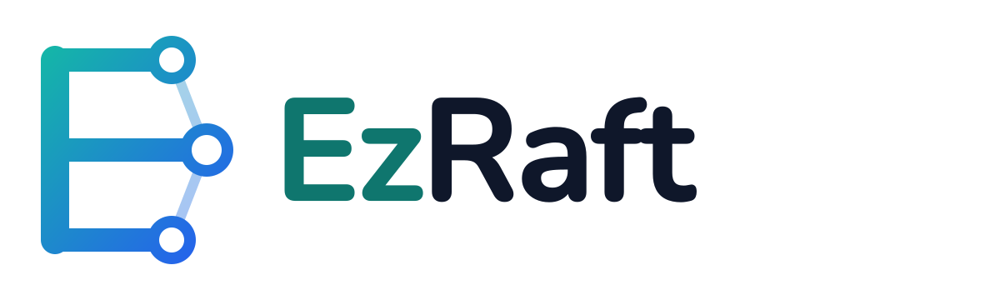
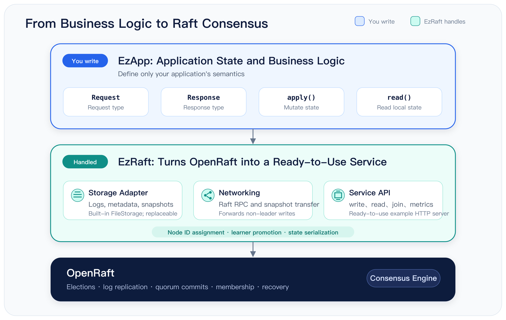
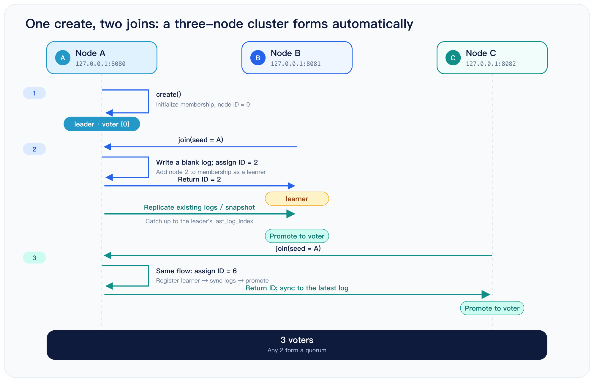
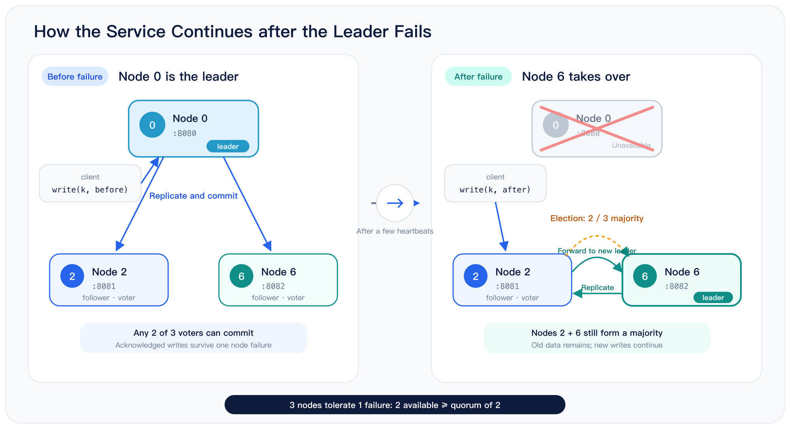
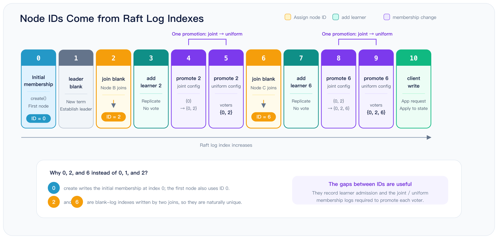

# EzRaft: Build a Distributed KV Store in 100 Lines

For the past few years, I have spent most of my time working on [OpenRaft][repo-openraft].

OpenRaft is an open-source project that runs in production at companies around the world. To support such a wide range of applications, it has to be highly flexible. Log entries, log IDs, state machines, and storage are all expressed as [Rust][rust-lang] traits, so users can adapt them to their own needs.

Today, OpenRaft's API and performance are both fairly mature. The trade-off is that its model of the [Raft][raft-website] algorithm remains quite abstract.

## The OpenRaft Learning Curve

That abstraction creates a steep learning curve. There are three main parts:

1. Understanding the Raft consensus algorithm:
   Before you can build a distributed store on OpenRaft, you need to understand what Raft guarantees—and what it does not.

2. Understanding Rust:
   OpenRaft is written in Rust. Reading the code and building an application requires some familiarity with Rust's abstractions and generics.

3. Understanding OpenRaft's own abstractions:
   Abstraction makes software easier to use once you understand the model. It gives experienced users convenience and flexibility. But when you are learning the system from the bottom up, the abstraction itself becomes another thing you must first understand.

This is a common problem with abstractions: before the whole system makes sense, you must understand how all of its abstract pieces fit together. Most people learn more naturally in the other direction—from concrete examples to general ideas.

Give someone an abstraction and ask them to imagine a concrete example, and the idea can be hard to grasp. Give them a concrete example first, and the underlying pattern is much easier to see. OpenRaft's abstractions make it a powerful, stable tool, but not necessarily an easy place to start learning.

## The Goal Behind EzRaft

As the maintainer of OpenRaft, I regularly hear from developers who are new to distributed systems, Rust, or OpenRaft itself. They want to build something of their own—perhaps a distributed storage system—but the amount they need to learn first can be overwhelming.

I wanted a layer that would let people focus on their business logic first, without requiring them to master Raft, Rust, and OpenRaft up front.

That question led to EzRaft.

[EzRaft][repo-ezraft] is a streamlined distributed storage library built on top of OpenRaft. It hides the details you do not need at the beginning, so you can concentrate on the application rather than the machinery underneath it.

Here is a rough comparison:

| | OpenRaft | EzRaft |
|---|---|---|
| Traits to implement | 7+ (`RaftLogStorage`, `RaftStateMachine`, ...) | 2 (`EzApp`, `EzStorage`) |
| Methods to implement | 21+ | 4 |
| Types to define | 12 generic parameters | 2 (`Request`, `Response`) |
| Network code | About 100 lines, written by the user | Built in, 0 lines |



## The Four Things Users Define

EzRaft asks you to define just four things:

1. The shape of a request: `Request`.
2. The shape of a response: `Response`. Requests and responses represent your application's operations, so only you can define them.
3. How a request changes the state machine: `apply()`.
4. How to read from the state machine: `read()`. You can think of the state machine as a key-value store and use a key to retrieve one part of it.

Together, these four pieces define the boundary of your application. EzRaft handles everything below that boundary: storage, network communication, service APIs, and more. When building directly on OpenRaft, you must provide these pieces yourself.

With EzRaft, you can build the business logic first and explore the lower-level details later, when you actually need them.

```rust
trait EzApp: Serialize + DeserializeOwned {
    type Request;
    type Response;

    async fn apply(&mut self, req: Self::Request) -> Self::Response;
    fn read(&self, key: &str) -> Option<serde_json::Value>;
}
```

That is the complete application-facing API. Define those four pieces, add a few lines of boilerplate to connect them, and let EzRaft handle the rest.

The `EzApp` value holds the application's entire state. EzRaft persists and restores that state through serialization and deserialization, which means a snapshot is simply the serialized form of the whole application.

This deliberate simplification makes EzRaft a good fit for applications whose state fits in memory. We will return to that constraint later.

## Build a Distributed KV Store in Three Steps

Building our KV store takes three steps:

1. Implement `EzApp` to define the business model.
2. Assemble a service from the components EzRaft provides.
3. Start three nodes and try the cluster for yourself.

## Step One: Define the Application

Let us start with the application itself. The service supports two write operations: set a key and delete a key.

The complete application state lives in a KV map, backed here by a [B-tree map][rust-btreemap].

`apply` takes a set or delete request and applies it to the map.

`read` looks up a value by key and returns it.

That is all the application needs to do. EzRaft takes care of everything else.

```rust
enum Request {
    Set { key: String, value: String },
    Delete { key: String },
}

struct KvApp {
    data: BTreeMap<String, String>,
}

impl EzApp for KvApp {
    type Request = Request;
    type Response = Option<String>;

    async fn apply(&mut self, req: Request) -> Option<String> {
        match req {
            Request::Set { key, value } => self.data.insert(key, value),
            Request::Delete { key } => self.data.remove(&key),
        }
    }

    fn read(&self, key: &str) -> Option<serde_json::Value> {
        self.data.get(key).cloned().map(serde_json::Value::String)
    }
}
```

Both `insert` and `remove` return the key's previous value, so `apply` returns it as well. Each write tells the caller exactly what it replaced or removed, without an extra read.

To keep the example readable, I omitted the derive attributes. A real implementation needs them. `Request` travels over the network and is written to the Raft log, so it must support serialization through [serde][serde].

OpenRaft also prints requests in its diagnostic logs, which requires `Debug` and `Display`. EzRaft may need to retain a copy while forwarding a request to the leader, so `Request` also needs `Clone`. Finally, `KvApp` is the state itself, and serde turns that state into snapshots.

The repository includes a complete, runnable version in [examples/kvstore.rs][repo-ezraft-kvstore], with all derives and imports in place. You can run it directly with `cargo run`.

It differs from the code in this article in two small ways. First, it uses clap to parse `--addr` and `--seed` instead of positional arguments. Second, it returns a `Response` struct rather than `Option<String>`, so the HTTP response is `{"value":"world"}` instead of `"world"`.

## Step Two: Assemble a Working Service

Now we can turn the business logic into a working server. The server accepts two arguments at startup:

1. This node's address. Other EzRaft nodes use it for cluster communication, and clients use it to send requests.
2. A seed address. A new node with uninitialized storage contacts the seed to join an existing cluster.

The first node does not need a seed. It creates a single-node cluster and can begin serving requests immediately.

The second and third nodes use the first node as their seed. Each asks to join the existing cluster, and together they form a three-node cluster.

EzRaft and OpenRaft handle the entire process: admitting each node, assigning its ID, and synchronizing its data.



The server code is short: read the command-line arguments, then initialize storage.

This example uses EzRaft's built-in `FileStorage`. It demonstrates every responsibility of a storage implementation, with clarity taking priority over performance.

A production system should replace it with a proper storage backend. `FileStorage` does not call fsync, so a power failure could lose a write that the cluster has already acknowledged to the client. That can [break Raft's correctness guarantees][post-raft-io-order-cn].

Fortunately, `EzStorage` has only three methods. The `FileStorage` source provides a complete template for implementing them.

After initializing storage, create the `KvApp` instance and pass it, the storage backend, and a configuration to EzRaft. The server is then ready to run.

```rust
#[tokio::main]
async fn main() -> io::Result<()> {
    // Usage: kvstore [addr] [seed-addr]
    let addr = std::env::args().nth(1).unwrap_or("127.0.0.1:8080".to_string());
    let seed = std::env::args().nth(2);

    let storage = FileStorage::new(format!("./data/{}", addr.replace(':', "-"))).await?;
    let (app, config) = (KvApp::default(), EzConfig::default());

    let raft = match seed {
        Some(seed) => EzRaft::join(&addr, seed, app, storage, config).await?,
        None => EzRaft::create(&addr, app, storage, config).await?,
    };

    raft.serve().await
}
```

`create` and `join` are deliberately separate methods rather than a single method with an `Option<seed>` parameter. Creating a cluster and joining an existing one are fundamentally different operations.

Suppose a node is meant to join a cluster, but its seed is accidentally omitted. If it calls `create`, it forms a second, independent single-node cluster—and the two clusters will never merge. Requiring the caller to choose explicitly is safer than letting an empty configuration value make that decision.

## Step Three: Start a Three-Node Cluster

Open three terminals and start one node in each:

```bash
cargo run -- 127.0.0.1:8080
cargo run -- 127.0.0.1:8081 127.0.0.1:8080
cargo run -- 127.0.0.1:8082 127.0.0.1:8080
```

Open a fourth terminal for client requests.

First, write a value. A write returns the key's previous value. Because `hello` does not exist yet, the response is `null`:

```bash
curl -X POST 127.0.0.1:8080/api/write \
    -H 'Content-Type: application/json' \
    -d '{"Set": {"key": "hello", "value": "world"}}'
# null
```

Now read the value from another node. The request goes to 8082, even though no client has written to that node directly:

```bash
curl '127.0.0.1:8082/api/read?key=hello'
# "world"
```

Every node holds a complete copy of the application state. A read can therefore go straight to local memory, without contacting the leader or running a round of consensus.

This local read is fast, but it can be slightly stale. The node may not yet have received a write that the cluster just acknowledged. If you need a strictly [linearizable][post-linearizable] read, call `linearizable()` first. It [confirms the leader's identity][post-openraft-read] and waits for the local state to catch up; the following `read()` will then see every earlier acknowledged write.

## Send Writes to Any Node

In Raft, only the leader can coordinate a client write, but EzRaft hides that restriction from the client. Every node exposes the same write endpoint. A follower forwards the request to the leader, waits for it to commit, and then returns the result to the caller.

That is why the following request succeeds when sent to 8081. The response, `"world"`, is the old value replaced by the write:

```bash
curl -X POST 127.0.0.1:8081/api/write \
    -H 'Content-Type: application/json' \
    -d '{"Set": {"key": "hello", "value": "again"}}'
# "world"
```

The client never needs to discover or track the leader; it can connect to any node. A delete works the same way and returns the value it removed:

```bash
curl -X POST 127.0.0.1:8080/api/write \
    -H 'Content-Type: application/json' \
    -d '{"Delete": {"key": "hello"}}'
# "again"
```

After the deletion, the key no longer exists, so another read returns HTTP 404:

```bash
curl '127.0.0.1:8080/api/read?key=hello'
# no value for key "hello"     [HTTP 404]
```

## Test a Node Failure

So far, a single HashMap on one machine could provide the same behavior. The reason to run three nodes is fault tolerance: the service keeps working when one node fails.

Write a key, then stop the leader—the first node, running on 8080:

```bash
curl -X POST 127.0.0.1:8080/api/write \
    -H 'Content-Type: application/json' \
    -d '{"Set": {"key": "k", "value": "before-failover"}}'
# null

# Press Ctrl-C in the first terminal, or kill the process.
```

The two remaining nodes still form a [majority][post-quorum], so they elect a new leader within a few heartbeats. The data written before the failure remains available, and the cluster continues to accept writes:

```bash
curl '127.0.0.1:8081/api/read?key=k'
# "before-failover"

curl -X POST 127.0.0.1:8081/api/write \
    -H 'Content-Type: application/json' \
    -d '{"Set": {"key": "k", "value": "after-failover"}}'
# "before-failover"

curl 127.0.0.1:8081/api/metrics | jq -c '{id, state, current_leader}'
# {"id":2,"state":"Follower","current_leader":6}
```

Node 6 is now the leader. The cluster completed the failover without any manual intervention.



Now restart the failed node with exactly the same command:

```bash
cargo run -- 127.0.0.1:8080
```

Notice that the command does not include a seed. The node ID is already stored in `./data/127.0.0.1-8080/`, so the node loads it during startup instead of joining again.

The original seed is no longer needed, even if it has since left the cluster. Once the restarted node is running, it automatically catches up on the write it missed:

```bash
curl '127.0.0.1:8080/api/read?key=k'
# "after-failover"
```

A three-node cluster tolerates one failure; a five-node cluster tolerates two. Even-numbered clusters provide no additional fault tolerance: four nodes, like three, can still tolerate only one failure.

## Cluster State

EzRaft includes a default endpoint for inspecting the current state of a node and its cluster:

```bash
curl '127.0.0.1:8080/api/metrics' | jq
```

The response comes directly from OpenRaft and exposes its full set of metrics:

```json
{
  "running_state": { "Ok": null },
  "id": 0,
  "current_term": 1,
  "vote": {
    "leader_id": { "term": 1, "voted_for": 0 },
    "committed": true
  },
  "last_log_index": 10,
  "local_committed": { "leader_id": 1, "index": 10 },
  "cluster_committed": { "leader_id": 1, "index": 10 },
  "committed": { "leader_id": 1, "index": 10 },
  "last_applied": { "leader_id": 1, "index": 10 },
  "snapshot": null,
  "purged": null,
  "state": "Leader",
  "current_leader": 0,
  "millis_since_quorum_ack": 3,
  "last_quorum_acked": 1785595777894002000,
  "membership_config": {
    "log_id": { "leader_id": 1, "index": 9 },
    "membership": {
      "configs": [ [ 0, 2, 6 ] ],
      "nodes": {
        "0": { "addr": "127.0.0.1:8080" },
        "2": { "addr": "127.0.0.1:8081" },
        "6": { "addr": "127.0.0.1:8082" }
      }
    }
  },
  "committed_membership_config": {
    "log_id": { "leader_id": 1, "index": 9 },
    "membership": {
      "configs": [ [ 0, 2, 6 ] ],
      "nodes": {
        "0": { "addr": "127.0.0.1:8080" },
        "2": { "addr": "127.0.0.1:8081" },
        "6": { "addr": "127.0.0.1:8082" }
      }
    }
  },
  "heartbeat": {
    "0": 1785595777894002750,
    "2": 1785595777894002209,
    "6": 1785595777894002125
  },
  "replication": {
    "0": { "leader_id": 1, "index": 10 },
    "2": { "leader_id": 1, "index": 10 },
    "6": { "leader_id": 1, "index": 10 }
  }
}
```

The three node IDs are 0, 2, and 6—not 0, 1, and 2. That is because the cluster assigns node IDs instead of reading them from configuration.

When a node joins, the leader first writes a blank log entry, then uses that entry's index as the new node's ID. Log indexes are unique, so the resulting node IDs are unique as well. They are not consecutive because other entries are written between two joins: one adds the new node as a learner, and a membership change promotes it to a voter. The gaps between IDs are a visible trace of those steps.



A new node first joins as a learner. It receives log entries, but it does not vote and does not count toward the cluster's majority. Once it has caught up, EzRaft automatically promotes it to a voter.

From the user's perspective, joining the node is enough. EzRaft handles synchronization and promotion, so the node begins contributing to fault tolerance automatically.

## When to Use EzRaft

EzRaft is designed for applications whose state fits in memory but must never be lost or allowed to diverge across nodes. Configuration services, service registries, discovery systems, metadata stores, distributed locks, and task schedulers all fit this pattern.

The data is usually small, but it is critical: losing it or allowing replicas to disagree can disrupt every system built on top of it. [ZooKeeper][zookeeper] and [etcd][etcd] serve this same class of workload.

This focus follows directly from EzRaft's snapshot model. A snapshot is the serialized form of the complete `EzApp`, and installing one simply deserializes that state back into the application.

As a result, snapshot support shrinks from "implement an entire snapshot mechanism" to "add one derive annotation to a struct." Applications whose state fits in memory get the full benefit of that simplification.

EzRaft also works well for read-heavy workloads with relatively few writes. Every node holds a complete copy of the state, and reads go straight to local memory without contacting the leader or running consensus. Clients can read from any node, so adding nodes increases read throughput.

EzRaft is also a practical way to see Raft working end to end. The roughly one hundred lines above already exercise leader election, log replication, membership changes, snapshots, and failover.

That makes the example easy to experiment with. Stop a node and watch the cluster elect a new leader. Follow the log index in the metrics. Change the heartbeat interval in `EzConfig` and see how it affects election time. Once these ideas are concrete, moving down a layer to [OpenRaft][repo-openraft] is much easier than starting with a set of trait definitions.

To turn this example into a production system, you need to replace two pieces. The first is `FileStorage`, which should become a production-grade storage backend.

The second is the service API. The built-in HTTP endpoints are designed for the example and provide neither authentication nor encryption. Use `EzServer` as a reference, define routes that fit your application, and call `EzRaft::write` and `EzRaft::read` underneath. The rest of the stack can remain unchanged.

## Links

- Code: [github.com/drmingdrmer/ezraft][repo-ezraft]
- crates.io: [crates.io/crates/ezraft][crates-ezraft]
- Documentation: [docs.rs/ezraft][docs-ezraft]
- OpenRaft: [github.com/databendlabs/openraft][repo-openraft]


[repo-ezraft]: https://github.com/drmingdrmer/ezraft "ezraft"
[repo-ezraft-kvstore]: https://github.com/drmingdrmer/ezraft/blob/main/examples/kvstore.rs "ezraft kvstore example"
[crates-ezraft]: https://crates.io/crates/ezraft "ezraft on crates.io"
[docs-ezraft]: https://docs.rs/ezraft "ezraft docs"
[repo-openraft]: https://github.com/databendlabs/openraft "openraft"

[raft-website]: https://raft.github.io/ "Raft"
[rust-lang]: https://www.rust-lang.org/ "Rust"
[rust-btreemap]: https://doc.rust-lang.org/std/collections/struct.BTreeMap.html "BTreeMap"
[serde]: https://serde.rs/ "serde"
[zookeeper]: https://zookeeper.apache.org/ "Apache ZooKeeper"
[etcd]: https://etcd.io/ "etcd"

[post-quorum]: https://blog.openacid.com/algo/quorum/ "Quorum Reads and Writes with a Minority"
[post-linearizable]: https://blog.openacid.com/algo/linearizable/ "Linearizable Transactions in Distributed Systems"
[post-openraft-read]: https://blog.openacid.com/algo/openraft-read/ "How OpenRaft Optimizes ReadIndex"
[post-raft-io-order-cn]: https://blog.openacid.com/algo/raft-io-order-complete-cn/ "I/O Ordering in Raft"
