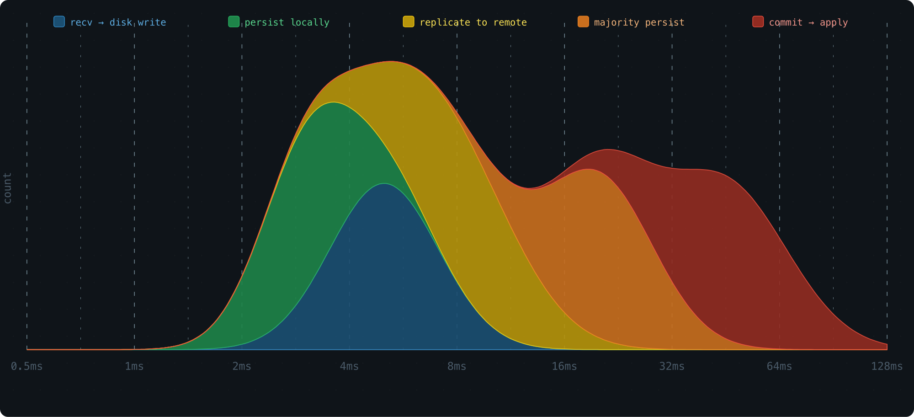
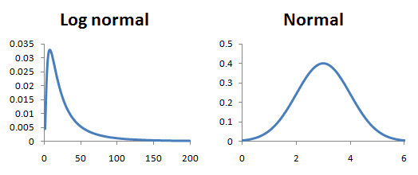
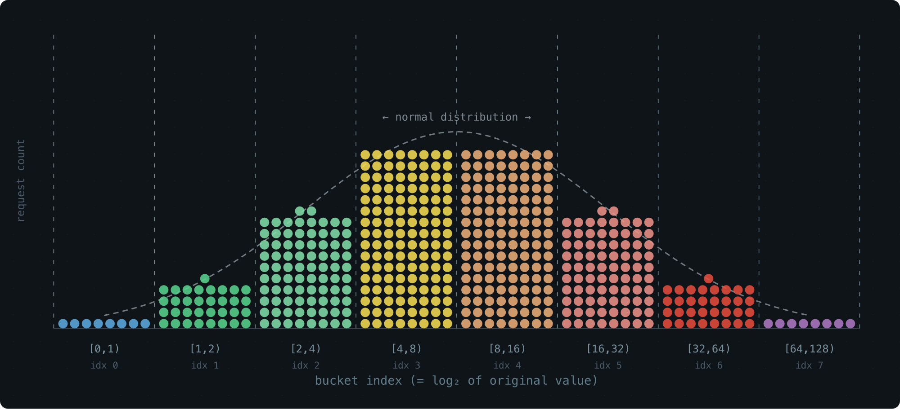
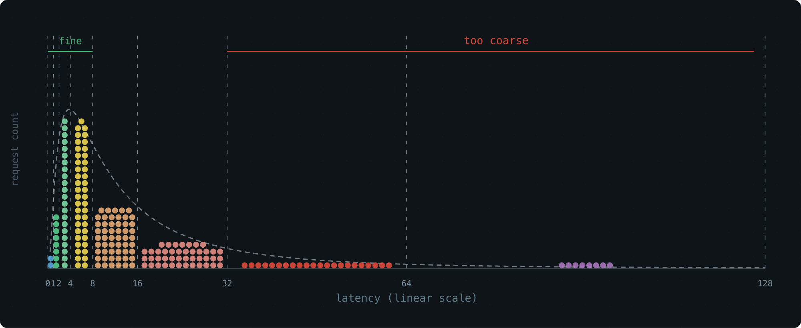
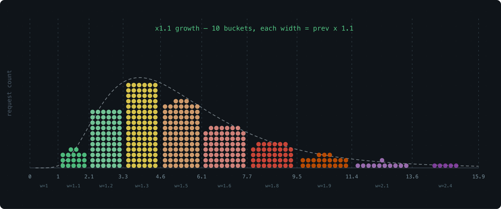
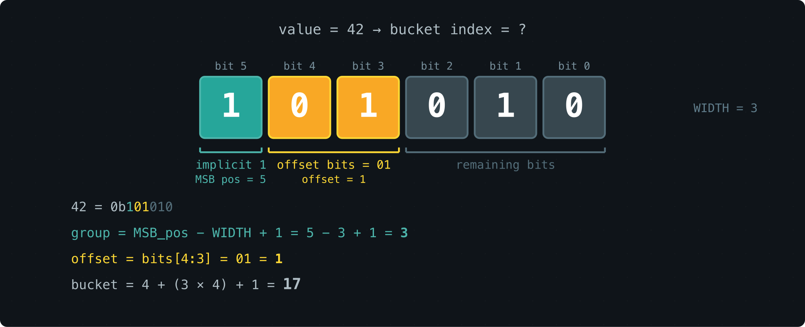
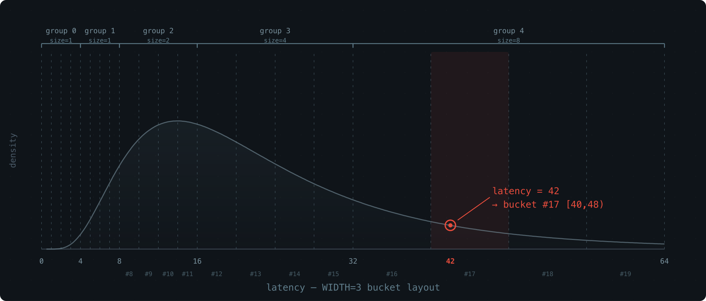
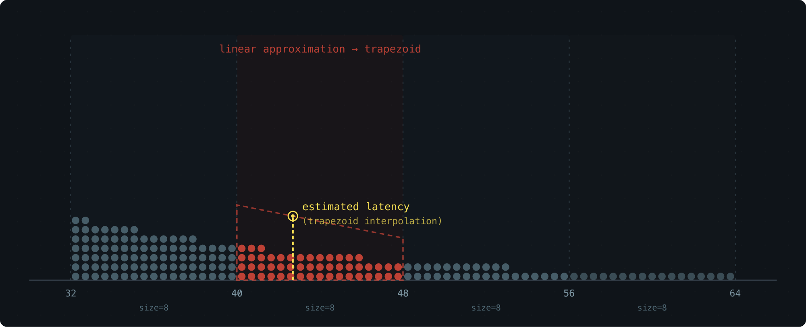
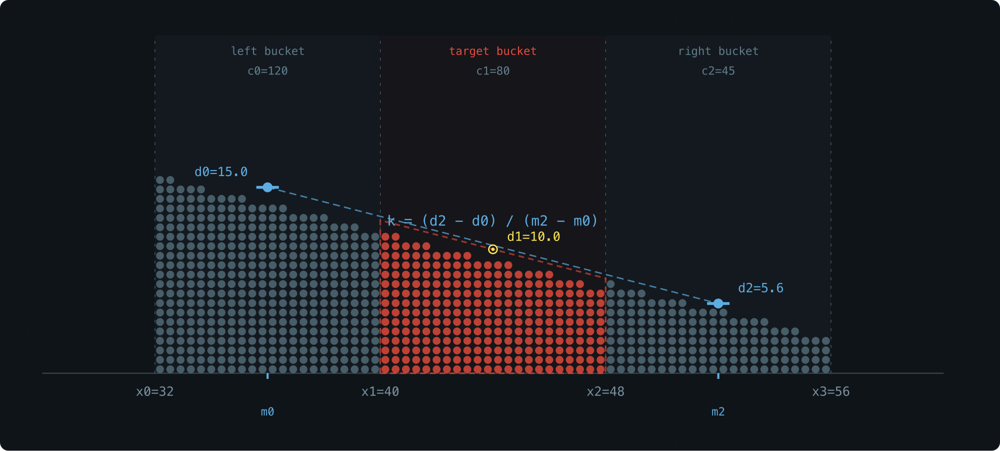

## The Problem: Tracking Request Latency Without Slowing Things Down

When we were building [Databend][] and [OpenRaft][],
we ran into a familiar need: we wanted to see how request latency was distributed across the system, in real time, without burning CPU or memory to do it.
This article explains the design behind [base2histogram][], the library we built to solve it.

Consider the life of a single Raft log entry. It passes through several stages, and each one has its own latency profile:

- Received → written to storage
- Persisted to local disk
- Replicated to remote nodes
- Acknowledged by a majority quorum
- Committed → applied to the state machine

A [histogram][] is the natural tool here — plot latency on the x-axis, request count on the y-axis, and you get an immediate picture of where time is being spent.



This kind of visibility is what lets you find bottlenecks and fix the right thing.

But there's a catch: collecting metrics can't get in the way of doing actual work. So the histogram needs to be:

- **O(1) to record** — no sorting, no rebalancing, nothing that can stall a hot path
- **Tiny in memory** — the system may run hundreds or thousands of these at once
- **Queryable for [percentiles][percentile]** — P50, P95, P99

Let's walk through how we designed one that hits all three.

## Recording: Getting Samples Into Buckets

### Why Log-Scale Buckets

Most requests cluster around some typical latency, with a few outliers on both ends. This is a [log-normal distribution][] — take the log of the latency values, and the shape becomes a classic [bell curve][normal distribution].

The signature look: a peak at lower values, then a gradual [long tail][] stretching to the right.



To build a histogram, we divide the x-axis into buckets and count how many samples land in each one.

The key question is how to size those buckets.
Equal-width buckets work great for a normal distribution, but latency is log-normal — the data only looks uniform on a logarithmic scale.
So the buckets need to grow on a **[log scale][]**, not a **linear** one.

The simplest version of this: each bucket is twice as wide as the one before it.

`[0,1), [1,2), [2,4), [4,8), [8,16), ...`

Why powers of 2? Because multiplying by 2 is free on a CPU, and mapping a value to its bucket takes a single [leading zero count][leading zero counting] instruction.

Simulate a log-normal workload, plot the bucket counts with the bucket index on the x-axis (effectively a log transform), and the result is a clean bell curve:



Storage-wise, this is great — 65 buckets cover the entire u64 range.
Resolution-wise, not so much. The last bucket spans half of all possible values. Everything that lands there is a blur.




### A Tempting Fix We Passed On

An obvious improvement: use a smaller growth factor, like 1.1× instead of 2×.
More buckets, finer resolution:



The problem is cost. Finding the right bucket for a value `l` means solving for the smallest `x` where `1 + 1.1 + 1.1^2 + ... + 1.1^x >= l` — and that requires floating-point logarithms. That's real overhead on a hot path.

We wanted to stay in the world of integers and bit operations.


### The Trick: Float-Like Encoding

Here's the idea that makes everything work. We keep the roughly exponential bucket sizes, but we encode each bucket using a fixed number of bits — a parameter we call WIDTH.

Think of a bucket's lower bound as a tiny [floating-point number][].
The [MSB][] position gives you the exponent (which group of buckets you're in),
and the next few bits give you the offset within that group.

With WIDTH=3 (the default), a bucket boundary looks like this in binary:

```
00..00 1 xx 00..00
       |
       MSB
<- significant
```

The position of the leading `1` picks the group. The two bits that follow pick the bucket within the group.

Here's what the first few groups look like — each bucket is fully described by just 3 bits:

```
WIDTH = 3:

range     bucket index        bucket size
[0, 1)     0  0b0 ..... 000    1
[1, 2)     1  0b0 ..... 001    1
[2, 3)     2  0b0 ..... 010    1
[3, 4)     3  0b0 ..... 011    1

[4, 5)     4  0b0 ..... 100    1
[5, 6)     5  0b0 ..... 101    1
[6, 7)     6  0b0 ..... 110    1
[7, 8)     7  0b0 ..... 111    1

[8, 10)    8  0b0 .... 1000    2
[10, 12)   9  0b0 .... 1010    2
[12, 14)  10  0b0 .... 1100    2
[14, 16)  11  0b0 .... 1110    2

[16, 20)  12  0b0 ... 10000    4
[20, 24)  13  0b0 ... 10100    4
[24, 28)  14  0b0 ... 11000    4
[28, 32)  15  0b0 ... 11100    4

[32, 40)  16  0b0 .. 100000    8
[40, 48)  17  0b0 .. 101000    8
[48, 56)  18  0b0 .. 110000    8
[56, 64)  19  0b0 .. 111000    8
```

The pattern is clean:

- Each group contains `2^(WIDTH-1) = 4` buckets
- The 2 bits after the MSB select the bucket within the group
- It's a 3-bit float: 1 implicit leading bit + 2 fractional bits



Bucket sizes grow roughly logarithmically,
and computing the bucket index is just a matter of extracting the top WIDTH bits — a handful of integer and bit ops. Recording a sample is **O(1)**.

Walk-through with latency = 42:

```text
value = 42 (binary: 0b101010)
  MSB position: 5
  group: 5 - 2 = 3
  2 bits after MSB: 01 (from 1[01]010)
  offset in group: 1
  Bucket index: 4 + (3 × 4) + 1 = 17
```




### Tuning WIDTH: The Precision–Memory Knob

WIDTH sets how many buckets each group gets (`2^(WIDTH-1)`).
Groups top out at 64 (they still double in size, covering the full u64 range).

Here's how the trade-off plays out:

| WIDTH | Buckets | Mem/slot | Buckets per group |
|-------|---------|----------|-------------------|
| 1     | 65      | 520 B    | 1                 |
| 2     | 128     | 1.0 KB   | 2                 |
| 3     | 252     | 2.0 KB   | 4 (default)       |
| 4     | 496     | 3.9 KB   | 8                 |
| 5     | 976     | 7.6 KB   | 16                |
| 6     | 1920    | 15.0 KB  | 32                |

At the default WIDTH=3, one histogram costs 2 KB and records every sample in O(1).

That's the write side sorted. Now for the read side.

## Percentile Estimation: Getting Answers Out

Once we've collected the counts, we want percentiles: at what latency have 50% of requests finished (P50)? 90% (P90)? 99% (P99)?

### Locating the Right Bucket

The basic idea is simple.
For P50: count the total samples, take 50% to get a target rank `p`, then walk through the buckets from the start, accumulating counts until you pass `p`. That's your bucket.

But a bucket spans a range, not a point. We still need to estimate where inside the bucket the percentile actually falls.

Here are a few ways to do that, from rough to precise.
All error numbers below come from a log-normal distribution (API latency scenario), WIDTH=3, 1,000,000 samples.

**Midpoint**: just return `(min + max) / 2`.
Many histogram libraries do this (e.g., [iopsystems/histogram][]).
It's a blind guess — it ignores everything about how samples are distributed within the bucket.

| | P50 | P95 | P99 |
|---|---|---|---|
| midpoint | 5.018% | 7.732% | 4.861% |

**Uniform interpolation**: assume samples are spread evenly across the bucket (a flat rectangle), then interpolate linearly: `estimate = min + (max - min) × rank / count`.

Better than midpoint — at least it uses where in the bucket the target rank falls. But "evenly spread" is a rough assumption. Log-normal data is skewed even within a single bucket.

### Trapezoid Interpolation (Our Approach)

Uniform interpolation treats the density inside a bucket as flat. In reality, it's sloped — denser on the side closer to the peak of the distribution.

If we know which way the density tilts, we can swap the rectangle for a trapezoid and land much closer to the true value.



Each bucket stores only a count — we don't want to add extra fields. So where does the slope information come from? The neighbors.

**The densities of the left and right buckets tell us how the density slopes through the current bucket.**

Here's the recipe.
Compute the average density of the left bucket: `d0 = c0/(x1-x0)`, and treat it as the density at that bucket's midpoint `m0`.
Do the same for the right bucket: `d2 = c2/(x3-x2)` at midpoint `m2`.
Assume density varies linearly from `m0` to `m2` — over this short range, that's a reasonable approximation.
This gives us the slope `k`.

Inside the target bucket, the density now forms a trapezoid: a sloped line with slope `k`, pinned so that the density at the bucket's midpoint `(x1+x2)/2` equals the bucket's own average density `d1 = c1/(x2-x1)` (the midpoint of a linear function always equals its average).

To find the percentile, we solve for the x-position where the trapezoid's area from `x1` equals the target rank.

Same distribution, same buckets — here's how it stacks up:

| | P50 | P95 | P99 |
|---|---|---|---|
| midpoint | 5.018% | 7.732% | 4.861% |
| trapezoid | 0.000% | 0.080% | 0.086% |

Two orders of magnitude better, with zero additional storage.

The three-bucket layout:



| Variable | Meaning |
|----------|---------|
| `x0, x1, x2, x3` | Boundaries of the three adjacent buckets |
| `w0, w1, w2` | Bucket widths: `w0 = x1-x0`, `w1 = x2-x1`, `w2 = x3-x2` |
| `c0, c1, c2` | Sample counts in each bucket |
| `rank` | How many samples into the target bucket the percentile falls |

```
d0 = c0 / w0       -- left bucket density
d1 = c1 / w1       -- target bucket density
d2 = c2 / w2       -- right bucket density
```

Midpoints of the left and right buckets: `m0 = (x0+x1)/2`, `m2 = (x2+x3)/2`.
Slope:

```
k = (d2 - d0) / (m2 - m0)
```

Then solve for the x-position where the trapezoid's cumulative area from `x1` equals the rank.

The whole thing runs on three counts and their bucket boundaries. Nothing else stored, nothing else needed.

## Benchmarks: Seven Distributions, Six WIDTH Settings

We tested across 7 representative distributions with 1,000,000 samples each, using trapezoid interpolation.

The rows to watch are **LN-API** and **LN-DB** at **W=3** — these are the real-world latency cases, running on the default 2 KB configuration:

```text
|                   W=1      W=2      W=3      W=4      W=5      W=6
| ------------------------------------------------------------------
| Uniform P50    0.108%   0.028%   0.012%   0.018%   0.019%   0.002%
|         P95    2.317%   1.988%   1.035%   0.475%   0.005%   0.005%
|         P99    4.290%   4.129%   3.706%   1.486%   0.298%   0.162%
| 
| LN-API  P50    2.281%   0.182%   0.000%   0.000%   0.000%   0.000%
|         P95   20.256%   3.963%   0.080%   0.040%   0.040%   0.000%
|         P99   11.951%   3.594%   0.086%   0.000%   0.029%   0.000%
| 
| Bimodal P50    1.381%   0.394%   0.394%   0.197%   0.197%   0.197%
|         P95    3.918%   0.172%   0.012%   0.028%   0.038%   0.008%
|         P99    1.521%   1.344%   0.543%   0.078%   0.016%   0.014%
| 
| Expon   P50    1.012%   0.000%   0.145%   0.145%   0.145%   0.000%
|         P95   10.989%   0.200%   0.000%   0.000%   0.033%   0.033%
|         P99   18.665%   4.574%   0.824%   0.022%   0.022%   0.022%
| 
| LN-DB   P50    2.018%   0.034%   0.000%   0.000%   0.000%   0.034%
|         P95    2.027%   0.368%   0.039%   0.006%   0.019%   0.026%
|         P99    3.764%   1.066%   0.187%   0.007%   0.003%   0.062%
| 
| Sequent P50    0.095%   0.000%   0.000%   0.000%   0.000%   0.000%
|         P95    2.271%   1.967%   1.011%   0.496%   0.000%   0.000%
|         P99    4.272%   4.118%   3.696%   1.521%   0.305%   0.169%
| 
| Pareto  P50   10.127%   1.899%   0.633%   0.633%   0.633%   0.000%
|         P95    9.239%   0.272%   0.000%   0.136%   0.000%   0.000%
|         P99    3.517%   0.879%   0.231%   0.093%   0.046%   0.046%
| 
| ------------------------------------------------------------------
| Buckets            65      128      252      496      976     1920
| Mem/slot        520 B   1.0 KB   2.0 KB   3.9 KB   7.6 KB  15.0 KB
| Mem total      1.0 KB   2.0 KB   3.9 KB   7.8 KB  15.2 KB  30.0 KB
```

What each distribution models:
- **Uniform ([uniform distribution][])**: synthetic benchmarks
- **LN-API ([log-normal][log-normal distribution] σ=0.5)**: API and microservice latency
- **Bimodal ([bimodal distribution][])**: cache hit/miss — 90% fast path ~500μs, 10% slow path ~50ms
- **Expon ([exponential distribution][])**: network and I/O waits
- **LN-DB (log-normal σ=1.0)**: database query latency, with a wider tail
- **Sequent (sequential)**: adversarial worst case
- **Pareto ([Pareto distribution][] α=1.5)**: heavy-tailed workloads like request sizes

For the latency distributions we care about most — LN-API and LN-DB — WIDTH=3 delivers sub-0.2% error on 2 KB of memory.

## Summary

- **2 KB memory** (WIDTH=3, 252 buckets of u64), P50/P95/P99 error under 0.2% for log-normal latency
- **O(1) recording**, O(buckets) querying
- **Trapezoid interpolation** is what makes it work — over 10× more accurate than midpoint, with zero extra storage
- **WIDTH is tunable**: 520 B for bare-minimum tracking, up to 15 KB for maximum precision
- Code: [base2histogram][]

---

[Databend]:              https://github.com/databendlabs/databend
[OpenRaft]:              https://github.com/databendlabs/openraft
[base2histogram]:        https://github.com/drmingdrmer/base2histogram
[iopsystems/histogram]:  https://github.com/iopsystems/histogram

[histogram]:             https://en.wikipedia.org/wiki/Histogram
[percentile]:            https://en.wikipedia.org/wiki/Percentile
[log-normal distribution]: https://en.wikipedia.org/wiki/Log-normal_distribution
[normal distribution]:   https://en.wikipedia.org/wiki/Normal_distribution
[long tail]:             https://en.wikipedia.org/wiki/Long_tail
[log scale]:             https://en.wikipedia.org/wiki/Logarithmic_scale
[leading zero counting]: https://en.wikipedia.org/wiki/Find_first_set#CLZ
[floating-point number]: https://en.wikipedia.org/wiki/Floating-point_arithmetic
[MSB]:                   https://en.wikipedia.org/wiki/Bit_numbering#Most_significant_bit
[uniform distribution]:  https://en.wikipedia.org/wiki/Continuous_uniform_distribution
[bimodal distribution]:  https://en.wikipedia.org/wiki/Multimodal_distribution
[exponential distribution]: https://en.wikipedia.org/wiki/Exponential_distribution
[Pareto distribution]:   https://en.wikipedia.org/wiki/Pareto_distribution
