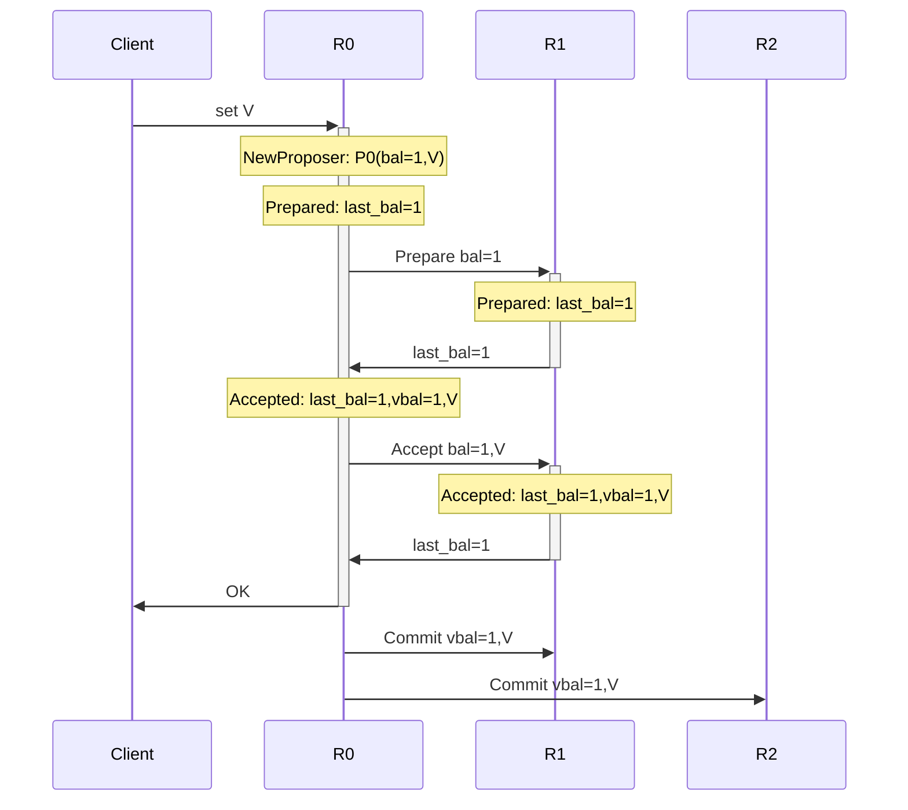
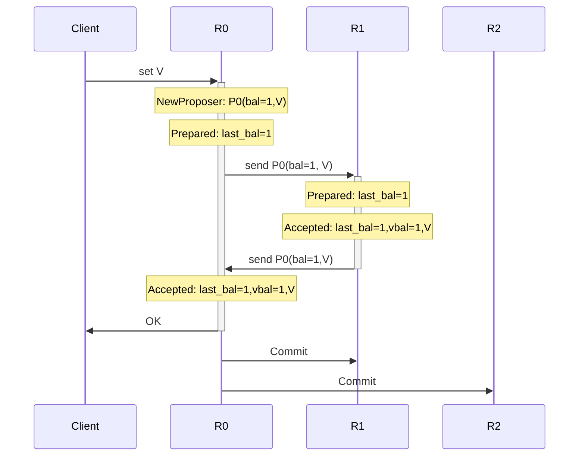
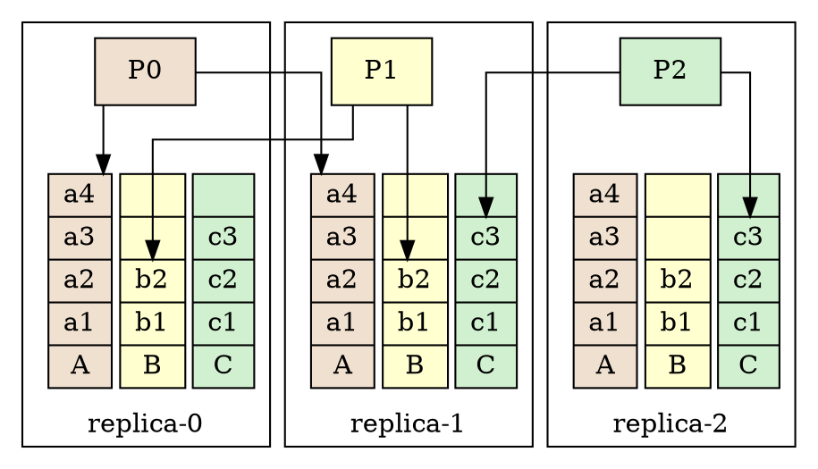
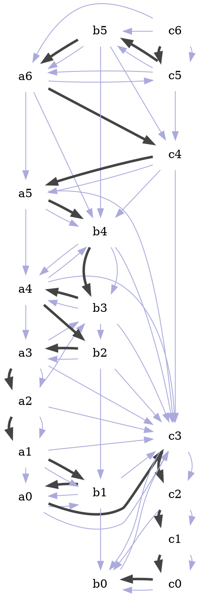
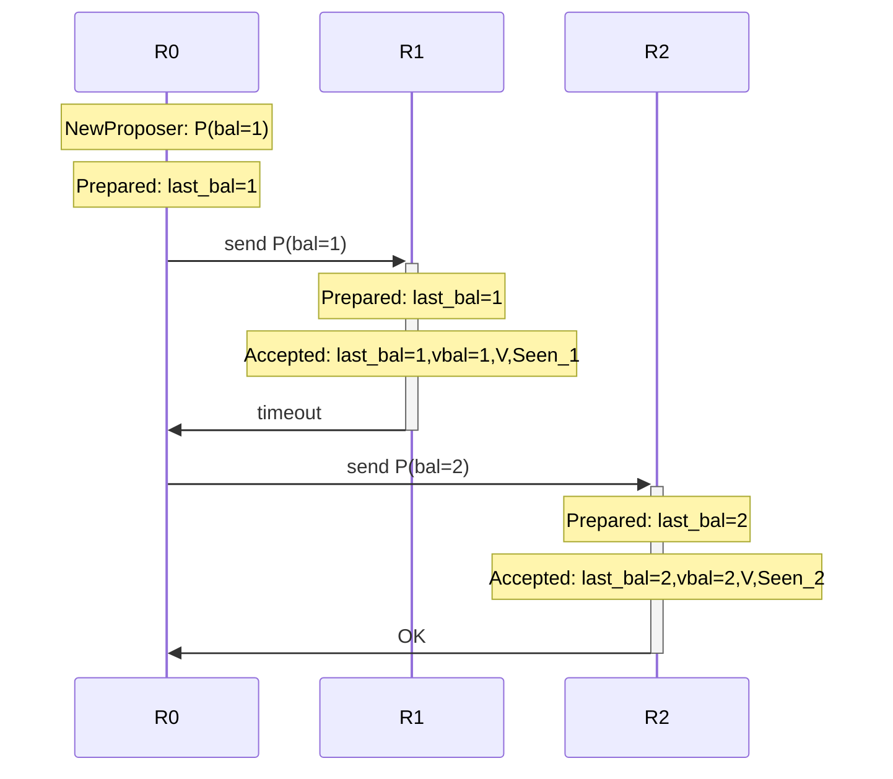

# Background

[200行代码实现paxos-kv][post-paxoskv]
中介绍了一款非常简洁的分布式kv存储实现, 它是基于 [classic-paxos][ref-classic-paxos]
实现分布式一致性. 在 [paxos的直观解释][post-paxos] 中我们提到, 每次写入, 也就是每个 paxos 实例需要2轮 RPC 完成, 效率低.

一个常见的优化就是 mutli-paxos(或raft), 用一次 RPC 对多个实例运行 phase-1;
再对每个实例分别运行 phase-2, 这样均摊开销是一次 RPC 完成一次写入.
它通过 phase-1 在集群中确定了一个唯一可写的 leader.
这种设计在跨机房(或跨云)部署的环境中的缺陷是:
异地机房的写入就需要2个 RTT 才能完成:

`client → leader → followers → leader → client`

也就是说它无法做到 **异地多活**, 在3节点的场景里, 有 `2/3` 的写入效率降低到2 个 RTT.

本文从另一角度出发来解决异地多活的问题, 3机房部署的3副本集群中:
- 任一节点都可写,
- 任一笔写入都可以严格在1个 RTT 内完成.

这就是今天要介绍的 
[200行代码实现paxos-kv][post-paxoskv]
的改进版: mmp-3: multi-master-paxos 3副本实现.

同样 show me the code 的原则不能变: 本文实现的3节点多活代码在: [mmp3][repo-mmp3]

> 异地多活是目前分布式领域越来越被重视的一个问题, 机房正在变成单机,
> 单机房多机分布式在现在大规模部署的业务中已经满足不了业务的可用性需求了.
>
> 几乎所有线上环境部署的分布式存储, 都需要跨机房(或者跨云)的部署.
> 而大家也积极在解决这些问题:
> - 或者用队列等最终一致性的手段来完成跨机房的复制, 这样会产生数据不一致, 2条互相冲突的数据可能同时被写入; 业务层需要参与解决这类冲突.
> - 或者将数据做拆分, 将在A地写入多的分配到A机房为 leader 的 sharding , 将B地写入较多的数据分配到B机房为 leader 的 sharding .
> - 或者一个机房为主: 部署2个副本, 另一个机房部署1个副本来形成3副本的集群, 这样实际上A机房故障会导致全局不可读写, B机房只能提供额外的数据冗余, 无法提供更多的数据可用性.


> paxos 在集群较小时可以通过定制 paxos 来完成1个 RTT 的写入,
> 如果使用 [majority-quorum][post-quorum], 最多支持5个副本的多活.
>
> 在 epaxos 定义的多活设计, 简单介绍了3节点的设计, 但并没有给出实现的细节,
> 其中各种冲突的处理以及修复的流程并没有明确的定义.
>
> - 同时 epaxos 的 apply 算法存在不可解决的 livelock 问题:
>   通过 SCC 来确定 instance 顺序无法保证在有限时间内结束.
>
> - 另外 epaxos 的设计中缺少一个 rnd 记录( paxos 中的 last-seen-ballot 或 vbal),
>   导致其一致性实现是错误的.
>
> - 以及 instance 之间的依赖关系会在修复过程中产生不一致的问题.
>
> - epaxos 需要另外一个seq来确定 instance 之间的顺序, 在 mmp3 的设计中, seq 是不必要的,
>   只需依赖关系就可以确定确定的 apply 顺序.

# Multi master paxos - 3

我们从 classic-paxos 出发来分析问题.

> xp的tips: 要实现一个稳定的分布式系统, 最好用 raft, 因为开箱就用.
> 要学习分布式系统, 最好从 paxos 开始.
> raft 看似简单的设计 隐藏了一些隐晦的条件, 其正确性的证明要比 paxos 复杂.

我们需要达到2个目的:
- 1个 RTT 完成一次commit.
- 3个节点同时无冲突写.

# 1 RTT 的 classic- paxos

如果 classic-paxos 不需要2个 RTT,
我们就不需要 multi-paxos 或 raft 这些东西来优化延迟了.

在3节点的系统中, 这是可以实现的.

首先做一些基础的设定: 一个 replica 在系统中是一个replica(或叫作server或node), 它同时是 proposer 和 acceptor.
一个 replica 接受到一个写入请求时, 它就用本地的 proposer 来完成提交.


## 回顾 classic paxos

[200行代码实现paxos-kv][post-paxoskv] 介绍的 classic-paxos 写入流程如下,
replica-0 上的 proposer P0, 顺次完成 phase-1, phase-2 和 commit:



🤔
思考以上过程...

## 优化 classic paxos 为 1个 RTT

因为 proposer 本身只是一个数据结构, 在 paxos 中, 它不需要跟 acceptor 有什么绑定关系,
所以, 我们可以**让 proposer 运行在任何一个 replica 上**:
把 proposer 发到另一个 replica 上运行, 
这样消息的传输就可以转变成 proposer 的传输.

要达到 paxos 要求的 2/3的多数派,
也只需要将 proposer 发到另外一个 replica, 
因为这个 proposer 永远只有1个实例, 所以不会出现不一致(proposer 或者在R0上工作或者在在R1上工作).

> 如果要将 proposer 发到 2个 replica 就会复杂一些, 例如5节点中 quorum=3, 2个不同的 proposer
> 可能会尝试使用不同的值.

通过发送 proposer 的方式, paxos 可以被优化成如下的1 RTT实现: P0 在 R1
上顺次执行 phase-1 和 phase-2, 然后再被送会R0:



> 在传输 proposer 的过程中, 区别于原始 paxos 的是: 往返两个过程都要包括 proposer 的完整信息:
> - R0 到 R1 的过程中, 要带上用户要提交的值, 以便在 R1 上 Prepare 成功后直接运行 Accept;
> - R1 到 R0 的过程中, 要带上 R1 的 Prepare 和 Accept 的执行结果.


这样一轮 RPC 后, R0 和 R1 就可以形成多数派, 然后 R0 可以直接 commit.

注意, 这个模型中, 除了 proposer 的位置变化了, 跟 classisc-paxos 没有任何区别!
也就是说, 任何 paxos 能完成的事情它都可以完成.

现在我们完成了第一个任务.
如果以此模型来重写 [200行代码实现paxos-kv][post-paxoskv],
可以在3副本系统上实现1 RTT提交, 但多写入点依然会有冲突,
例如 R0 和 R1 同时发起同一个paxos instance的写入, R0 在收到发送回来的 P0 后,
可能就会发现本地的 instance 已经被 P1 以更高的 ballot 覆盖了, 要重新提升P0
的ballot再重试.

这就是我们要解决的第二个问题: 避免不同 replica 的写入冲突.


# Multi column log

2个 replica 同时写一个 instance 产生活锁, 导致无法保证1个 RTT 完成写入.
要避免冲突, 我们就需要让每个 replica 不能产生互相冲突的 instance,
**所以给每个 replica 分配 instance 的空间要分开**.

在 mmp3 的实现中, 有3个replica 就需要有3列 instance , 每个 replica 只写其中一列.



例如:
- R0 维护一个 proposer P0, 不断的运行 paxos 在每个 replica 上 column `A` 的 instance,
- R1 维护 proposer P1, 只写每个 replica 上的 column `B` 列的 instance.

> 这种结构有点类似于 3 个标准的 raft 组, 每组都部署在3个replica上, 第i组的raft的leader就是R[i]

这样, 因为没有 instance 冲突, 所以不论任何一个 replica 上收到的写请求, 都只需 1个 RTT 完成 instance 的提交.

但是!

这3列的 instance 目前还是**无关**的, 要想将 instance 应用到 state machine, 所有 replica 上的 instance 都必须以相同的顺序 apply.
(不像 raft 里的 instance 是简单的单调递增的, 只要保证 instance 一致, apply 的顺序就一致).

因此在 mmp3 中, 除了 instance 内容一致外, 还需要额外增加每列 instance 之间的约束,
来保证 apply 顺序一致. 3个 column 中的 instance 之间是一种(较弱但一致的) 拓扑顺序, 因此在 mmp3 中,
paxos 要确定的值(Value)包括2个:
- 用户要提交的数据: 一条操作 state machine 的日志: instance.Val,
- 还需要确定这个 instance 与其他 instance 的关系**.


## 使用 paxos 确定 instance 之间的关系

这个**关系**我们描述为: 一个 instance `X` 看到了哪些其他 instance: 用 `X.Deps` 来表示, 用它来确定 instance 之间的 apply 的顺序:

> 例如在单机系统中, 并发写入3条数据a, b, c, 可以这样确定 a, b, c 的顺序:
> **如果 a 写入时没有看到 b ,那么 a 就在 b 之前运行**.
> 所以可见性就表示了 instance 之间的顺序.
>
> 当然这个思路在分布式系统中要复杂一些, 因为多个 replica 之间没有单机中的锁的保护,
> 多个 replica 上同一个 instance 看到的其他 instance 也可能不一样.

最终 mmp3 中的 instance 数据结构相比 classic-paxos, 多了一个`Deps`字段:
-  instance.Deps: 看到了哪些其他的 instance.

```proto
message Ins {
    InsId          InsId

    Cmd            Val
    repeated int64 Deps // <--

    BallotNum      VBal // <--
    bool           Committed
}
```

`Deps` 的实现包括以下步骤的变化:

## Proposer 选择 Deps 的值

在上面 1-RTT 的 classic-paxos 基础上:

- 在初始化 instance X 的时候(也就是创建`X`后, 在本地replica执行prepare的时候),
  将当前 replica 上所有知道其存在的 instance 集合初始化为`X.Deps`(包括 replica 上能看到的所有 instance, 以及这些 instance
  看到的 instance, 虽然间接看到的 instance 可能不存在于当前 replica),

- 执行 accept 的时候, 最终`X.Deps`的值为2次 prepare 获得的`Deps`的**并集**作为 accept 的值.

例如 instance `a4`, 在创建它的 replica 上和被复制到的另一个 replica 上分别看到
`b2, c2` 和 `b1, c3`, 对应得到的2个 `a4.Deps` 分别是:
`[4, 2, 2]` 和 `[4, 1, 3]`:

```graphviz
digraph seen
{

    size="5,5";
    dpi=100;

    layout=dot
    rankdir=LR;
    ranksep=0.1;
    splines=ortho;

    nodesep=0.04;
    labelloc = "t"
    node [shape=plaintext, style=filled]
    node[width=0, height=0];
    node [shape=rect]
    edge[minlen=1]


    edge [weight=1000 style=invis color=dimgrey]

    e004 -> e014 -> e024 -> s04 -> e104 -> e114 -> e124
    e003 -> e013 -> e023 -> s03 -> e103 -> e113 -> e123
    e002 -> e012 -> e022 -> s02 -> e102 -> e112 -> e122
    e001 -> e011 -> e021 -> s01 -> e101 -> e111 -> e121

    rank=same {e004 -> e003 -> e002 -> e001}
    rank=same {e014 -> e013 -> e012 -> e011}
    rank=same {e024 -> e023 -> e022 -> e021}

    rank=same {e104 -> e103 -> e102 -> e101}
    rank=same {e114 -> e113 -> e112 -> e111}
    rank=same {e124 -> e123 -> e122 -> e121}


    e004 [label=a4, fillcolor="#ffe0d0"]
    e003 [label=a3, fillcolor="#ffe0d0"]
    e002 [label=a2, fillcolor="#ffe0d0"]
    e001 [label=a1, fillcolor="#ffe0d0"]

    e014 [label=b4, fillcolor="#ffffd0"]
    e013 [label=b3, fillcolor="#ffffd0"]
    e012 [label=b2, fillcolor="#ffffd0"]
    e011 [label=b1, fillcolor="#ffffd0"]

    e024 [label=c4, fillcolor="#d0ffd0"]
    e023 [label=c3, fillcolor="#d0ffd0"]
    e022 [label=c2, fillcolor="#d0ffd0"]
    e021 [label=c1, fillcolor="#d0ffd0"]


    e104 [label=a4, fillcolor="#ffe0d0"]
    e103 [label=a3, fillcolor="#ffe0d0"]
    e102 [label=a2, fillcolor="#ffe0d0"]
    e101 [label=a1, fillcolor="#ffe0d0"]

    e114 [label=b4, fillcolor="#ffffd0"]
    e113 [label=b3, fillcolor="#ffffd0"]
    e112 [label=b2, fillcolor="#ffffd0"]
    e111 [label=b1, fillcolor="#ffffd0"]

    e124 [label=c4, fillcolor="#d0ffd0"]
    e123 [label=c3, fillcolor="#d0ffd0"]
    e122 [label=c2, fillcolor="#d0ffd0"]
    e121 [label=c1, fillcolor="#d0ffd0"]


    s04 [style=invis]
    s03 [style=invis]
    s02 [style=invis]
    s01 [style=invis]

    // replica-1 Deps

    e004 [fillcolor="#a0b0e0"]
    e012 [fillcolor="#a0d0f0"]
    e022 [fillcolor="#a0d0f0"]

    e014 [style=invis]
    e013 [style=invis]
    e024 [style=invis]
    e023 [style=invis]

    edge [style="", arrowhead=none]
    e004 -> e012 -> e022[weight=0]

    // replica-2 Deps

    e104 [fillcolor="#a0b0e0"]
    e111 [fillcolor="#a0d0f0"]
    e123 [fillcolor="#a0d0f0"]

    e114 [style=invis]
    e113 [style=invis]
    e112 [style=invis]
    e124 [style=invis]

    edge [style="", arrowhead=none]
    e104 -> e111 -> e123[weight=0]
}

```



那么 `a4` 将用来运行 accpet 的 `Deps` 值就是 `[4, 2, 3]`:

```graphviz
digraph seen
{

    size="5,5";
    dpi=100;

    layout=dot
    rankdir=LR;
    ranksep=0.1;
    splines=ortho;

    nodesep=0.04;
    labelloc = "t"
    node [shape=plaintext, style=filled]
    node[width=0, height=0];
    node [shape=rect]
    edge[minlen=1]


    edge [weight=1000 style=invis color=dimgrey]

    e004 -> e014 -> e024
    e003 -> e013 -> e023
    e002 -> e012 -> e022
    e001 -> e011 -> e021

    rank=same {e004 -> e003 -> e002 -> e001}
    rank=same {e014 -> e013 -> e012 -> e011}
    rank=same {e024 -> e023 -> e022 -> e021}

    e004 [label=a4, fillcolor="#ffe0d0"]
    e003 [label=a3, fillcolor="#ffe0d0"]
    e002 [label=a2, fillcolor="#ffe0d0"]
    e001 [label=a1, fillcolor="#ffe0d0"]

    e014 [label=b4, fillcolor="#ffffd0"]
    e013 [label=b3, fillcolor="#ffffd0"]
    e012 [label=b2, fillcolor="#ffffd0"]
    e011 [label=b1, fillcolor="#ffffd0"]

    e024 [label=c4, fillcolor="#d0ffd0"]
    e023 [label=c3, fillcolor="#d0ffd0"]
    e022 [label=c2, fillcolor="#d0ffd0"]
    e021 [label=c1, fillcolor="#d0ffd0"]


    // replica-1 Deps

    e004 [fillcolor="#a0b0e0"]
    e012 [fillcolor="#a0d0f0"]
    e023 [fillcolor="#a0d0f0"]

    e014 [style=invis]
    e013 [style=invis]
    e024 [style=invis]

    edge [style="", arrowhead=none]
    e004 -> e012 -> e023[weight=0]
}
```



> classic-paxos 中要求 prepare 阶段看到的已存在的值要使用,
> 而 mmp3 中将所有 prepare 阶段看到的 `Deps` 的值做了并集, 
> 实际上并没有破坏 paxos 的约束,
> 只不过 classic-paxos 假设它的**值**是任意的, 不一定可取并集,
> mmp3 中可以把 prepare 过程中看到的 `Deps` 的值认为是 `VBal` 为 0 的一个值,
>
> 读者可以自行验证, 它不会破坏 classic-paxos 要求的任何约束.

因为 `X.Deps` 的值的确定也通过 paxos,
所以可以保证每个 replica 上的每个 instance 最终提交的 `Deps` 都是一致的.

这时再通过一个确定的算法使用每个 instance `Deps`的值来决定 apply 的顺序,
就可以保证多个 replica 上的 state machine 最终状态一致.

以上两点满足了 apply 算法的第一个要求: **Consistency**.
此外, apply 的顺序还需提供另外一个保证 **Linearizability**, 即:
如果 propose A 发生在 commit B 之后, 那么 A 应该在 B 之后apply.

这是一个直觉上的要求: 如果一个命令 `set x=1` 发给存储系统并返回OK(committed),
那么这之后发给存储的 `get x` 命令, 应该一定能看到`x=1`的值.

> 实际上xp认为在分布式系统全局范围内使用绝对时间的先后并不是一个理性的选择.
> 不过它更容易被业务使用.

接下来我们设计一个算法来满足**Linearizability**的要求:


# Apply 算法: 有环有向图中节点的定序

## Interfering instance

mmp3 中设定: 任意2个 instance 都是 interfering 的,
即, 交换2个 instance 的 apply 顺序会导致结果不同(虽然可能是可以互换顺序的).

> epaxos 中认为 set x=1 和 set y=2 这2个 instance
> 可以互换顺序, 因为x的值跟y的值无关,
> 但 set x=y 和 set y=2 这2个 instance 不能互换顺序 apply, 因为顺序的变化会产生不同的x的结果.
> 也是因为 epaxos 需要通过减少 interfering 的数量来实现1个 RTT, 所以才有了这个设计.

在3 replica 的系统中,  **mmp3 有无冲突都只需要1个 RTT**, 所以我们可以无需担心
interfering 的 instance 的冲突带来的另一个RTT开销.
只需假设任意2个 instance 都是 interfering 的, 这样反倒能简化问题.


## Lemma-0: instance 之间的依赖关系

定义 A 依赖 B, 即  `A → B` 为: `A.Deps ∋ B`.

因为 mmp3 假定任意2个instance都是interfering的,
并且2个 instance 提交的 quorum 必然有交集,
所以任意2个 instance 之间至少有一个依赖关系, 即, A, B之间的关系只可能是:

- A → B
- B → A
- A ↔ B

> 依赖关系构成一个可能带环的有向图, 例如按照以下时间顺序执行:
> - R0 propose a1, a1.Deps = [1, 0, 0],
> - R1 propose b1, b1.Deps = [0, 1, 0],
> - R0 send a1 to R1, a1.Deps = [1, 1, 0]
> - R1 send b1 to R0, b1.Deps = [1, 1, 0]
> - R0 commit a1
> - R1 commit b1
> 
> 这样 a1 ∈ b1.Deps 且 b1 ∈ a1.Deps

依赖关系很直观, 这个依赖关系的图中,
我们将试图寻找一个有限大小的集合来实现一个有效的 apply 算法.


## Lemma-1: 用Deps确定Linearizability

首先我们有一个小结论:

**如果 A 在 B commit 之后被 propose, 那么一定有 A.Deps ⊃ B.Deps**.

因为 B 如果 commit 了,
那么 `B.Deps`, 也就是 B 看到的所有其他 instance 的 id 集合, 就已经复制到了某个 quorum.
那么 A 在运行 paxos 的时候,一定会看到 B commit 的 `B.Deps` 的值.

又因为 `A.Deps` 是2个在 prepare 阶段看到的 `Deps`的值的并集, 
因此 `A.Deps` 一定包含全部 `B.Deps` 的instance.


于是实现 apply 算法的思路就是:

- 如果 A.Deps ⊃ B.Deps, 先 apply B, 即可以保证Linearizability.
- 其他情况下, 选择何种顺序都不会破坏 Linearizability,
  所以 mmp3 中使用 instance 的 (columnIndex, index) 的大小排序来确定 apply 顺序.

> epaxos 提供了一种简单粗暴的方法来在有环图中确定 apply 顺序:
> 从图中一个节点出发:
> 找到最大连通子图(Strongly-Connected-Component or SCC)(没有出向边的一个节点也是一个SCC),
> 然后按照节点, 也就是 instance 的某个属性(例如epaxos中使用(seq, instanceId)) 来排序一个SCC中的节点, 再按顺序 apply.
>
> epaxos 的 SCC 算法有个问题, 就是一个 SCC 可能无限增大, 例如 A commit
> 之前有另一个interfering 的 instance B 被 propose, 然后 B commit
> 之前又出现interfering 的 instance C...,
>
> 那么 epaxos 的做法就无法保证在有限时间内找出 SCC.
>
> epaxos 建议中断一小段时间的新 instance 的 propose 来断开 SCC,
> 这也是不容易实现的, 因为必须在n-1个 replica 同时中断才有效.
> 只要有2个 replica 在持续的写入新 instance, 那么就有可能造成无限大的 SCC.


## Lemma-2: 不需要 SCC

第2个小结论:

**如果 A, B不属于同一个 SCC, 即, A ∈ SCC₁ B ∉ SCC₁, 那么**:
- **A → B ⇒ A.Deps ⊃ B.Deps**.
- **B → A ⇒ B.Deps ⊃ A.Deps**.

因为根据 Lemma-0,
任意2个 instance 至少有一个依赖关系,
如果X ∈ B.Deps 且 X ∉ A.Deps,
那么必然有 X → A, 导致 A → B → X → A 成为一个SCC.

因此, **不论A, B是否在一个 SCC 中, 保证 Linearizability
的条件都可以用 Deps 来确定, 
所以我们的算法不必寻找 SCC , 只需遍历依赖关系**.


## 减小遍历数量: 只需考虑最老的 instance

以上 apply 算法还可以进一步优化为最多只考虑3个 instnace 的方式:

假设 a1, a2 是 column-A 上相邻的2个 instance, 那么一定有 `a1 ∈ a2.Deps`.
根据 apply 算法设计, `a1.Deps ⊃ a2.Deps` 一定不成立, a2 一定不会在 a1 之前 apply:
- 如果 a1 不依赖 a2, a1 一定先apply,
- 如果 a1 依赖 a2, 但 a1 的 `(a3.columnIndex, a3.index)` 较小, 所以 a1 也一定会在 a2 之前apply.

因此只需考虑每个 column 上最老的一个未 apply 的 instance 就可以找出下一个 apply
的 instance.
在 mmp3 中, 最多有3个(但算法本身不限于3).


## Lemma-3: Deps 集合数量来决定 Linearizability

定义一个依赖数量:
**|X.Deps| 为 X 依赖的, 未 apply 的 instance 的所在 column 的数量**.

例如: a3.Deps = [3, 2, 2]:
- 如果完成 apply 的 instance 是 [2, 1, 1], 即 a1, a2, b1, c1,
  那么此时a3在3个 column 上都依赖一个未 apply 的 instance: `|a3.Deps|=3`.

- 之后如果c2 被 apply 了, 那么`|a3.Deps| = 2`.

```graphviz
digraph seen
{

    size="10,10";
    dpi=100;

    layout=dot
    rankdir=LR;
    ranksep=0.1;
    splines=ortho;

    nodesep=0.04;
    labelloc = "t"
    node [shape=plaintext, style=filled]
    node[width=0, height=0];
    node [shape=rect]
    edge[minlen=1]
    graph [labelloc = "b" ];


    edge [weight=1000 style=invis color=dimgrey]

    e004 -> e014 -> e024
    e003 -> e013 -> e023
    e002 -> e012 -> e022
    e001 -> e011 -> e021
    e000 -> e010 -> e020

    rank=same {e004 -> e003 -> e002 -> e001 -> e000}
    rank=same {e014 -> e013 -> e012 -> e011 -> e010}
    rank=same {e024 -> e023 -> e022 -> e021 -> e020}


    e004 [label=a4, fillcolor="#ffe0d0"]
    e003 [label=a3, fillcolor="#ffe0d0"]
    e002 [label=a2, fillcolor="#ffe0d0"]
    e001 [label=a1, fillcolor="#ffe0d0"]

    e014 [label=b4, fillcolor="#ffffd0"]
    e013 [label=b3, fillcolor="#ffffd0"]
    e012 [label=b2, fillcolor="#ffffd0"]
    e011 [label=b1, fillcolor="#ffffd0"]

    e024 [label=c4, fillcolor="#d0ffd0"]
    e023 [label=c3, fillcolor="#d0ffd0"]
    e022 [label=c2, fillcolor="#d0ffd0"]
    e021 [label=c1, fillcolor="#d0ffd0"]

    e000 [label="A"]
    e010 [label="B"]
    e020 [label="C"]


    // next apply:

    e003 [fillcolor="#a0d0f0"]
    e012 [fillcolor="#a0d0f0"]
    e022 [fillcolor="#a0d0f0"]

    // applied:

    e002 [fillcolor="#90a0d0"]
    e001 [fillcolor="#90a0d0"]
    e011 [fillcolor="#90a0d0"]
    e021 [fillcolor="#90a0d0"]

    edge [style="", arrowhead=none]
    e003 -> e012 -> e022[weight=0]

}
```



这里可以清楚的看到一个结论:
`A.Deps ⊃ B.Deps ⇒ |A.Deps| > |B.Deps|`.


最终 apply 算法为:

**找到一个 column 上下一个已 commit, 未 apply 的 instance X,
遍历`X.Deps`, 得到未遍历过的 column 上的最老的未 apply 的 instance,
遍历结束后, 选择(|X.Deps|, X.columnIndex) 最小的一个apply 到 state machine**.

下次再 apply 时, 重新构造这个图, 找到第二个要执行的 instance.

> 必须重新遍历, 因为之前排序第2的 instance, 在新加入一个 instance 之后可能还是第2.

这样, 每个 replica 上, committed 的 instance 的 Deps 值都一样,
最老的3个 instance 构成的依赖图也都一样,
于是找出第1个 apply 的 instance 也一样,
重复这个步骤, 找出的第2个 apply 的 instance 也一样...
最终每个 replica 上的 state machine 达到一致的状态, 保证了 **Consistency**.


## Apply 执行的例子


例如以下 20 个 instance 的 Deps 关系是一个有向图, 最终生成的 apply
顺序是一个单向路径:




# RPC的超时重试

paxos 假设工作在一个网络不可靠的环境中, 在标准的实现中, 如果某个请求超时,
理论上应该进行重试. mmp3 的运行环境假设与 classic-paxos 一样, 也需要对超时重试.
这里跟 classic-paxos 有一点差别, 就是**重试时必须提升自己的 BallotNum**,
重新在本地执行 prepare, 再用新的 BallotNum 重发RPC.

这是因为 prepare 过程中, 在每个 replica 上得到的 `Deps` 的值可能不同.

例如R0 propose 的 instance X, 在 R1 和 R2 上的 prepare 后,
可能会分别得到不同的`X.Deps`的值(2个replica包含的instance不同).
使用同一个 BallotNum 无法区分哪一个才是最新的值.
重试提升BallotNum, 才能保证最后被确定的值能被识别出来.

一个修复进程(例如R0宕机后, R1或R2都可以重新运行 paxos 进行修复), 在R1 和 R2上看到2个不同 BallotNum 的 X,
那么说明较小 BallotNum 的 `X` 没有成功返回应答给 R0, R0 放弃了它, 并进行了重试.
这时只需考虑较大 BallotNum 的 instance , 它是唯一可能被 R0 commit 的.

以下是重试过程:




# recovery

上面提到的重试机制为正确的recovery做好了准备:
当 R0 发起一轮 paxos 后并宕机了, R1 或 R2 都可以通过超时检查来发现这个问题并修复未 commit 的 instance .
要修复的内容依旧是2个:  instance 要执行的命令 Val , 以及 instance 看到哪些其他的 instance: Deps.

因为这2个值都是通过 classic-paxos 来确立的, 修复过程也很简单, 提升 BallotNum 再运行一次 paxos 就可以了.
相当于将 R0 的leadership 抢走赋予给了另一个 replica.


# 代码和测试

git repo [mmp3][repo-mmp3] 是一份本文介绍的 multi-master 的三副本实现(mmp3 分支),
其中主要的 server 端 instance 提交的逻辑实现在`mmp.go`,
apply 算法实现在`apply_*`中.

代码中除了基本的单元测试, 最主要的是:
`Test_set_get` 对一个三副本集群进行随机读写压测,
这个测试中模拟发送和接受的网络错误(各20%几率), 在这种情况下, 检查:
- 全部写请求都提交
- 3个 replica 的 instance 一致
- 3个 replica 上 apply 顺序一致, 以及最终 state machine 中的状态一致.


# Limitation

mmp3 设计上只支持3节点系统, 其次这个实现中不包含成员变更实现.


# 总结

mmp3 是一个完全对等的设计实现的multi-master consensus.
之前在试图基于 epaxos 实现一个 multi-master 的存储,
中间却发现几处不易修复的问题(开始还有几个容易修复的问题),
于是打算自己设计一套.


期待与对这个方向感兴趣各路神仙交流蛋逼~
