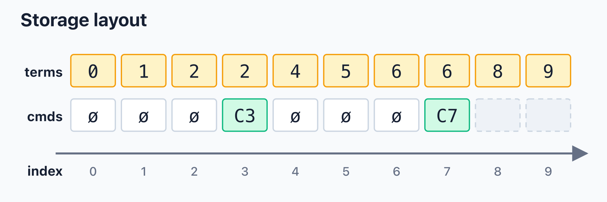
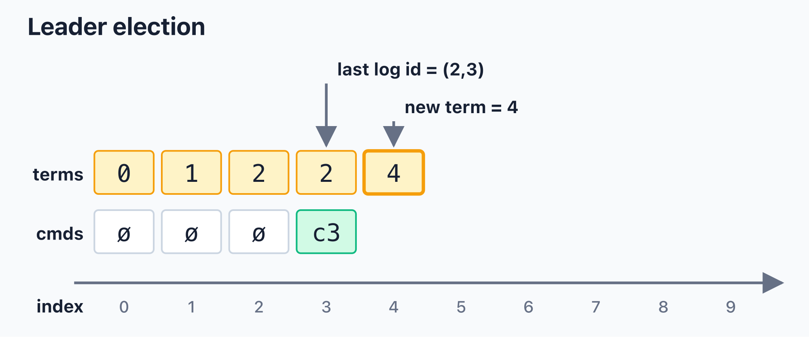
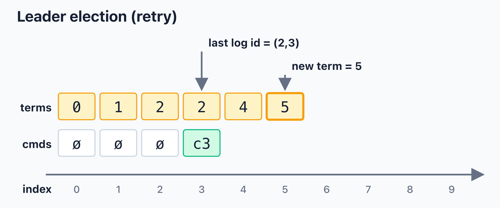
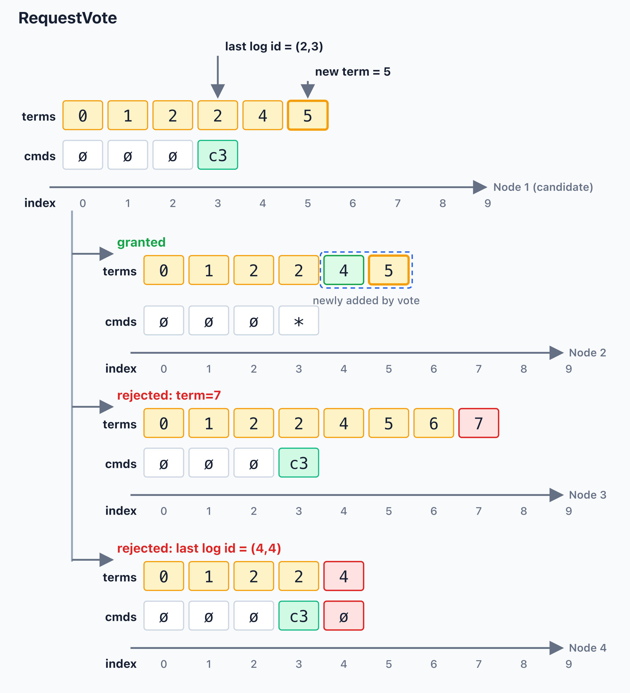
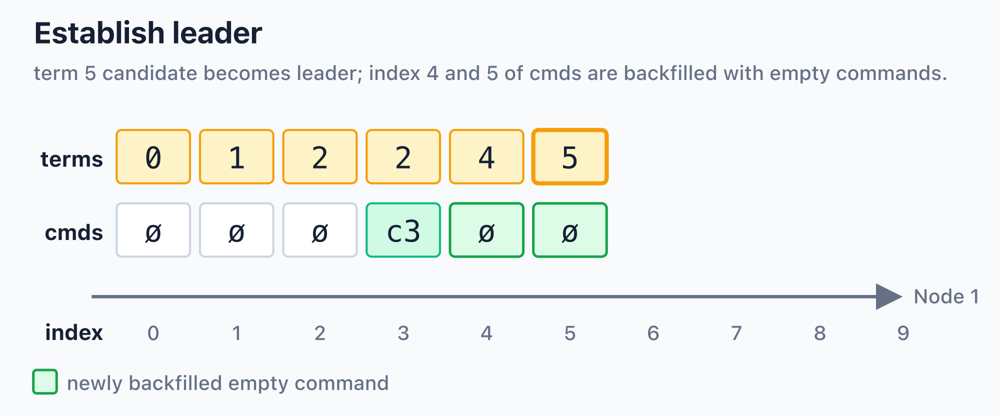
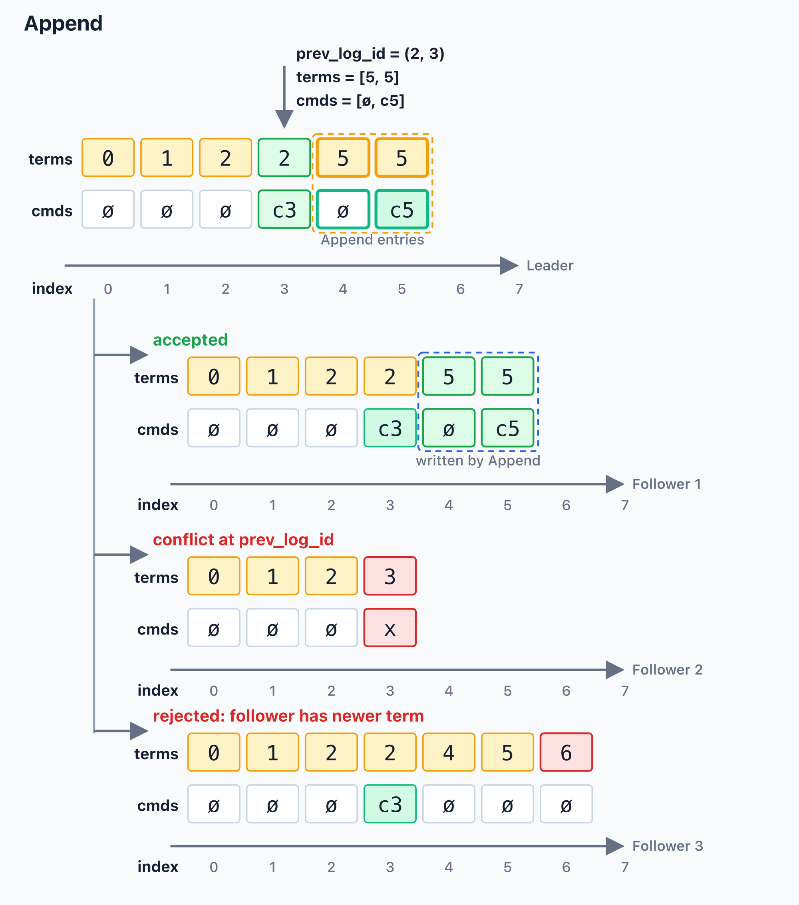
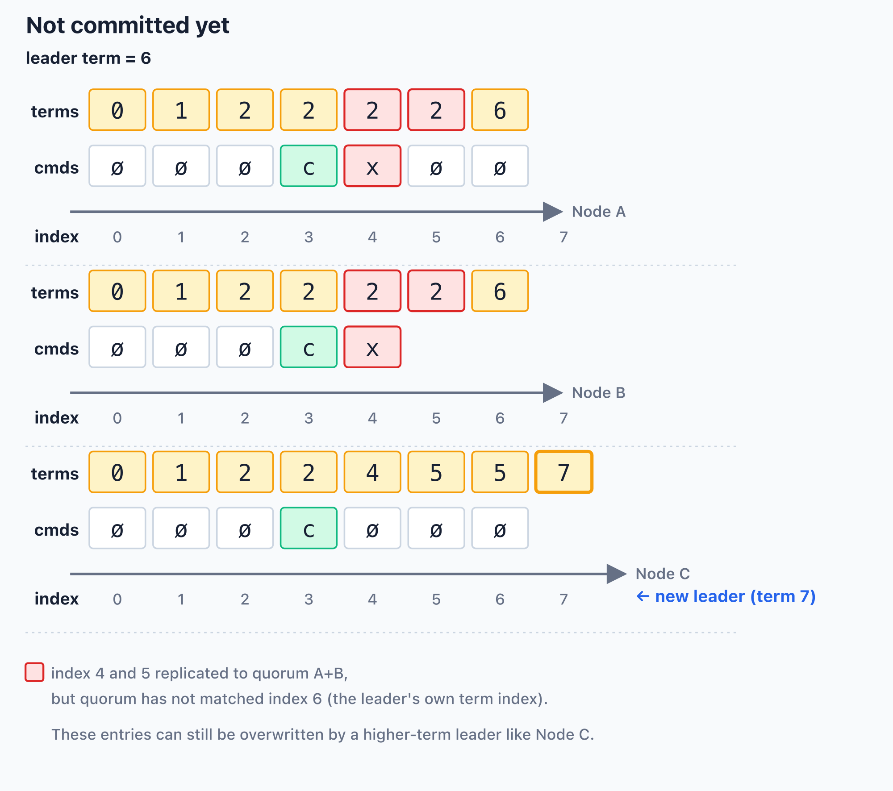

> 摘要：`raf: Raft without [T]erm` 是一个实验性的 Raft 变体。它不再单独持久化 `currentTerm`，而是让 candidate 在发起 election 时占用一个 log index，并把这个 index 作为 leader term。这样做不会取消 Raft 的逻辑时间模型，而是简化了 term 在存储中的来源。

> 声明：这篇文章的想法来自 Zhang Yanpo，代码由 Zhang Yanpo 古法编程实现，文章由 Codex 起草并改进。

代码仓库：[raf][]（`v0.1.0`）。

## 导读

我之前看到过一些有趣的提议，想把 Raft 里的 term 去掉。这个想法很吸引人：如果一个共识协议能少维护一份持久化状态，它的模型和实现也许都会更简单。但 Raft 的 term 并不是普通的计数器，它承担着逻辑时间、leader 新旧判断和 log 安全提交的角色。因此，真正的问题不是能不能直接删除 term，而是能不能换一种方式来表达它。

`raf` 的名字来自 `Raft without [T]erm`。这里的 “without term” 不是说协议里完全没有 term，而是不再把 `currentTerm` 作为独立字段持久化。这个仓库想把这个想法认真落成一个尽量正确的实现：不单独保存 `currentTerm`，但仍然让 Raft 需要 term 的地方有一个可靠的逻辑时间来源。

这篇文章解释的就是这个核心想法：term 作为概念仍然存在，log 仍然用 `(term, index)` 比较新旧，但 term 不再来自独立递增的持久化计数器，而是来自一次 election 占用的 log index。这个实现的目标不是证明自己和标准 Raft 在所有工程行为上完全等价，而是观察这种 storage 表达是否仍能保留 Raft 最重要的安全直觉。

后文会依次介绍 storage 模型、election、replication、commit，以及仓库里的三节点示例。本文假设读者已经了解 Raft 的基本流程，包括 leader election、AppendEntries、quorum commit 和 `(term, index)` 形式的 log id。

## 为什么 term 不能消失

在共识算法里，log 表示已经发生或将要发生的事件，term 表示这些事件所属的逻辑时间。

标准 Raft 用 term 来解决以下问题：

- leader election 先推进 term，再选择 leader。term 表示 leader 的先后顺序.
- 基于上一点, log 比较先后时, 先比较所属的 term，再比较 index。
- leader 只能在自己的 term 内安全地推进 commit。

这个 term 与 Paxos 里的 ballot number 扮演的是类似角色。它让系统可以在不知道所有节点完整 log 的情况下，仍然判断哪个历史更新、更有资格成为 leader。

简单来说: **Log index 表示本地事件位置；term 表示跨节点比较历史时使用的逻辑时间**

`raf` 保留 term 这个概念，但省去了它的存储。

## 实现思路

标准 Raft 通常会持久化类似下面的状态：

```rust
struct StandardRaftStorage {
    current_term: Term,
    voted_for: Option<NodeId>,
    log: Vec<LogEntry>,
}

struct LogEntry {
    term: Term,
    cmd: Cmd,
}
```

`raf` 把持久化状态压成两段按 log index 对齐的 `Vec`：

```rust
struct RafStorage {
    terms: Vec<Term>,
    cmds: Vec<Cmd>,
}
```

其中：

- `terms[i]` 是 index `i` 这条 log entry 的 leader term。
- `cmds[i]` 是 index `i` 这条 log entry 的应用命令。
- `log_id(i)` 仍然是 `(terms[i], i)`。

下面是一段可能出现的存储状态。`ø` 表示 empty command；`cmds` 只到 index `7`，所以 index `8` 和 `9` 还不是完整 log entry。

<!-- [ASCII source](assets/storage-layout.txt) -->



逐个 index 看，这段状态表示：

- index `0`：固定存在的默认项。`terms[0] = 0`，`cmds[0]` 是 empty command。
- index `1`：term `1` 对应的一次成功 election。这个 leader 当选时占用 index `1`，并写入第一条 empty command。
- index `2`：term `2` 对应的一次成功 election。新的 leader 占用 index `2`，第一条 log entry 同样是 empty command。
- index `3`：term `2` 的 leader 写入的一条业务 log entry `C3`，所以 `terms[3] = 2`，`cmds[3] = C3`。
- index `4`：term `4` 对应的一次 election attempt，但没有形成 established leader。后来 term `6` 的 leader 建立时，为了让 `cmds` 追上 `terms`，这里被补成 empty command。
- index `5`：term `5` 对应的一次 election attempt，同样没有形成 established leader；后来也被补成 empty command。
- index `6`：term `6` 对应的一次成功 election。这个 leader 当选时占用 index `6`，并写入第一条 empty command。
- index `7`：term `6` 的 leader 写入的一条业务 log entry `C7`，所以 `terms[7] = 6`，`cmds[7] = C7`。
- index `8`：term `8` 对应的一次新的 election attempt。当前只看到 `terms[8] = 8`，还没有对应的 command，因此它还不是完整 log entry。
- index `9`：term `9` 对应的另一次 election attempt。和 index `8` 一样，当前只有 term 记录，还没有对应的 command，是否最终形成 leader 还不能从这段状态判断。


_标准 Raft 持久化独立的 `current_term` 和一个 `(term, command)` 的数组作为 log entries；`raf` 类似, 但把每个 index 的 term 和 command 拆成两段对齐的 `Vec`。_


## storage 模型

index `0` 是固定存在的默认项(简化类型, 不需要用`Option`)：

```text
terms[0] = 0
cmds[0]  = empty
```

当两个 `Vec` 在同一个 index 上都有值时，该 index 对应一条完整 log entry,
否则, 对应的 index 没有 cmd, 只有 term, 表示正在进行选举的状态，还没有日志写入到这个位置：

```text
log[index] = (terms[index], cmds[index])
log_id     = (terms[index], index)
```

_`terms` 和 `cmds` 共享同一个 log index；election 期间，`terms` 领先于 `cmds`。_

在 election 期间，`terms` 可以短暂比 `cmds` 长。原因是 candidate 会先占用一个 index 作为 term (多次未成功选举会占用多个 index 作为 term)；只有当它成为 established leader 后，才会用一条 empty command 把 `cmds` 补齐。

因此这个实现需要维持两个基本事实：

- `cmds` 不应比 `terms` 长。
- 对所有 index `i`，都应满足 `i >= terms[i]`。

第二个不变量来自这个设计本身：
最开始生成一个 term 的时候是使用一个 log index 去作为 term 的值。
当这个 leader established 后, 开始 append log entries 的时候，都会用这个 term 去填充 terms 数组对应的位置。
所以每个 terms 里面的元素都小于等于它的 index。

## 为什么拆成 `terms` 和 `cmds`

这个实现把 leader term 和 application command 分成两个 `Vec`，和 Raft 的语义无关，而是为了让存储层有更清晰的优化空间。

例如，一个 leader 任期内可能连续写入大量 log entries，这些 log entries 的 term 都相同。存储实现可以把连续相同的 term 压缩成更紧凑的表示，而 commands 则按应用需要存储。两者分开之后，term 的压缩、command 的持久化、payload 的编码都可以独立演进。

这也是这个项目的实验价值：它尝试把 Raft 中“逻辑时间”和“log 位置”的关系表达得更紧，同时观察这种表达能否简化持久化状态。

## 发起 election

candidate 发起 election 时，取 `terms` 数组的下一个 index 作为新 term：

```rust
let term = terms.len();
terms.push(term);
```

上面的代码中:
- candidate 声明自己要使用 `term` 作为 leader term。
- 本地持久化已经记录：这个 index 被一次 election 占用。

随后 candidate 发送 `RequestVote`。和标准 Raft 没有差别, 请求中携带两个关键信息：

- `term`：candidate 要使用的 leader term。
- `last_log_id`：candidate 最后一条完整 log entry 的 `(term, index)`。

`last_log_id` 来自 `cmds` 的最后一个 index：

```rust
let last_log_index = cmds.len() - 1;
let last_log_id = (terms[last_log_index], last_log_index);
```

这里 `last_log_id` 和标准 Raft 的含义一致：voter 用它判断 candidate 的 log 是否至少和自己一样新。注意，新的 election term 来自 `terms.len()`，而 `last_log_id` 来自 `cmds.len() - 1`；因此它们可以指向不同的 index。

下面这个例子中，当前完整 log 只到 index `3`，所以 `last_log_id = (2, 3)`。candidate 发起新 election 时，取 `terms.len() = 4` 作为新的 term，并先把 index `4` 写入 `terms`。此时 `cmds` 仍然只到 index `3`，因为这个 candidate 还没有成为 established leader。

<!-- [ASCII source](assets/leader-election-term4.txt) -->



如果 term `4` 的 election 没有形成 quorum，它只会在 `terms` 中留下一个已经观察到的 term index，不会产生新的 command。下一次 election 会继续使用 `terms.len()`，也就是 term `5`。

<!-- [ASCII source](assets/leader-election-term5.txt) -->



这时 `last_log_id` 仍然是 `(2, 3)`，因为 `cmds` 仍然没有超过 index `3`；变化的是新的 candidate term 从 `4` 前进到 `5`。只有当某次 election 成功并建立 leader 后，系统才会用 empty command 把 `cmds` 补到对应的 term index。


## Voter 处理 RequestVote 请求

收到 `RequestVote` 后，voter 需要判断两件事：

1. candidate 请求用的 term 是否最大, 即 term 作为 log index 是否尚未在本地存在。
2. candidate 的 log (`last_log_id`) 是否够新(不比自己的小)。

这部分逻辑, 对 term 的判断之外, 跟标准的 Raft 也几乎没有区别。因为我们 term
没有独立存储了，所以这里的 term 判断有一点点差别。

可以把核心判断理解成下面的伪代码：

```rust
let local_last_log_index = cmds.len() - 1;
let local_last_log_id = (terms[local_last_log_index], local_last_log_index);

let can_vote =
    req.term >= terms.len()
        && req.last_log_id >= local_last_log_id;
```

下面的图把同一个 `RequestVote { term: 5, last_log_id: (2, 3) }` 发给三种不同本地状态的 voter。candidate 自己的状态在最上面；下面三条分支分别展示 voter 会如何判断。

<!-- [ASCII source](assets/request-vote.txt) -->



三种结果分别是：

- `granted`：voter 的 `terms` 只到 index `3`，`cmds` 也只到 index `3`。因此 `req.term = 5` 是一个尚未出现过的新 term index，并且 `req.last_log_id = (2, 3)` 不落后于 voter，本次投票可以授予。
- `rejected: term=7`：voter 已经观察到更靠后的 term index `7`。因为 `req.term = 5 < terms.len()`，candidate 请求的 term 在 voter 本地已经过期，所以拒绝。
- `rejected: last log id = (4,4)`：voter 的最后一条完整 log entry 是 `(4, 4)`，比 candidate 的 `(2, 3)` 更新。即使 candidate 请求的 term 可以写入，log freshness 也不满足，所以拒绝。

如果请求合法，voter 会把这个 term 记录进本地 `terms`。如果本地 `terms` 比 `req.term` 短，就用默认 index 补齐，直到本地已经包含 index `req.term`：

```rust
if can_vote {
    while terms.len() <= req.term {
        let index = terms.len();
        terms.push(index);
    }
}
```

这些默认项的 term 值等于自己的 index，用来保持 `i >= terms[i]`。它们表示本地已经观察到对应 term index，并不表示这些 index 都已经有完整 log entry，因为对应的 `cmds` 可能还不存在。循环最后一次写入时，`index == req.term`，因此这个 voter 已经观察并接受了该 term；后续它不会再接受旧 term 或已经存在于本地 `terms` 中的 term。

这部分替代了标准 Raft 中持久化 `currentTerm` 的角色，但它不完全等价于标准 Raft 的 `votedFor`。
当前实现没有持久化“这个 term 投给了谁”，因此 RequestVote 重试和节点重启后的行为会更保守；后面的“当前边界”会单独说明这个取舍。

_candidate 选择 `terms.len()` 作为 term；其它节点在本地 `terms` 中记录这个 term 并授予投票。_

当 candidate 收到 quorum 的 granted reply 后，它成为 established leader。此时它会追加一条 empty command，使 `cmds.len()` 追上 `terms.len()`。这条 log entry 对应 leader 当选时占用的 index。

## 建立 leader 状态

当 candidate 变成 established leader 后，它需要在内存里保存这次 leadership 的核心状态。可以把它理解成下面的结构：

```rust
struct LeaderState {
    term: Term,
    granted_nodes: Vec<NodeId>,
    replications: BTreeMap<NodeId, ReplicationState>,
}

struct ReplicationState {
    matched: LogIndex,
    end: LogIndex,
    inflight: bool,
}
```

这里最重要的是三类信息：

- `term`：这个 leader 当选时占用的 log index。后续由它产生的 log entries 都会再 terms 数组里对应的 index 写入这个 term。
- `granted_nodes`：已经授予这次 leadership 的节点 ID。它证明这个 leader 是由 quorum 选出来的。
- `replications`：leader 视角下每个节点的 replication progress。`matched` 表示该节点已知匹配到的最大 index；`end` 是继续探测或 replication 时使用的上界；`inflight` 用来避免对同一个节点同时发送多个 Append 请求。

> leader 自己也会有一份 replication state。
> 这样计算 commit 时可以统一处理：
> 只需要看哪些节点的 `matched` 覆盖了某个 index，并判断这些节点是否组成 quorum。


建立 leader 之后，本地 `terms` 存储中已经存在但 `cmds` 还缺失的位置都会被补成 empty command。
这样做之后，leader 本地的每个 index 都有对应 command，后续新的业务写入就可以从下一个 index 开始。

<!-- [ASCII source](assets/establish-leader.txt) -->



在这个例子里，term `4` 是之前失败 election 留下的 term index；term `5` 是当前 leader 当选时占用的 index。当 term `5` 的 candidate 成为 established leader 后，index `4` 和 index `5` 都会被补上 `ø`。其中 index `5` 上的 `ø` 就是这个 leader 的第一条 log entry。

## 写入 log entry

成为 leader 后，新的 application write 会追加一条 log entry。term 不再变化，仍然使用 leader 当选时选择的 term：

```rust
terms.push(leader.term);
cmds.push(user_cmd);
```

所以在一个 leader 任期内，后续 log entries 的 `terms[i]` 都相同。这与标准 Raft 的行为一致，只是 term 的来源不同。

## Log replication

leader 向其它节点发送 Append 请求。逻辑上，请求先声明一个已经匹配的前置 log id，然后携带这个位置之后的一段连续 log entries：

```rust
struct Append {
    term: Term,
    prev_log_id: LogId,
    terms: Vec<Term>,
    cmds: Vec<Cmd>,
}
```

这里 `prev_log_id` 是匹配点，`terms` 和 `cmds` 是匹配点之后的真实 entries。两者必须等长，并且第一项对应 `prev_log_id.index + 1`。follower 先检查自己的本地 log 在 `prev_log_id.index` 上是否有相同的 `LogId`；如果这个前置位置匹配，才继续接受后面的 entries。

这个设计和标准 Raft 的 AppendEntries 更接近：标准 Raft 会单独携带 `prevLogIndex` 和 `prevLogTerm`，`raf` 这里把它合成一个 `prev_log_id`。这样做比依赖请求里第一条 entry 作为匹配点更清楚，因为请求中的 `terms` 和 `cmds` 都只表示真正要复制的 entries。

下面的图展示同一个 Append 请求面对几种 follower 状态时的结果。这个请求的 `term = 5`，`prev_log_id = (2, 3)`，并携带 index `4..=5` 的连续 log entries。

<!-- [ASCII source](assets/append-replication.txt) -->



三种结果分别是：

- `accepted`：follower 在 `prev_log_id = (2, 3)` 处和 leader 匹配，因此可以接受这段 Append。`{...}` 标出本次请求覆盖的 `terms` 范围，以及本地缺失后被追加的 command 范围。这里 index `4` 的 term 从旧值更新成 `5`，index `5` 的 command `c5` 被追加。
- `conflict at prev_log_id`：`*` 标出 conflict position。follower 在 index `3` 的 term 是 `3`，而请求的 `prev_log_id` 是 `(2, 3)`。因为前置 log id 不匹配，follower 直接返回 conflict index，leader 需要换一个更早的 `prev_log_id` 继续探测。
- `rejected: follower has newer term`：follower 已经在 index `6` 观察到 term `6`，而 Append 的 term 是 `5`。这个请求来自 stale leader，follower 不修改 log 并拒绝。

处理逻辑可以概括为：

1. 如果请求 term 比本地最后观察到的 term 更旧，拒绝。
2. 用 `prev_log_id` 匹配 follower 的本地 log；如果不匹配，返回 conflict index。
3. 如果 `prev_log_id` 匹配，处理 `prev_log_id.index + 1` 之后的真实 entries。
4. 如果本地后续 commands 与 leader 分歧，截断本地 commands。
5. 覆盖本地 `terms` 中本次请求对应的范围。
6. 只追加本地缺失的 commands。

_Append 先用 `prev_log_id` 找到共同前缀，再截断 follower 的冲突后缀，并复制 leader 缺失的 log entries。_

这个流程仍然是 Raft 的核心 replication 模型：leader 找到双方共同的 log 前缀，然后用自己的后缀覆盖 follower 的分歧历史。

## 推进 commit

replication 到 quorum 不等于立刻提交所有历史。标准 Raft 有一个重要规则：leader 只能直接提交自己当前 term 内的 log entry；旧 term 的 log entries 需要被当前 term 的 log entry 间接带上。

`raf` 保留这个规则。因为当前 leader 的 log 从它当选时占用的 index 开始，所以 leader 在计算 commit 时只考虑已经进入当前 leader 历史范围的 matched index。

直观地说：

```rust
if quorum_has_matched(index) && index >= leader.term {
    commit(index);
}
```

这样做的目的和标准 Raft 一样：一旦某个 index 被提交，后续任何合法 leader 都必须包含它，不能再覆盖它。

下面这个状态展示了为什么不能只看“是否 replication 到 quorum”。term `6` 的 leader 已经把 index `4` 和 `5` 的旧 log entries replication 到 quorum `A+B`，但 quorum 还没有匹配到这个 leader 自己的 term index `6`，所以 index `4` 和 `5` 仍然不能被提交：

<!-- [ASCII source](assets/not-committed.txt) -->



如果随后出现 term `7` 的新 leader，并且它的 `last_log_id=(5,6)` 更大，那么它可以用自己覆盖这些未提交 log entries。这里 `{x}` 标出被新 leader 替换的范围：


_leader 只直接提交 quorum 覆盖且位于当前 leader term 范围内的 index。_

## 示例

仓库里有一个三节点进程内示例，用来演示本文描述的基本流程：创建三个 `Raf` 节点，通过 `InProcessNetwork` 连接它们，显式触发 node 1 的 election，然后通过 leader 写入几条 log entries，并通过 metrics 观察 role、term、commit index 和 replication progress 的变化。

示例源码在这里：

https://github.com/drmingdrmer/raf/blob/v0.1.0/examples/three_node.rs

可以在仓库根目录运行：

```sh
cargo run --example three_node
```

这个示例不是生产部署模板，而是用于观察核心协议状态变化的最小演示。它把 logging 输出到 stderr，并且没有 election timer、heartbeat、snapshot 或 membership change。

## 当前边界

当前实现刻意保持很小，不包含一些完整生产系统通常需要的能力：

- automatic election trigger。
- snapshot 和 log compaction。
- membership change。
- heartbeat。
- RequestVote retry logic。
- application payload 的持久化语义。

Automatic election trigger 指的是标准 Raft 里的 election timer：节点周期性检查自己是否太久没有看到合法 leader，如果超时就发起新 election。这个机制可以由外部 timer 调用 `Raf::elect()` 实现，不需要放进 `raf` 的核心状态机，所以当前实现没有内置它。

RequestVote retry 有一个更细的边界：如果目标节点已经成功处理了 `RequestVote`，但 reply 在网络里丢失，candidate 重试同一个请求时，目标节点本地已经在 `terms[req.term]` 记录过这个 term。按当前规则，它会拒绝这个重试请求，因为这个 term index 已经存在。

一个可选修补方式是在内存中增加 `voted_for`，记录某个 term 属于哪个 candidate。这样同一个 candidate 对同一个 term 的重试可以被识别并再次返回 granted。这个字段不一定要持久化：如果节点重启后丢失了 `voted_for`，它可以保守地拒绝所有使用本地已存在 term 的 `RequestVote`。这会带来一个小的可用性问题，但只发生在节点重启之后；它不会改变已经持久化的 log 和 term 关系。

_如果 RequestVote reply 丢失，重试会遇到已存在的 term；可选的 in-memory `voted_for` 可以改善这个可用性问题。_

这些能力都可以在这个核心模型之外继续加入。本文关注的是最核心的问题：如果 term 来自 log index，Raft 的 election、replication 和 commit 是否仍然能用熟悉的方式表达。

## 总结

`raf` 并不是一个“没有 term 的 Raft”。它仍然有 term，也仍然用 `(term, index)` 比较 log 新旧。它真正去掉的是独立持久化的 `currentTerm`，并把 leader term 绑定到一次 election 占用的 log index。

这个变化让存储状态变成两段按 index 对齐的 `Vec`：

```rust
struct RafStorage {
    terms: Vec<Term>,
    cmds: Vec<Cmd>,
}
```

election 时，candidate 用 `terms.len()` 选择 term；成为 leader 后，后续 log entries 都写入这个 term；replication 和提交仍然沿用 Raft 的基本规则。

这个设计还有一个意外的好处：失败的 election 也会在 `terms` 中留下对应的 term index。它们不会自动变成完整 log entry，但会让系统曾经观察到哪些 election attempt 变得可见。对调试 leader 抖动、频繁 election 或网络分区期间的状态变化，这可能会提供一些额外线索。

这就是这个实验实现的核心：不改变 Raft 的逻辑时间模型，只改变这个逻辑时间在持久化状态中的来源。

代码仓库：[raf][]（`v0.1.0`）。

[raf]: https://github.com/drmingdrmer/raf/tree/v0.1.0 "raf"
[raft]: https://raft.github.io/ "Raft"
[raft-paper]: https://raft.github.io/raft.pdf "In Search of an Understandable Consensus Algorithm"
