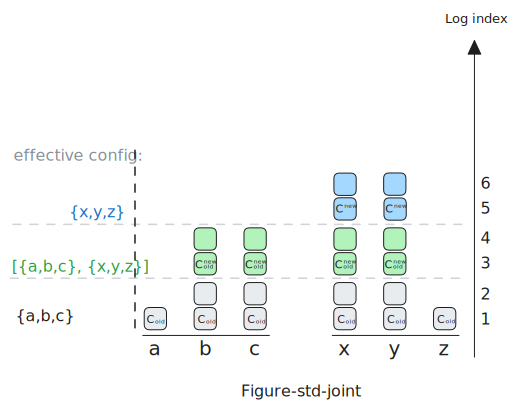
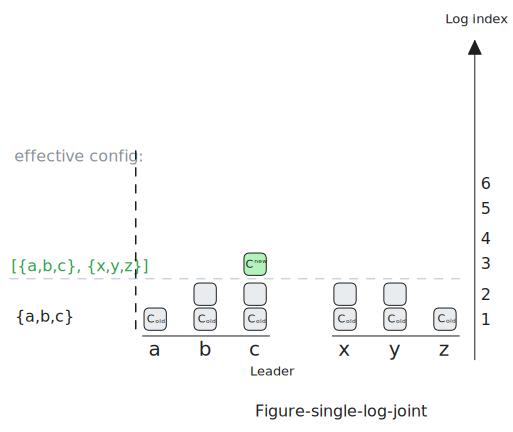
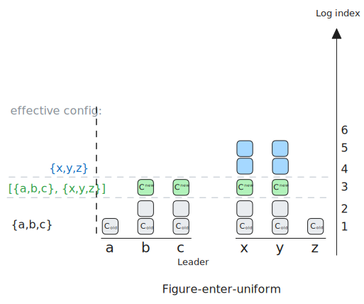
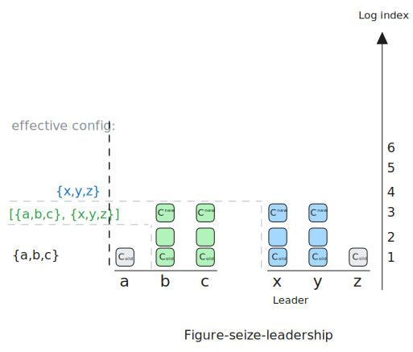
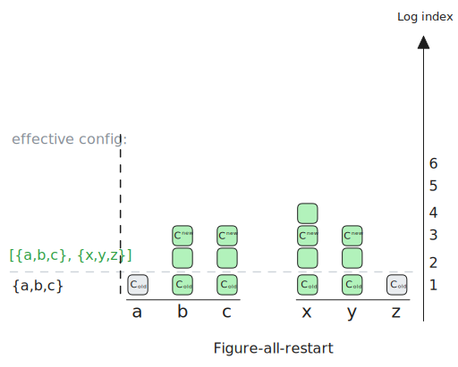
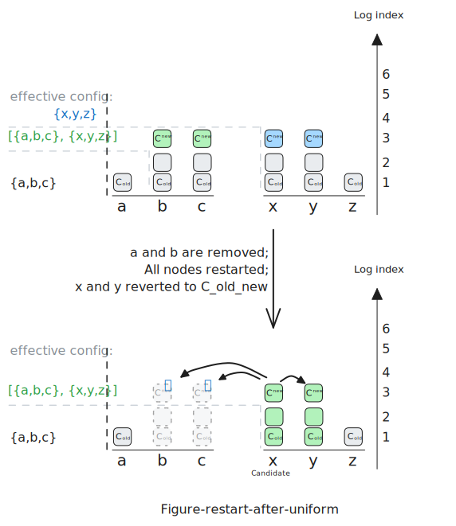
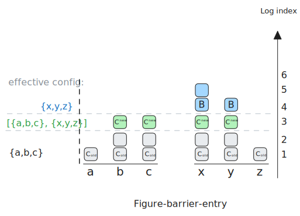
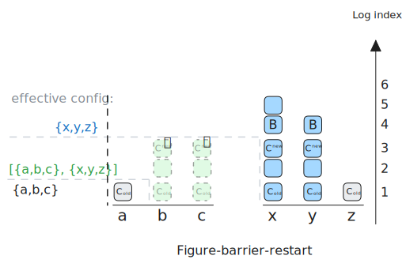

# 前言

**TL;DR**

原生 Raft 配置变更需要两条日志条目，涉及多阶段提交与状态管理。本文探索单条日志完成配置变更的可行性，提出**effective-config**概念，分析其正确性与实际问题。
最终比较不同方案，解释为何标准 Joint Consensus 仍是推荐选择。

**文章大纲**

1. Raft Joint Consensus 简介
2. 单条日志变更的基本思路
3. 正确性证明
4. 单条日志方案的局限性及补丁
5. 结论

# Raft Joint Consensus 简介, 2 条 Config log entry

在 Raft 共识算法中, 集群成员的变更是一个关键且复杂的操作.  直接从旧 config(例如
`{a,b,c}`)切换到新 config(例如 `{x,y,z}`)是**不安全**的.  因为集群中的 Node
不可能在同一时刻原子性地完成切换. 在切换过程中, 可能存在一个时间点, 一部分
Node(如 `a,b`)仍在使用旧 config `C_old`, 而另一部分 Node(如 `x,y,z`)已经切换到新
config `C_new`. 如果 `C_old` 的 Quorum(例如 `{a,b}`)和 `C_new` 的
Quorum(例如 `{x,y}`)没有交集, 就可能在同一任期(Term)内选出两个不同的 Leader,
这破坏了 Raft 的核心安全保证, 导致"split brain".

为了安全地进行 config change, Raft 论文提出了一种名为 **Joint Consensus(联合共识)** 的两阶段方法：

1.  **第一阶段：进入 Joint state (`C_old_new`)**:
Leader 收到变更请求时, 创建包含 Joint config `C_old_new` 的 log entry, 在 `C_old_new` 状态下, 任何决策都需同时获得 `C_old` 和 `C_new` 各自 Quorum 的支持.  一旦 Leader 添加 Joint config 到日志, 立即使用 `C_old_new`.

2.  **第二阶段：切换到 Uniform state (`C_new`)**:
`C_old_new` 被提交后, Leader 创建第二个 config log entry, 仅包含新 config `C_new`.
一旦 Leader 看到这个新的 config entry, 立即切换为开始使用 `C_new`.
从这条日志开始, 这个 config entry 和所有后续的 log entry 只需要在 `C_new` 定义的 quorum 中提交.
当这个包含 `C_new` 的日志条目被提交后, config change 过程正式完成.

这种两阶段方法通过引入一个中间的"Joint state", 保证了在整个 config change 过程中,
任意两个可能形成的 Quorum(无论是基于 `C_old`, `C_new` 还是
`C_old_new`)都必然存在交集, 从而防止了"split brain"问题, 确保了安全性. 然而,
这个过程需要**两条**config log entry 完成一次 config change.

# 希望只用一个 log entry 完成 安全的 Raft config change.

Joint Consensus 需要两个 log entry 和两个阶段, 略显复杂.
一个自然的想法是：能否只用**一个**config log entry 就安全地完成 config change?

Single log entry 的 config change 的想法在社区被先后提出过很多次, 下面我们将详细讨论这种 Single log entry 方法的工作原理, 并与标准的 Joint Consensus 方法进行对比分析, 看看它如何在保证安全性的同时简化实现流程.

这里我们引入一个概念 `effective-config`: 即 Leader
当前实际使用的、用它指定的 quorum 来判断一个 log entry 是否完成 commit 的 config.
 这个 `effective-config` 可能跟 Leader 日志中任何一个已存储的 config log entry
中的 config 都不同. 它是一个动态的概念, 反映了 Leader
在 config change 过程中的"实时"决策依据. 在下面的算法执行步骤中我们会详细介绍它.

## 术语说明

- **effective-config**: Leader 当前用于判断 log entry 是否提交的动态配置集合.
- **Joint config (联合配置)**: 同时包含旧 config 和新 config 的配置集, 例如 `C_old_new`.
- **Uniform config (单一配置)**: 仅包含新 config 的配置集, 例如 `C_new`.
- **Barrier entry (屏障条目)**: 用于标记 joint state 安全结束的特殊日志条目.

## 实现方法是:

使用单个 config log entry 完成变更的方法:

-   **初始状态**: 假设当前集群 config 为 `{a,b,c}`, 对应的 config log entry
    已经提交, 记为 `C_old`.
    这时 `effective-config` 也为 `C_old`. Raft 要求前一个 config log
    entry 必须提交后才能 propose 新的 config change, 这一点保持不变.

    

-   **发起变更**: 当需要将 config 更改为 `{x,y,z}` (记为 `C_new`) 时, Leader
    提议 (propose) 一个新的 config log entry `entry-i`(log index 为 `i`), 该条目内包含 config
    `C_new` (`{x,y,z}`).

-   **进入 Joint state (关键步骤)**: 当 Leader **看到** `entry-i` 时(即,
    仅仅是追加到自己的日志中, **不需要等待它被提交**), Leader **立即** 将其
    `effective-config` 变更为**Joint config (联合配置)**: `[{a,b,c}, {x,y,z}]`, 记为 `C_old_new`.

    *   这意味着从 `entry-i` 这条日志开始(包括 `entry-i` 自身), 后续的所有 log entry
        都必须被复制到 `C_old_new` 所定义的 quorum 上(例如 `[{a,b}, {x,y}]`), 才能被认为是 committed.

    

-   **允许写入**: 在此期间, 集群仍然可以处理其他的 log entry(例如客户端请求),
    但这些条目的提交同样需要满足 `C_old_new` 的 Joint Consensus 规则.

-   **完成变更**: 一旦 `entry-i` **在 `C_old_new` 的 quorum 中被成功 committed**,
    Leader 就将 `effective-config` 切换回**Uniform config (单一配置)**, 即新的
    config `C_new` (`{x,y,z}`).

    *   从这个时间点开始, 后续的所有 log entry(`entry-i` 之后的条目)的提交,
        只需提交到 config `C_new` 的 Quorum 即可.

通过这种方式, 理论上只用了一个 config log entry `entry-i`
就驱动了 `C_old -> C_old_new -> C_new` 的 config change.

### 正确性证明

我们需要证明这种单条目变更方法不会破坏 Raft 的安全性,
即, 不会在当前 Term 和 后续 Term 中产生两个 Leader(split brain).

假设执行 config change(提议 `entry-i`)的 Leader 的任期是 `t`.
考虑一个可能在之后当选的新 Candidate, 其任期为 `u`, 且 `u > t`. 我们需要证明 Leader
`t` 和 要发起选举的 Candidate `u` 不会同时成为 Leader.

**情况：新 Candidate `u` 的选举**

新 Candidate `u` 的日志中可能包含 `entry-i`, 也可能不包含 `entry-i`, 分两种情况讨论:

-   如果 Candidate `u` 的日志中包含 `entry-i`, 则它的 `effective-config` 一定包含 `{x,y,z}`.

    旧 Leader `t` 的 `effective-config` 可能是 `C_old_new`: `[{a,b,c}, {x,y,z}]`(config change 进行中), 或 `C_new`: `{x,y,z}`(config change 完成), 不论哪种情况, 它都包含 `{x,y,z}`. 而因为 Candidate `u` 必须需要获得 `C_new`: `{x,y,z}` 的 Quorum 的选票. 那么 `u` 和 `t` 无法同时成为 Leader;

-   如果 Candidate `u` 的日志中不包含 `entry-i`, 则它的 `effective-config` 一定包含 `C_old`: `{a,b,c}`.
    这时要分两种情况讨论 Leader `t` 的 `effective-config`:

    - 如果 Leader `t` 的 `effective-config` 是 `C_old_new`: `[{a,b,c}, {x,y,z}]`, 因为 Candidate `u` 需要获得 `C_old` 的 Quorum 的选票. 那么 `u` 和 `t` 无法同时成为 Leader;

    - 如果 `t` 的 `effective-config` 是 `C_new`: `{x,y,z}`, 那么说明 `entry-i` 已经在 `C_old_new` 上的一个 Quorum 被 commit, 那么就说明, `entry-i` 一定存在在 `{a,b,c}` 的一个 Quorum 的每个 Node 中. 因此这个 Quorum 里每个 Node 的 log index 已经大于等于 `entry-i` 的 log index: `i`.

      但是 Candidate `u` 不包含 `entry-i`, 即它的最大 log index 小于 `i`, 它在选举过程中会因为在 `{a,b,c}` 中的一个 Quorum 中看到大于 `i` 的 log entry 从而放弃选举.

所以在各种情况下, 在 Leader `t` 完成 config change 的整个过程, Candidate `u` 都不会成为 Leader, 从而避免了 split brain 的发生.

由此可见, 我们这种只需要单条 log entry 去进行 config change 的算法是正确的.
这种方法简化了配置变更过程, 减少了状态转换的复杂性.

然而, 尽管理论上正确, 但在实际实现中它会引入一些问题:

## 第 1 个问题: 持久层无法区分 Joint 和 Uniform

第一个问题是：节点从 Joint 状态切换到 Uniform 状态时(`C_old_new` 到 `C_new`),
变化仅在内存中发生(修改 effective-config), 没有写入持久层. 这导致：

`C_old` 中的节点仍可以发起选举, 与 `C_new` 中的节点竞争, 因为 `C_old` 的 log 和 `C_new` 的 log 一样多,
即使配置变更已完成, `C_old` 中的节点仍能抢走 `C_new` 中的节点的 Leadership.
这个问题根源是状态变化未记录在持久层上.

相比之下, 标准 Raft Joint Consensus 会将写一条新的 Uniform config (`C_new`) 日志, 形成屏障. `C_old` 中的节点在选举时会因日志不够新而被拒绝.
单条目配置变更对系统从 `C_old_new` 到 `C_new` 缺少这种持久层状态记录, 导致状态表达缺失, 也可以认为是一种状态回退.

例如下图中, 集群从 `C_old_new` 切换到 `C_new` 时, 任何 Node 的 log 都没有发生变化,
假设 Leadership 已经 transfer 到 `C_new`: `{x,y,z}`中的一个节点, 例如 `x`,
但`C_old`中的节点仍会发起选举, 并且可以抢走`x`的 Leadership.

**补丁-1**: 可以在进入 Uniform config 后, 在 `C_new` 的日志中添加一个 Noop log entry, 用来屏蔽
`C_old` 中的节点发起的选举.

## 第 2 个问题: 新启动 Node 必须先进入 Joint config

这种单条目 config change 方法虽然简洁,
但也引入了一个棘手的问题：一个新启动(重启)的 Node, 无法确定当前集群是处于
Joint state 还是 Uniform config 阶段:

-   启动后, 该 Node 在其持久化的日志存储中, 可以看到一系列的 config log entry.
    假设它看到的最后两条 config log entry(按时间顺序)分别是 `entry-i` (包含 config
    `C_old`) 和 `entry-j` (包含 config `C_new`): `i < j`.

-   根据 Raft 规则, 可以确认 `entry-i` 一定是已提交的(因为 Leader 必须等前一个 config
    提交后才能提议下一个).

-   但是, 对于最新的 `entry-j`, 该
    Node **无法仅凭本地信息判断它是否已经被集群提交**:
    - 如果 `entry-j` 未提交, 集群的 `effective-config` 应该是 Joint config `C_old_new`;
    - 如果 `entry-j` 已提交, 则 `effective-config` 应该是 Uniform config `C_new`.

这是 single log entry 做 config change 的第2个问题: **新启动的 Node 无法确定当前集群是处于 Joint state 还是 Uniform config 阶段**.

例如上图中, 即使 `entry-3` 已经提交, 但新启动的 Node b,c,x,y 无法确定当前集群是处于 Joint state 还是 Uniform config 阶段(另外 2 个 Node a, z, 它们没收到 Joint config entry, 仍然停留在旧 config `{a,b,c}`).

了解了这个问题后, 它的解决方法也很直接: **补丁-2**: 重启后回到 Joint state:

1. 新启动的 Node 在启动后, 必须将初始的 `effective-config` 设置为由最后两条 config log entry 组成的 Joint config `C_old_new`, 并使用此 Joint config 参与选举.
2. 只有在确认最后一个 config log entry(包含 `C_new` 的 log
 entry) 在 `C_old_new` 上被提交后, 该 Node 才能安全地将其 `effective-config` 切换为 Uniform config `C_new`.

**示例**: 新启动的 Node 看到最后两条 config 为 `{a,b,c}` 和 `{u,v,w}` 时, 必须先使用 Joint config `[{a,b,c}, {u,v,w}]` 作为 `effective-config`, 需要获得两个 config 各自的 Quorum 投票才能当选 Leader, 确认新 config 在 `[{a,b,c}, {u,v,w}]` 上被提交后, 才能切换到仅使用 `{u,v,w}` 的 Uniform config.

但这个解决方案又引入了另一个问题:

## 第 3 个问题: 依赖旧 config 可能无法完成选举

补丁-2(新 Node 启动时默认使用 Joint config)解决了新 Node 状态不确定的问题,
但它自身又引入了另一个问题：
**可能导致 Node 尝试联系已经被移除且不存在的旧 Node, 从而无法完成选举**.

**例子**:

1.  集群 config 从 `C_old` (`{a,b,c}`) 变更到 `C_new` (`{x,y,z}`).

2.  包含 `C_new` 的 `entry-j` 已经被成功在 `C_old_new` 上提交.

3.  集群现在切换 config 到 `C_new` (`{x,y,z}`) 下.

4.  根据 `C_new` config 的定义, Node `a`, `b`, `c` 不再是集群成员.
    它们可能已经被安全地关闭、数据被清理、并彻底从集群中移除.

5.  之后, 发生了某种情况导致集群中所有的 Node 全部重启.

6.  Node `x` 重启后, 根据 **补丁-2**, 它检查日志, 发现最后两个 config 是 `C_old`
    (`{a,b,c}`) 和 `C_new` (`{x,y,z}`),
    并将其 `effective-config` 设置为 Joint config (`[{a,b,c}, {x,y,z}]`).

7.  Node `x` 决定发起选举.
    但 Node `b`, `c` 已经不存在了！ 因此, Node `x` 无法获得 Joint config `C_old_new`
    所需的选票, 选举失败, 集群可能无法选出 Leader 而永远无法恢复.

因为从 `C_old_new` 切换到 `C_new` 时, 没有持久化任何信息,
所以这个问题可以看做是系统在重启后发生的一次"状态回退"(`C_old_new` -> `C_old`)而造成的.

**缓解措施**:
可以通过外部的集群管理工具来延迟或协调旧 Node 的下线清理操作,
确保它们在被彻底移除前, 集群已经稳定运行在新 config 下一段时间. 但这只能"缓解",
不能从根本上解决重启 Node 在特定时刻仍可能尝试联系旧 Node 的风险.

真正的解决方案还需要从 Raft 内部来解决:

## 添加 barrier 防止用旧 config 选举

为了解决 补丁-2 引入的"尝试联系已移除旧 Node 进行选举"的问题, 我们需要一种机制,
让重启的 Node 能够**确切地知道** Joint state 是否已经**安全结束**,
从而避免使用包含旧 config 的 Joint config 进行选举.

**补丁-3：引入 Barrier entry (屏障条目)**

解决方案: 在 config log entry `entry-j` (`C_new`) 在 `C_old_new` 上完成 commit 后,
再 commit 一个**特殊类型的 log entry**, 我们称之为 **Barrier entry**, 表示 `entry-j` 已经完成 commit.

> **注意**: 这个 Barrier entry 必须在 `entry-j` commit 后再 append 到 log 中, 否则它不能作为 `entry-j` 已经完成 commit 的根据.

这样, 新启动的 Node 如果看到这条 Barrier entry, 那么它就能确定之前的 Joint config `C_old_new` 状态已经安全结束, 可以直接使用新的 Uniform config `C_new` 来进行选举和其他操作, 而无需再尝试联系可能已经不存在的旧集群成员.

例如下图中, 当 entry-3 在 `C_old_new` 下被提交后,
添加一个 Barrier `entry-4`, 表示 `entry-3` 已经完成 commit:

这样在所有节点再次重启后, 也不会出现状态回退, Node x, y 看到 Barrier entry 后, 直接使用 `C_new` `{x,y,z}` 进行选举,
它们已经进入 `C_new` 的状态不会回退
这时即使 Node b, c 下线, Node x 或 y , 也能顺利当选 Leader:

> **Plan-B**: 如果不用 log entry 做屏障, 另一个选择是 **记录 commit-index**,
> 这个方案最初由 [马健将][people-ma-jianjiang] 提出.
>
> 这个方案中, 要求 Joint Consensus 结束的标准为：commit-index 同步到一个 `C_new` 的 quorum,
> 并且要求 Raft 的实现 **持久化 commit-index 的值**.
>
> 虽然标准 Raft 是不需要记录 commit-index 的值的, 但是记录 commit-index 几个题外话的好处,
> 在这里的好处就是可以当做一个状态存储的补充, 来区分 Joint 和 Uniform 状态.
>
> 因为 commit-index 记录了哪些 log entry 已经被提交, 如果 commit-index 包含 config change entry 的 index,
> 就可以知道 `C_old_new` 已经提交, 可以直接进入 `C_new` 状态, 从而避免出现向已清理节点请求选票的问题;
>
> 但是这个方案仍会出现 `C_old_new` 与 `C_new` 争夺 Leadership 的问题(问题-1),
> 因为 `C_new` 没有更多的 log, 而且 commit-index 只在 `C_new` 上提交无法保证一定会同步给 `C_old` 中的节点.
> 这是分布式中消息到底是**投递至少一次**还是**投递至多一次**的选择的问题：
> - 如果选择至少一次, 即要求 commit-index 在 `C_old_new` 上 commit, 则可能出现 commit-index commit 成功了, `C_old` 节点被清理了, 然后再次尝试 commit commit-index 时无法完成的情况.
> - 所以只能选择至多一次, 即 commit-index 只在 `C_new` 上 commit, 在 `C_old` 上尽量投递, 但这会导致 `C_old` 中节点可能没有收到 commit-index 更新的情况, 使它们不知道集群已经变化, 继续发起选举.
>
> 所以还有几率出现 `C_old_new` 与 `C_new` 争夺 Leadership 的问题(问题-1).

最后, **修改后的 Single log config change** 流程如下:

1.  初始状态同上, `effective-config` 为 `C_old` (`{a,b,c}`).

2.  Leader 提议一个包含 `C_new = {x,y,z}` 的 config log entry: `entry-j`, 并立即将 `effective-config` 切换为 Joint config `C_old_new = [{a,b,c}, {x,y,z}]`.

3.  所有 `index >= j` 的日志在 `C_old_new` 下进行复制和提交.

4.  **关键步骤**: 一旦 `entry-j` 在 `C_old_new` 下**成功提交**, Leader 立即提议一个特殊的 **Barrier entry**. 这个 Barrier entry 不包含任何 config 信息, 它的存在仅仅是为了标记"Joint state 的安全结束点". Leader 在提议 Barrier entry 的同时, 可以立即将 `effective-config` 切换为 `C_new = {x,y,z}`, 并使用这个新 config 来复制和提交 Barrier entry.

5.  **当 Barrier entry 被提交后**, config change 过程结束.

对应的, **新 Node 启动时的行为**:

一个新启动的 Node 检查日志. 它看到最后两个 config 日志是 `entry-i` (`C_old`) 和 `entry-j` (`C_new`). 它**首先检查**在 `entry-j` 之后, 是否存在一个**Barrier entry**:

-   **如果存在 Barrier entry**: 这意味着 Joint state `C_old_new` 已经安全结束. 该 Node 应该直接将
    `effective-config` 设置为`C_new`. 不需要去联系可能已经被移除的旧 Node.

-   **如果不存在 Barrier entry**:
    这意味着 Joint state 可能仍在进行中. 那么该 Node
    应该将 `effective-config` 设置为 Joint config
    `C_old_new`.

但是, 到这里细心的你一定已经发现: 这个 补丁-3 引入了第二条 log entry, 不再是严格意义上的"单条日志条目"完成, 而是需要"一条 config 条目 + 一条 Barrier 条目".

# 总结

因为 config change 必然让系统经历 3 个阶段: `C_old -> C_old_new -> C_new`,
如果只用一条 log, 那么在持久层层面, 它只能表示 1 bit 的信息, 即最多表示 2 个状态: `C_old` 或 `C_new`,
这是问题的根本所在,
一个通用且安全的 config change 算法, 至少需要 2 条 log entry 参与, 才能提供 2 bit 的信息, 最多能表达 4 个状态, 来支持系统所需的 3 个状态.

所以, 还是老老实实回到 Joint Consensus 吧, 它更简洁.

## 参考资料

- Diego Ongaro & John Ousterhout. In Search of an Understandable Consensus Algorithm (Raft 原论文): https://raft.github.io/raft.pdf
- OpenRaft(rust): https://github.com/databendlabs/openraft
- etcd/raft 项目源码: https://github.com/etcd-io/raft
- Hashicorp Raft 实现: https://github.com/hashicorp/raft
