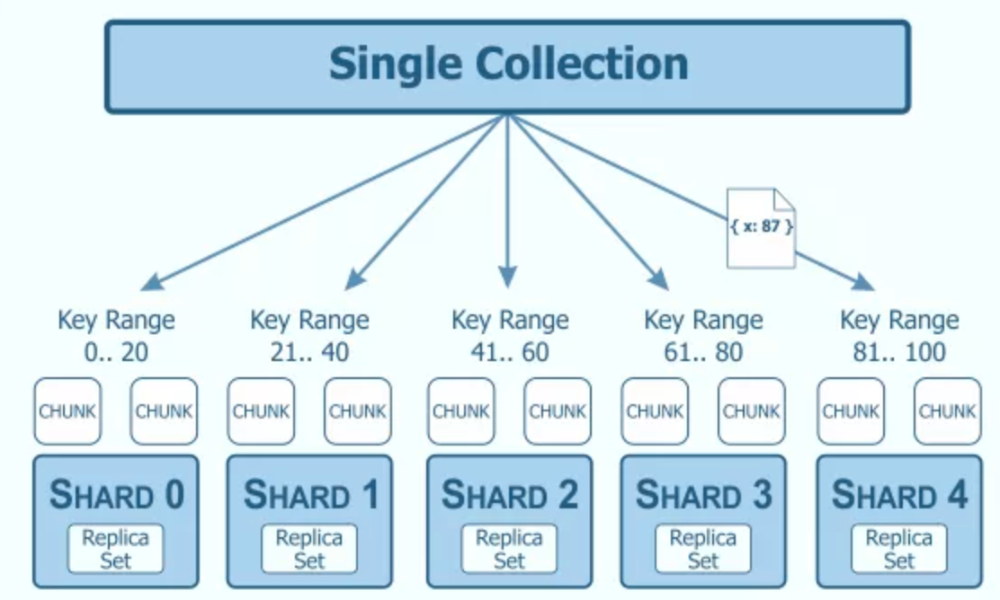
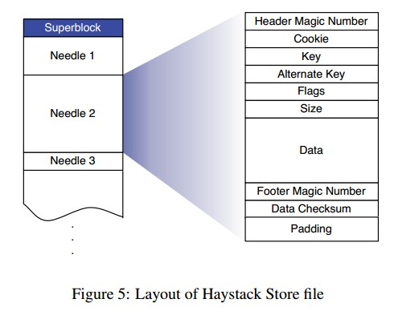
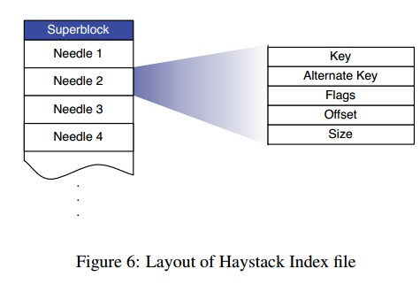
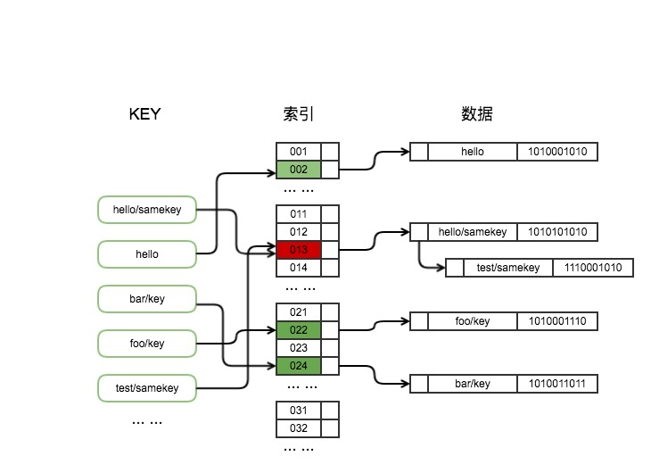
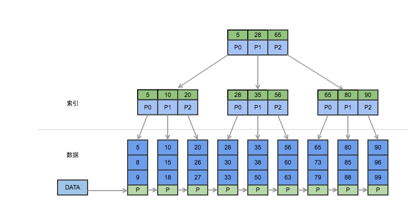
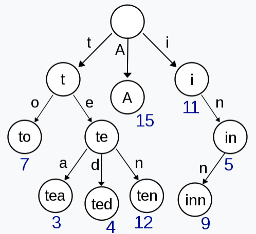
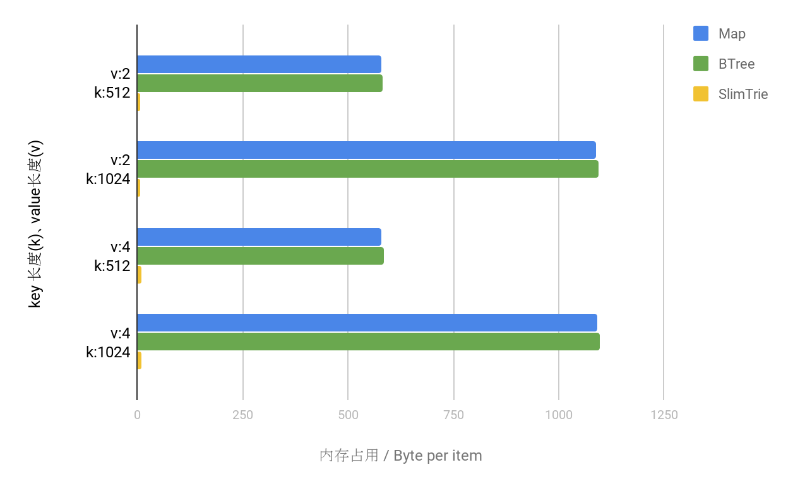
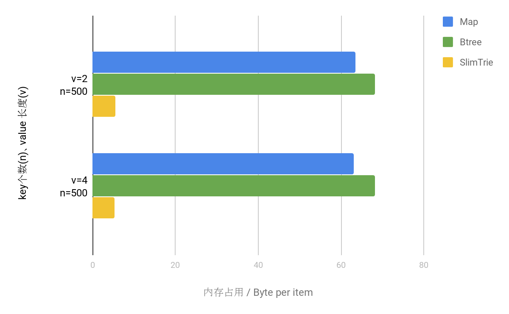
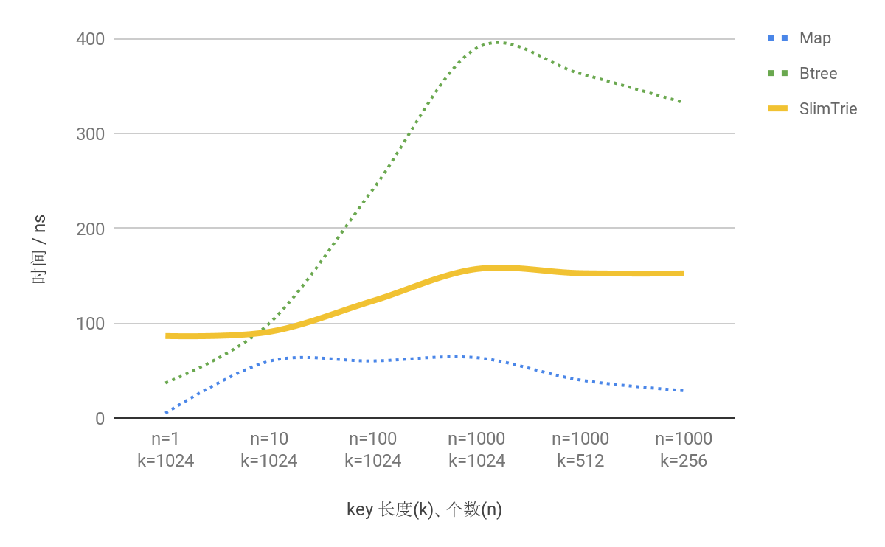
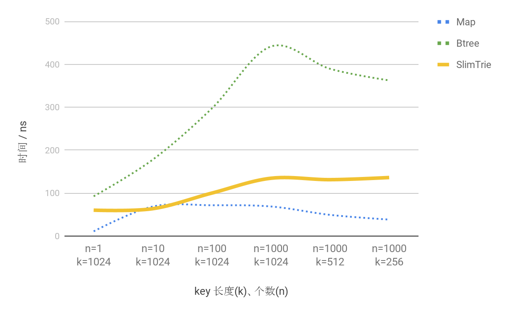

Github: [SlimTrie](https://github.com/openacid/slim)

# 背景

当下信息社会每天都产生大量需要保存的数据，这些数据在刺激海量存储技术发展的同时也带来了新的挑战。比如，海量数据为存储系统增加了大量的小文件，这些小文件的元数据如何管理？如何控制定位某个文件的时间和空间开销？

随着对数据实时性要求的增加, 文件也越来越趋于碎片化，像短视频, 直播类的业务, 往往一个视频只有几百KB 大小, 甚至几十KB 。可以说, 一个成熟的对象存储系统最后都会面临巨量元数据管理的挑战, 如HDFS, openstack-swift 等, 在软件整体进入相对成熟的阶段, 小文件都成为了最头疼的问题。

以100TB 数据(大约是日常的单机容量)为例，若全部存储10KB 的文件(如果文件名`<=1KB`)，仅是管理这些文件所需的索引数据就会达到大约10,000GB 的内存空间。这是这对存储系统来说是难以承受的内存开销。

为了应对当前环境给存储带来的挑战，经过不懈的研究和探索，我们在两个方面进行了优化:

- 整体上对元数据管理采用无中心的设计，索引采用分层的思想，抛弃中心化元数据管理的策略, 将元数据分散到每个单机存储服务器;
- 单机上,  我们部署了一套全新的索引数据结构: SlimTrie 。对索引数据进行了裁剪、压缩和聚合的方法，对索引进行了极大的优化, 逼近空间利用率的理论极限。以做到单机100TB 数据为例, 如果文件都是10KB 小文件, 那么就有100 亿个文件，我们的SlimTrie 算法最终只需10GB 内存空间。

今天我们就主要来聊聊如何能在单机上实现百亿文件的索引。

# 巨人的肩膀: 主流索引设计

存储系统的架构主要由两方面构成: 数据的存储 和 数据的定位 .

- 数据的存储 更多关注文件布局、复制、故障检测、修复等环节，它主要决定系统的可靠性。
- 而 数据的定位 是最具挑战的, 尤其是面对海量数据时，一个存储系统中索引的设计，直接决定了这个系统的读写效率、可扩展能力和成熟度。

然而，索引的设计面临着各种挑战和难题。比如，当存储的数据量越来越大，如何权衡索引数据的格式、算法、达到最高的空间利用率和查询效率等问题, 就成为系统设计的关键。

在讨论我们的索引设计之前，首先我们来回顾一下已知的几种索引设计, 分析它们的优劣, 以及为什么我们不能选择其中一个常规的设计, 而必须站在这些巨人的肩膀上更进一步。

## 存储体系

在分布式领域，管理大量索引数据时，一般会采用分层的思路(非常类似于两层的b+tree 的实现), 如果不是超大规模的系统, 两层最为常见：

- 上层索引主要负责sharding, 将查询路由到一个独立的服务器
- 下层负责具体的查询

一般来说单集群规模可能是几百到几千个服务器组成, 这时上层sharding 部分的数据可能只有几千条(或上百万条: 如果使用虚拟bucket 等策略, 虚拟节点可能是物理节点的几百倍), 所以上层索引会很小. 大部分问题集中在底层索引上.

在我们的设计中, 上层是一个百万级别的sharding, 下层直接是存储服务器, 存储服务器负责索引整机的文件. 这样, 上层sharding 的量级不会很大, 整个系统设计的核心问题就落在了单机的文件索引设计上.

 

- Tip: 一般少有千台服务器以上的集群, 多数时候不是受限于技术, 而是为了简化运维, 几百到几千个服务器已经具备了不错的容量, 负载弹性和单点故障容错能力, 而且几百个服务器的小集群的管理相对容易.
- Tip: 如果集群规模大到需要3 层索引的话, 多一次索引访问, 性能也会降低.
- Tip: 类Haystack 的设计在对象存储中很常见: Haystack 是一个关于单机存储设计的实现, 为了提升IO 性能, 降低文件系统Inode 的读写开销, 将小文件合并成一个大文件存储, 并在内存中存储所有文件的元信息(meta), 这样直接将每个文件读取的2 次IO(inode+data)转变成一次内存操作和一次IO 操作.

剥去系统架构层面的组件, 剩下的就是单机上文件定位的问题:

## 方案-0: 消灭问题: 在URL 中嵌入定位信息

这一类方案可以称之为: 服务器端URL 生成 :

每次上传时, 存储服务器负责生成一个用于下载的URL. 如FastDFS 的实现:

http://192.168.101.5/group1/M00/00/00/wKhlBVVY2M-AM_9DAAAT7-0xdqM485_big.png

其中, group1, M00, 00, 00 是分组和定位信息;

当服务器接到一个URL 时,直接从其中解析出文件位置, 然后定位到文件所在的服务器, 磁盘, 目录和文件名. 于是不再需要额外的索引数据了.

这种方案实际上是将 ”数据的定位” 绕开了, 交给外层逻辑, 也就是存储的使用方来处理, 而自己只处理 ”数据的存储” 这个问题.

- 优势: 简化了问题, 在实际生成环境中, 有不少应用是倾向于这种策略的:

它们对url 的组织形式不关心, 只要求能下载到, 例如“图床”类应用

- 劣势: 缺少通用性, 存储的使用方必须负责管理每个URL.
- 劣势: 这类场景一般不适合删除文件:

- 劣势: 此外, 按照规则自动清理, 授权等需求,也会因为URL 没有业务上的规律而变得复杂.

## 标准方案: 解决”数据的定位”问题

标准的方案都是 客户端指定URL  的方式:

客户端指定URL 是比较通用的方式: 它允许用户在上传时指定下载的URL, 因此它不仅要管理 ”数据的存储” 的问题, 同时也关心 ”数据的定位” 的问题: 存储系统负责记录每个URL 到文件数据位置的信息. 相当于一个分布式的key-value map.

类似aws S3 和其他大部分公有云对象存储服务, 都属于第二类, 是通用的存储.

提到key-value map, 分布式领域和单机领域有颇多相似, 分布式存储系统的 ”数据的定位” 问题, 也就是索引的构建, 基本上也分为两个思路: 无序的hash map 类结构, 和有序的tree 类结构. 接下来我们来分别分析两类索引的优劣.

## 明确问题: 定义索引

索引可以被认为是一些"额外"的数据, 在这些额外的数据帮助下, 可以在大量的数据中快速找到自己想要的内容.

就像一本数学课本, 它一般包括1 个"索引": 目录, 它让读者可以只翻阅几页的目录后就可以定位到某个章节的页码.

存储系统中的索引需要:

- 足够小 : 如果目录过于详细, 翻阅目录的时间成本就会变高.
- 索引是用于缩小查询范围的 : 目录的作用不是精确的定位到某一页某一行某个字, 而是定位到一个足够小的范围(几页).
- 足够准确 : 对较小的文件, 访问一个文件开销为1 次磁盘IO 操作.
- 全内存 : 索引信息必须全部在内存中, 访问一个文件分为2 步: 访问索引, 访问磁盘. 访问索引的过程中不能访问磁盘, 否则延迟变得不可控(这也是为什么leveldb 或其他db 在我们的设计中没有作为索引的实现来考虑).

## 方案-1: 基于Hash map 的索引

Hash 类索引例图

Hash map 类索引首先会利用hash 函数的计算，将要存储的key 映射到一个新的hash 值，然后再建立索引。查找定位时也需要这一步的计算来定位到真正数据存储的位置。上面的例图简单展示了其结构和工作原理。

它的优点很明显:

- 一次检索定位数据. 即, 每个key 都可以通过一步计算找到所需的值的位置.
- 查找的时间复杂度是O(k)(k 是key 的长度)。这个特点非常适合用来做 单条 数据的定位，然而它有一个前提是查找的key 必须是等值匹配的，不支持“`>`”、“`<`”的操作。

范围查找在存储系统中也是一个非常重要的特性, 在数据清理, 合并等操作时, 是必须要支持的一个API.

从图中我们能明显看到它的一个天然缺陷:

- 无序 。当进行查找操作时，如果不是等值的匹配而是范围查询，比如，想要顺序列出索引中全部的key ，最优时间复杂度也需要O(k * n * log(n))，这样的操作消耗的空间和时间代价都是索引系统不可接受的。
- 内存开销大 . Hash map 要求在内存中保存完整的key, 也就是说内存开销是O(k*n)的, 这对单机百亿文件级别的目标来说无疑是致命的缺陷。

有一种优化方式是: 使用MD5(key)的前8 字节作为索引的key, 可以将任意长度key 缩减到8 字节, 并在一定范围内把碰撞几率控制到很小.

但我们没有选择这种方案的原因还是因为hash 的无序.

- 内存开销: O(k * n)
- 查询效率: O(k)

## 方案-2: 基于Tree 的索引

Tree 类索引例图

Tree 类索引利用树的中间节点和分支将全量的key 分成一个个更小的部分。上图是一个典型的B+Tree 实现，其中间节点只保存了key ，数据部分全部保存在叶子节点里。这样的结构在查询时，通过树的中间节点一步一步地缩小查找范围，从而找到要查找的key 。

Tree 类中代表性的数据结构有:

- B+tree, RBTree, SkipList, LSM Tree 都是Tree 类的数据结构, 一般 以平衡性最优为特点, 适用于数据 库中实现索引等场合.
- 排序数组: 也可以认为是Tree 类的数据结构, 它的空间开销, 查询性能都跟平衡树相当.

Tree 类的索引的特点也很明显:

- 优势: 它对保存的key 是排序的，如例图所示，通过一个顺序访问数据的指针，就能够方便地顺序列出全部数据，这弥补了Hash 类索引不能够范围查询的缺点。

此外，Tree 类索引有许多成熟的实现，如B 树、B+树的设计在查询性能方面也有很好的表现，MySQL 的默认索引类型就是B+树。

- 劣势: 跟Hash map 一样, 用Tree 做索引的时候, map.set(key = key, value = (offset, size)) 内存中必须保存完整的key, 内存开销也很大: O(k * n)
- 内存开销: O(k * n);
- 查询效率: O(k * log(n))

## 小结

以上是两种经典的索引结构设计案例，但是它们都存在一个无法避免的问题： key 的数量快速增长时，它们对内存空间的需求会变的非常巨大 。这两种索引结构首先都会存储全量的key 信息，我们假设key 的平均长度是1KB ，以100TB 的磁盘为例，可以存储1 亿个10KB 的小文件。那么仅这些key 的索引就有10,000GB 。这是完全无法接受的内存开销。

小文件索引数据量大的困境，导致以上的经典索引结构无法支持在索引海量数据的同时，将索引缓存在内存中。而一旦索引数据需要磁盘IO ，时间消耗会增大几个量级，存储系统的性能将因索引效率低而大打折扣。优化索引结构以提高存储性能，才是解决这个问题的唯一出路。

对此，目前业界也有自己的一些方案，比如LevelDB 采用skiplist 建立索引，但skiplist 内存占用太大，需要2n 个指针的开销，而且无法做前缀压缩。经过仔细研究这些已有的方案，我们认为都不太理想。

基于以上分析，我们希望找到一种数据结构，能够索引海量数据，同时将内存开销控制在可接受的范围内。

# SlimTrie 索引：兼顾低内存与高性能

## 理论极限:

如果要索引n 个key, 那至少需要log₂(n) 个bit, 才能区分出n 个不同的key.

如果一共有n 个key, 因此理论上所需的内存空间最低是log₂(n) * n, 这个就是我们空间优化的目标.

在这个极限中, key 的长度不会影响空间开销, 而仅仅依赖于key 的数量, 这也是我们要达到的一个目标: 允许很长的key 出现在索引中而不需要增加额外的内存.

实际上我们在实现时限制了n 的大小, 将整个key 的集合拆分成多个指定大小的子集, 这样有2 个好处:

- n 和log₂(n) 都比较确定, 容易进行优化.
- 占用空间更小, 因为: `a * log(a) + b * log(b) < (a+b) * log(a+b)`

我们最终达到每个文件的索引均摊内存开销与key 的长度无关:

每条索引一共10 byte, 其中:

- 6 byte 是key 的信息;
- 4 byte 是value: offset;

## SlimTrie 的前辈: Trie

Tree 的顺序性, 查询效率都可以满足预期, 但空间开销仍然很大.

在以字符串为key 的索引结构中, Trie 的特性刚好可以优化key 存储的问题:

Trie 是一个前缀树, 例如:

保存了8 个key 的trie 结构

"A ", "to ", "tea ", "ted ", "ten ", "i ", "in ", and "inn "

Trie 的特点在于在于原生的前缀压缩, 而Trie 上的节点数最少是O(n), 但Trie 的空间开销比较大, 因为每个节点都要保存若干个指针(指针单独要占8 字节), 导致它的空间复杂度虽然是O(n), 但实际内存开销很大. 如果能将Trie 的空间开销降到足够低, 它就可以很好地满足我们的需求。

## SlimTrie 的设计

- 静态数据索引

数据生成之后在使用阶段不修改, 依赖于这个假设我们可以对索引进行更多的优化: 预先对所有的key 进行扫描, 提取特征, 大大降低索引信息的量。

在存储系统中, 需要被索引的数据大部分是静态的: 数据的更新是通过Append 和Compact 这2 个操作完成的. 一般不需要随机插入一条记录.

- SlimTrie 保证存在的key 被正确的定位, 但被索引到的key 不一定存 在 .

索引的目的在于快速定位一个对象所在的位置范围, 但不保证定位到的对象一定存在，就像Btree 的中间节点, 用来确定key 的范围, 但要查找的key 是否真的存在, 需要在Btree 的叶子节点(真实数据)上来确定。

- SlimTrie 支持顺序查找和遍历key.

索引很多情况下需要支持范围查询，SlimTrie 作为索引的数据结构，一定是支持顺序遍历的特点。SlimTrie 在结构上与树形结构有相似点，顺序遍历的实现并不难。

- SlimTrie 的内存开销只与key 的个数n 相关，不依赖于key 的长度k.
- SlimTrie 支持最大16KB 的key.
- SlimTrie 查询速度要非常快.

 假设n 个key ，每个key 的长度为k ，各数据结构的特性如下表：

| | 空间开销 | 查询时间 |
|---|---|---|
| Hash map | O(k * n) | O(k) |
| Skiplist, btree | O(k * n) | O(k * log(n)) |
| Trie | O(k * n) | O(k) |
| SlimTrie | O(n) | O(log(n)) |

## 生成的SlimTrie 三个步骤

- 用所有的key 创建一个标准的Trie 树, 然后在标准Trie 树基础上做裁剪，裁剪掉标准Trie 中无效的节点，将索引数据的量级从O(n * k)降低到O(n)。

裁剪掉Trie 树中单分支节点，单分支节点对索引key 没有任何的帮助

- Trie 的压缩, 通过一个compacted array 来存储整个Trie 的数据结构, 在实现上将内存开销降低。

接下来还要在实现上压缩Trie 实际的内存开销。树形结构在内存中多以指针的形式来实现, 但指针在64 位系统上占用8 个字节, 相当于最差情况下, 内存开销至少为8*n ，这样的内存开销还是太大了，所以我们使用compacted array 来压缩内存开销。

- 对小文件的优化, 将多个相邻的小文件用1 条索引来标识, 平衡IO 开销和内存开销 。

索引的设计以降低IO 和降低内存开销为目的，这两方面有矛盾的地方, 如果要降低IO 就需要索引尽可能准确, 这将带来索引的容量增加。如果要减小索引的内存开销, 则可能带来不准确的对磁盘上文件的定位而导致额外的IO 。在做这个设计的时候, 有一个假设是, 磁盘的一次IO, 开销是差不多的, 跟这次IO 的读取的数据量大小关系不大，所以可以在一次IO 中读取更多的数据来有效利用IO 。

# 实测 SlimTrie 索引

使用SlimTrie 数据结构的索引相比于使用其他类索引，在保证索引功能的情况下压缩了索引中的key 所占用的空间。理论上来讲，使用SlimTrie 做索引可以极大的节约内存占用，现在我们来看看实际测试的结果: 内存的低开销, 以及查询的高性能.

## 内存开销

首先我们用一个基本的实验来证明我们的实现和上文说到的理论是相符的。实验选取Hash 类数据结构的map 和Tree 类数据结构的B-Tree 与SlimTrie 做对比，计算在同等条件下，各个数据结构建立索引所耗费的内存空间。

实验在go 语言环境下进行，map 使用golang 的map 实现，B-Tree 使用Google 的BTree implementation for Go (  [github.com/google/btree](https://www.google.com/url?q=https://github.com/google/btree&sa=D&ust=1552110053540000)  ) 。key 和value 都是string 类型（我们更多关心它的大小）。实验的结果数据如下：

索引内存占用对比图：

可以得出明显结论：

1. SlimTrie 作为索引在内存占用上显著低于map 和B-Tree 。
2. SlimTrie 作为索引其内存占用的决定因素是value 的大小，与key 的大小无关。

在此实验的基础上我们再做一个理论上的计算：1PB 的数据量，使用SlimTrie 做索引，小文件合并到1MB ，索引的value 是每一个1MB 数据块的起始位置，4 byte 的int 足够，根据测试，索引的key 在SlimTrie 中占的空间不会超过6 Byte 。

那么 ，1GB 内存便可建立100TB 数据量的索引:

100TB / 1M * (4+6) = 1GB 。

### SlimTrie 在通用场景中的表现

因为这次测试所有的数据结构都保存了完整的key 和value 信息，所以我们只看memory overhead 即可比较出谁的空间占用小。测试得到的数据，见下面的图表：

memory overhead 对比图：

两者进行对比，可以明显看出，SlimTrie 所占用的空间额外开销仍然远远小于map 和B-Tree 所占的内存，每个key 能够节省大约50 Byte 。

在内存开销方面验证了预期之后，我们还对SlimTrie 的查询进行了测试，同时和map 、Btree 进行了比较。在与内存测试相同的go 语言环境下进行实验。

## 查询 性能

测量查询相同的确定存在的key 的查询时间的比较结果如下图：

存在的key 的查找耗时对比图(越小越优)：

查询相同的确定不存在的key 的查询时间的比较结果如下图：

不存在的key 的查找耗时对比图(越小越优)：

SlimTrie 的查询效率远好于Btree, 也非常接近Hash map 的性能。

- 上面两个图中，前半段key 的长度k=1000 保持不变，随着key 的个数n 的增长，SlimTrie 查询耗时随之上涨；
- 后半段key 的个数保持不变，长度减小，SlimTrie 的查询耗时基本维持不变。

也从查询效率上反应了SlimTrie 的内部结构只与n 相关的特性.

另一方面，在上图中，我们也能够看到，SlimTrie 的实际查询的耗时在150ns 左右，加上优秀的空间占用优化，作为存储系统的索引依然有非常强的竞争力。

# 总结

随着数据规模的持续增长，传统的索引结构在面对海量小文件时，内存开销成为一个突出的瓶颈。SlimTrie 尝试从一个新的角度来应对这一问题。

从实测结果来看，SlimTrie 可以在约1GB内存中建立100TB数据量的索引，在空间利用率上相比传统结构有较大改善；查询性能方面，SlimTrie 的查找速度与sorted Array接近，优于经典的B-Tree。作为通用的Key-Value数据结构，其内存额外开销也明显低于map和Btree。

当然，SlimTrie 的设计基于静态数据的假设，适用范围有一定局限。我们希望这一思路能为类似场景下的索引设计提供一些参考，也期待在后续工作中继续改进。

Github: [SlimTrie](https://github.com/openacid/slim)
