Github: [SlimTrie](https://github.com/openacid/slim)

上一篇 [《SlimTrie 设计篇》](https://openacid.github.io/tech/algorithm/slimtrie-design) 中，我们介绍了单机百亿文件的索引设计思路，今天我们来具体介绍下它代码级别的实现。文中我们要解决的问题是: 在一台通用的100TB的存储服务器的内存中, 索引100亿个小文件。

在我们的测试中，SlimTrie对存储系统中静态文件的索引，内存开销约为 Btree的 13%，查询速度约为 Btree 的 2.6倍。

## 索引的一点背景知识

索引可以被认为是业务数据（用户文件）之外的一些"额外"的数据, 在这些额外的数据帮助下, 可以在大量的数据中快速找到自己想要的内容. 就像一本数学课本的2个"索引": 一个是目录, 一个是关键词索引.现实系统中，存储系统中的索引需要做到：

- 足够小 : 一般实现为将索引信息全部存储在内存中可以达到比较好的性能。访问索引的过程中不能访问磁盘, 否则延迟变得不可控(这也是为什么leveldb或其他db在我们的设计中没有作为索引的实现来考虑).
- 足够准确 : 对较小的文件, 访问一个文件开销为1次磁盘IO操作。

分析下已有的2种索引类型, hash-map类型的和tree类型的,Hash map类索引利用hash函数的计算来定位一个文件：

- 优势 ：快速，一次检索定位数据。非常适合用来做 单条 数据的定位。

- 劣势 ：无序。不支持范围查询。必须是等值匹配的，不支持 `>` 、 `<` 的操作。
- 内存开销: O(k * n)。

- 查询效率: O(k)。

而基于Tree 的索引中代表性的有: B+tree, RBTree, SkipList, LSM Tree, 排序数组 :

- 优势 : 它对保存的key是排序的；

- 劣势 : 跟Hash map一样, 用Tree做索引的时候, map.set(key = key, value = (offset, size)) 内存中必须保存完整的key, 内存开销也很大: O(k * n)；
- 内存开销: O(k * n)；
- 查询效率: O(k * log(n))；

以上是两种经典的索引都存在一个无法避免的问题： key的数量很大时，它们对内存空间的需求会变的非常巨大：O(k * n) 。

如果100亿个key（文件名）长度为1KB的文件。那么仅这些key的索引就是 1KB * 100亿 = 10,000GB。导致以上的经典数据结构无法将索引缓存在内存中。而索引又必须避免访问磁盘IO，基于这些原因我们实现了一套专为存储系统设计的SlimTrie索引.

## 索引数据大小的理论极限

如果要索引n个key, 那每条索引至少需要log₂(n) 个bit的信息, 才能区分出n个不同的key. 因此理论上所需的内存空间最低是log₂(n) * n, 这个就是我们空间优化的目标. 在这里,  空间开销仅仅依赖于key的数量，而不会受key的长度的影响!

我们在实现时将所有要索引的key拆分成多组，来限制了单个索引数据结构中 n的大小, 这样有2个好处:

- n 和 log₂(n) 都比较确定, 容易进行优化；
- 占用空间更小, 因为: `a * log(a) + b * log(b) < (a+b) * log(a+b)`；

## SlimTrie索引结构的设计

我们最终达到每个文件的索引平均内存开销与key的长度无关， 每条索引一共10 byte, 其中:

- 6 byte是key的信息;
- 4 byte是value: (offset, size); // value的这个设定是参考通常的存储实现举的一个例子，不一定是真实生产环境的配置。

### 实现思路：从Trie开始

在研究Trie索引的时候, 我们发现它的空间复杂度(的量级)、顺序性、查询效率(的量级)都可以满足预期, 虽然实现的存储空间开销仍然很大，但有很大的优化空间。

Trie 就是一个前缀树, 例如，保存了8个key（"A", "to", "tea", "ted", "ten", "i", "in", and "inn"）的Trie的结构如下：

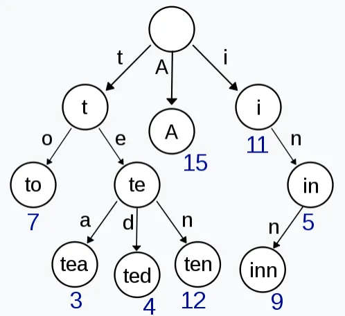

Trie的特点在于原生的前缀压缩, 而Trie上的节点数最少是O(n), 这在量级上跟我们的预期一致。但Trie仍然需要每个节点都要保存若干个指针(指针在目前普遍使用的64位系统上单独要占8字节)。

### SlimTrie的设计目标

功能要求：

- SlimTrie能正确的定位存在的key，但不需要保证定位不存在的key。

- SlimTrie支持范围定位key。
- SlimTrie的内存开销只与key的个数n相关，不依赖于key的长度k 。
- SlimTrie查询速度要快。

限制：

- SlimTrie只索引静态数据。 数据生成之后在使用阶段不修改, 依赖于这个假设我们可以对索引进行更多的优化。
- SlimTrie支持最大16KB的key 。
- SlimTrie在内存中不保存完整的key的信息。

最终 性能目标对比其他几种常见的数据结构应是：

| | 空间开销 | 查询时间 |
|---|---|---|
| hashmap | O(k * n) | O(k) |
| btree | O(k * n) | O(k * log(n)) |
| Trie | O(k * n) | O(k) |
| SlimTrie | O(n) | O(log(n)) |

### SlimTrie的术语定义

- key：某个用户的文件名，一般是一个字符串。
- value: 要索引的用户数据, 这里value是一组(offset, size)。
- n: key的总数: `<= 2^15`。
- k: key的平均长度 `< 2^16`。
- Leaf 节点: SlimTrie中的叶子节点, 每个Leaf对应一个存在的key。
- LeafParent 节点：带有1个Leaf节点的节点。 SlimTrie中最终Leaf节点会删掉，只留下LeafParent节点。
- Inner 节点: SlimTrie中的Leaf和LeafParent节点之外的节点。

## SlimTrie的生成步骤

我们通过一个例子来看看SlimTrie的生成: 如果一步步将Trie的存储空间压缩, 并在每一步处理后都验证去掉某些部分后, 它仍然满足我们的查询的准确性要求. 然后在这个例子的基础上，给出完整的算法定义。

SlimTrie的生成分为3部分：

- 1. 先用一个Trie来构建所有key的索引。
- 2. 在Trie的基础上进行裁剪, 将索引数据的量级从O(n * k)降低到O(n)。
- 3. 通过3个compacted array来存储整个Trie的数据结构, 将内存开销降低。

### 1 SlimTrie原始Trie的建立

假设有一组排序的key用来构建索引：”abd”, “abdef”, “abdeg”, “abdfg”, “b123”, “b14”，首先创建一个标准的Trie：

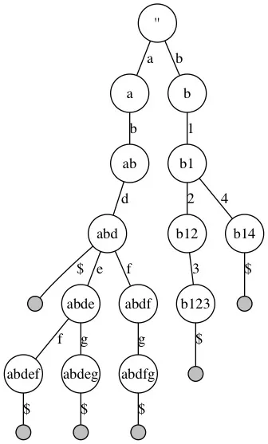

查询遵从标准的Trie的查询流程：

例如从Trie中查询”abdfg”，首先定位到根节点，然后从查询key中取出第1个字符”a”, 在根节点上找到一个匹配的分支”a”，定位到第2层节点”a”，再从被查询的key中取出第2个字符”b”，匹配第2层中节点”a”的分支”b”，依次向下，直到遇到一个Leaf节点，结束查询。

### 2 SlimTrie的裁剪

基于SlimTrie的设计可以看出： 多分支的SlimTrie节点是关键的 ，单分支的节点对定位一个存在的key没有任何帮助。所以可以针对节点类型，进行几次单分支节点的裁剪。

并且在每次剪裁后，我们会依次展示剪裁过的Trie依旧满足我们设计目标中对查询的功能需要。

#### LeafParent节点的裁剪

上图中，”abdfg”中的”g”节点不需要保留, 因为存在的key的前缀如果是”abdf”, 它最后1个字符只能是”g”，所以将”abdfg”的”g”去掉。

同理，”b123”中的”3”也去掉。得到裁剪之后的结果：

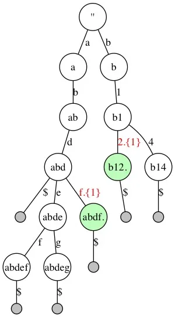

图中使用正则表达式的风格表示路径：

“.” 代表任意字符； “{1}” 代表1个； ”f.{1}“ 代表f后面越过（Step）一个字符。

剪掉单分支LeafParent节点后依旧满足查询需求：

还以查询key ”abdfg”为例，假设目前定位到节点”abd”，要继续查询key中的字符”f”，发现Trie中有分支”f”，并且”f”之后的可以略过”g”的查询，则查询直接定位到”abdf.”节点，查询结束。

#### Inner 节点的裁剪

继续观察上图, a分支下的”b”, “d”节点是不需要的, 因为一个存在的key如果以”a”开头, 它的接下来的2个字符一定是”b”, “d”，同样b节点后面去掉1分支，得到第2次 裁剪后的结果：

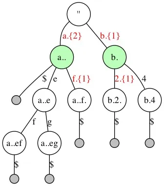

剪掉单分支Inner节点后依旧满足查询需求：

继续以查询”abdfg”为例，假设开始查询，定位到根节点，要查询key中第1个字符”a“，根节点有1个分支”a”与之匹配，并且可以越过2个字符，此时查询定位到节点”a..”上，并继续查询key的第3个字符”f”，最终也定位到节点”a..f.”上。查询结束。

#### 去掉尾部Step

最后，去掉所有单分支LeafParent节点节点后缀，以及指向这个节点的路径的Step数（例如“a..f.”和“b.2.”中尾部被Step掉的字符不需要记录。但同时包含分支的LeafParent节点需要保留Step数，例如“a..”，指向它的分支“a.{2}”中的Step数还必须记录）

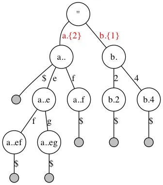

去掉LeafParent节点的Step数后 依旧满足查询需求 ：

当查询一个存在的key：”abdfg”时，假设定位到了“a..”节点（对应查询字符串中的”abd“），继续查找下一个字符”f“时，因为key”abdfg”是存在于Trie中的，所以被查询的key中f后面剩下的字符数（1个”g“）跟分支“f.{1}”中记录的需要Step掉的字符数一定是相等的，所以当查询到节点”a..f”时，发现它是1个LeafParent节点，则直接略过被查询key中剩余的字符。最终结束查询。

#### 裁剪之后的SlimTrie：

- 每个节点都有大于1个子节点, 除LeafParent节点之外。
- SlimTrie的大小跟key的长度无关. 也就是说任意长度的key的集合都可以使用有限大小的SlimTrie来索引: SlimTrie最多有2n-1个节点: 最多节点是出现在所有inner节点都是二分的时候（空间复杂度为O(n)）

### 3 SlimTrie的压缩

现在我们在结构上已经将SlimTrie裁剪到最小, 接下来还要在实现上压缩SlimTrie实际的内存开销。树形结构在内存中多以指针的形式来实现, 但指针在64位系统上占用8个字节, 相当于最差情况下, 内存开销至少为 8*n个字节，这样的内存开销还是太大了，所以我们使用2个约束条件来压缩内存开销：

- key的个数n：`n < 2^15`；目的是通过id来替代指针，将节点id值限制在16bit内。节点id分配规则是：从根节点开始，逐层向下，按照节点从左到右的顺序编号。
- 4 bit的word：创建Trie时，将每个长度为k的字符串，视为2 * k个4 bit的word，而不是k个8 bit的byte，作为SlimTrie上节点的单位。这样做的目的是减少分支数量，限制存储分支信息的bitmap的大小。

另外为了更具体的说明这个例子，我们假设value是1个4 byte的记录, 来展示SlimTrie中每个节点对应的信息，其中只有 绿色 是需要记录的, 如下图：

| 层 | 节点ID | 对应前缀 | 分支 | 第一个子节点ID | Step 数 | 是否是leaf | value |
|---|---|---|---|---|---|---|---|
| `<root>` | 0 | | a,b | 1 | | | |
| Lvl-1 | 1 | a.. | e,f | 3 | 2 | `<leaf>` | |
| Lvl-1 | 2 | b. | 2,4 | 5 | 1 | | |
| Lvl-2 | 3 | a..e | f,g | 7 | | | |
| Lvl-2 | 4 | a..f. | | | 1 | `<leaf>` | |
| Lvl-2 | 5 | b.2. | | | 1 | `<leaf>` | |
| Lvl-2 | 6 | b.4 | | | | `<leaf>` | |
| Lvl-3 | 7 | a..ef | | | | `<leaf>` | |
| Lvl-3 | 8 | a..eg | | | | `<leaf>` | |
| 最大数量 | | | n - 1 | n - 1 | n - 1 | n | n |
| 长度 | | | 16bit | 16bit | 16bit | 0 | 4 byte |

上面的表格中, 因为1个节点”是否leaf“的信息跟”是否有value“是对等的，所以leaf信息不需要记录。而最终的索引需要的 总存储量是:

分支信息 + 子节点位置 + Step 信息 + value

总共小于: 16bit * (n-1) + 16bit * (n-1) + 16bit * (n-1) + 4byte * n；

因此总存储量小于 10 * n byte；其中去掉4 * n 个byte的value信息， 大约每个Key 6字节 。 接下来我们来解释下如何在实现上达成6 字节这个目标：

#### SlimTrie内部的 数据结构

通过上面的表格我们看到，如果要完整的表达SlimTrie的结构，需要存储4个映射表：

- uint16 id → uint16 branch

每个节点的分支有哪些； 因为使用了4 bit的word, 所以每个节点最多只有16个分支，每个节点的分支表使用一个16 bit的bitmap存储；

- uint16 id → uint16 offset

每个节点的第一个子节点id；

- uint16 id → uint16 step

每个节点被查询到之后需要越过源查询key后面几个word； 因为key的最大长度设定为16 KB，所以step最大是2 * 16 KB = 2^15；

- uint16 id → uint32 value

实际存储的数据，也同时表示了是否是LeafParent节点；

把SlimTrie抽象成这几个映射表后，所需的数据结构 就变得清楚了：

整数作为下标，整数为元素的数组，例如 branch可以定义为 uint16_t branch[n]。但是，并不是每个节点id都存在分支，这个数组中很多位置是空的。如果用数组来保存会造成一半的空间浪费（Inner节点数量最多只占一半）。所以我们需要一个更加紧凑的数据结构来保存这几个映射表，这里我们引入了一个数据结构：compacted array。

#### compacted array：压缩数组

compacted array类似数组，但不为 不存在 的数组元素分配空间。在实现上，为了标识空的数组元素，使用了1个bitmap，虽然每个要存储的信息平均多分配了1个bit，但整体空间开销非常接近于我们的预期。

使用压缩数组来保存SlimTrie的逻辑结构, 压缩数组用来保存最大大小不超过 2^16 个条目的信息，首先定义压缩数组的结构：

```c
typedef struct {
    uint16_t cnt;        // number of items in this compacted array.
    uint16_t capacity;   // 2^16 = 65536 in our case.
    uint16_t bitmap_cnt; // capacity / 64 = 1024
    uint16_t item_size;

    uint64_t item_bitmap[bitmap_cnt]; // every 64 items in one bitmap
    uint16_t item_offset[bitmap_cnt]; // offset of the first item in a bitmap.

    char items[cnt * item_size];
} compacted_array_t;
```

因为我们使用16 bit的id代替指针, 这就要求每个组里的节点(node)数量不能超过65536 (2^16)，由于SlimTrie生成时会产生至多 n-1 个中间节点(在满二叉的情况下总结点数是 2n-1), 所以我们需要限制每个组的原始数据条目数n 小于 2^15 = 32768。

compacted array的内存额外开销

除了数据items数组之外，每个compacted array的额外数据包括：

4个 uint16 的成员属性，以及跟元素总数相关的bitmap 和 offset，分别占(n / 64) * 8 byte 和 (n / 64) * 2 byte；

于是每个compacted array的总的内存额外开销是 (0.15 * n + 8) byte；

到这里，可以近似认为SlimTrie的空间开销是(6 * 1.15 * n + 24) byte。

对于SlimTrie，我们只需要3个compacted array来保存其结构：内部节点(inners)，用户数据（LeafParent）和Step信息：

#### inners数组:

inners的每个元素是4 byte, 其中2 byte是一个bitmap来保存最多15个子节点的branch. 另外一个2 byte的uint16表示它第一个子节点id(offset)，因为一个节点的所有子节点id是连续的，所以只需要保存第一个子节点。

在访问SlimTrie时, branch_bitmap和第一个子节点的id（offset），几乎所有的情况下都需要同时对其访问，因此把他们放到一个compacted array中，减少compacted array查询的次数（虽然查询开销不大，但减少不必要的操作仍然值得考虑）。

#### LeafParent数组:

LeafParent的一个item保存4 byte的用户数据value 。

#### Step数组:

Step数组中的每个元素是单分支节点裁剪掉的节点数，使用一个2 btye的uint16表示。

最终SlimTrie的所有信息在内存中的组织方式如下：

```c
struct slimtrie {
    compacted_array_t  inners;      // 4 byte
    compacted_array_t  LeafParents; // 4 byte
    compacted_array_t  steps;       // 4byte
}
```

### 内存开销分析

假设 ：

- 共有n个key，也就是LeafParent节点(或value)的个数；
- 每个value是4字节 ；
- 至多存在n - 1个Inner节点；(全二分时最多)
- 并且Step 只存在于指向Inner节点的分支，因此最多也是n - 1个；

再考虑compacted array的额外开销，最终整体的内存开销如下：

| 数据 | 最大个数 | 有效大小(byte) | 总大小(byte) | 总实际大小(byte) |
|---|---|---|---|---|
| Inner(branch, offset) | n - 1 | 4 | 4 * n | 4 * 1.15 * n + 8 |
| Step | n - 1 | 2 | 2 * n | 2 * 1.15 * n + 8 |
| LeafParent | n | 4 | 4 * n | 4 * 1.15 * n + 8 |
| 总和 | | | | 10 * 1.15 * n + 24 |

在存储系统 中使用SlimTrie作为数据索引的场景里, 如果用 32G内存, 大约可以索引32亿个文件。

### SlimTrie的查询实现

SlimTrie的查询类似于普通Trie的查询，在创建过程中已经逐步描述了查询在裁剪之后的Trie中的处理方式, 现在将整个过程统一用下面这个c语法的伪代码来描述查询过程，其中几个函数get_value，get_branches，get_step实际上会通过compacted array的"get"操作来访问SlimTrie的3个映射表来实现。

其中src是1个4 bit word的数组：

```c
uint32_t search(slim, src) {
  uint16_t  curr_id = 0; // root
  uint16_t  branches;
  uint16_t  offset;
  uint32_t *value = NULL;
  int    i = 0;

  while (1) {

    value = get_value(slim, curr_id);
    branches, offset = get_branches(slim, curr_id);

    if (i >= strlen(src)
      || branches &(1 <<src[i]) == 0) {
      break;
    }

    /*
     * ones_count() returns the count of 1 in a bitmap, before a specified position.
     * It equals the number of preceding children on the left side of branch `src[i]`.
     */
    curr_id = offset + ones_count(branches, src[i]);

    /* If step is not found, it should return 1 */
    i += get_step(slim.steps, curr_id);
  }

  /* Auto skip all trailing chars for an LeafParent node */
  if (branches == 0) {
    i = strlen(src);
  }

  if (value != NULL &&i == strlen(src)) {
    return *value;
  }

  return NOT_FOUND;
}
```

### 索引合并优化

到目前为止索引的空间利用率已经非常高了，但是，它还是一个不安全的设计！因为它没有给出一个最坏情况保证：如果文件超过32亿个怎么办？如果出现了超出的情况，最好的结果恐怕也是内存开始使用swap，系统反应变慢3个数量级。

因此我们需要对算法给出一个稳定下界，妥善处理超多文件的情况， 所以可以在准确度和内存开销方面做一个折中：这里有一个假设是, 磁盘的一次IO, 开销是差不多的, 跟这次IO的读取的数据量大小关系不大，所以可以在一次IO中读取更多的数据来有效利用IO ：

对一个存在的key, 我们的索引将返回一个磁盘上的offset, 我们一定可以在这个offset和之后的64KB的磁盘空间上找到这个文件，也就是说, 我们的索引不允许索引过小的文件, 只将文件的位置定位到误差64KB的范围内。

最差情况是全部文件都是小文件(例如10K, 1K), 这时索引个数 = 100T / 64KB =~ 20亿条。按照每条索引10 字节计算，需要20GB内存空间。

## SlimTrie索引的内存开销测试

首先我们用一个基本的实验来证明我们实现的内存开销和上文说到的理论是相符的。实验选取Hash 类数据结构的map 和 Tree 类数据结构的B-Tree 与 SlimTrie 做对比，计算在同等条件下，各个数据结构建立索引所占用的内存空间。

实验在go语言环境下进行，map 使用 golang 的 map 实现，B-Tree使用Google的BTree implementation for Go ( [github.com/google/btree](https://github.com/google/btree) ) 。 key 和 value 都是 string 类型（我们更多关心它的大小而不是类型）。实验的结果数据如下 ：

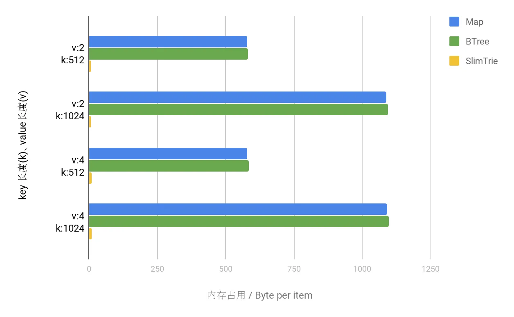

上图中可以看到:

1. SlimTrie 作为索引在内存占用上显著低于 map 和 B-Tree。
2. SlimTrie 作为索引其内存占用的决定因素是 key的数量，与key的大小无关。

## SlimTrie 作为Key-Value map的内存开销测试

以上比较中SlimTrie 的内存优势较为明显，其主要原因是 SlimTrie 在设计上大幅缩减了索引中 key 的存储空间。这一点上面也提到了，SlimTrie 作为索引有一个前提约束是，索引只提供完整的 value 信息而不提供 key 的信息。这一点在作为数据定位的索引时，是可以接受的，也正是因为这一设计取舍，SlimTrie 在内存占用方面获得了较大的优势。

现在如果抛开 “索引” 这个用处，在通用场景下，让SlimTrie作为索引, 同时也记录完整的key的信息, 将他实现为一个通用的key-value map, 看看 SlimTrie 这个数据结构的性能。这里需要将 key + value 当做 SlimTrie 的一个 value 去使用就可以做到。

此次试验，我们同样选取了几组 key 和 value 的大小，在 同之前一样的 go 语言环境下进行了测试，SlimTrie 的 value 是这样一个结构：

```c
type  Valule struct  {
     key    string
     value  string
}
```

因为这次测试所有的数据结构都保存了完整的key和value信息，所以我们只看memory overhead(除了key, value本身数据之外, 额外需要的空间)。测试得到的数据，见下面的图表：

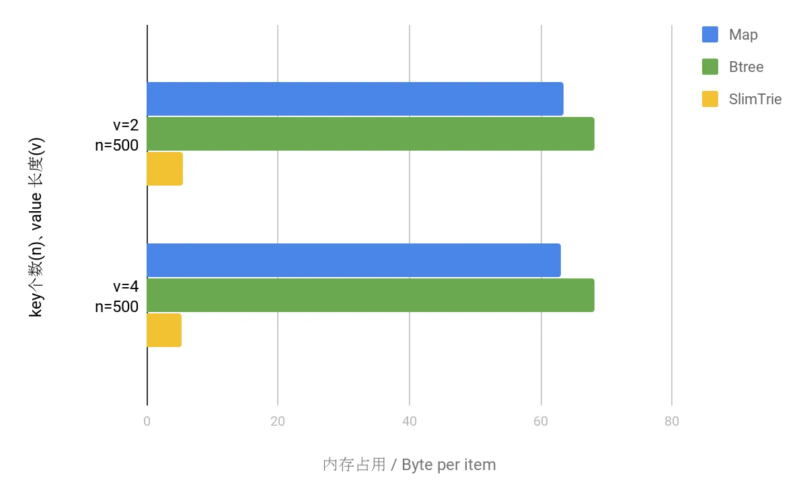

两者进行对比，可以明显看出，SlimTrie 所占用的空间额外开销仍然远远小于 map 和 B-Tree 所占的内存，在 map 和 btree 中, 每个 key 能够节省大约 50 Byte, 而SlimTrie是6字节左右 .

## SlimTrie的查询性能测试

在内存开销方面验证了预期之后，我们还对 SlimTrie 的查询性能进行了测试，同时与 map 、Btree 进行了比较。在与内存测试相同的go语言环境下进行实验。为了公平起见，同样对比的是SlimTrie实现的key-value map跟 golang map, btree的性能。

### 存在的 key 的查询效率对比

越小越优:

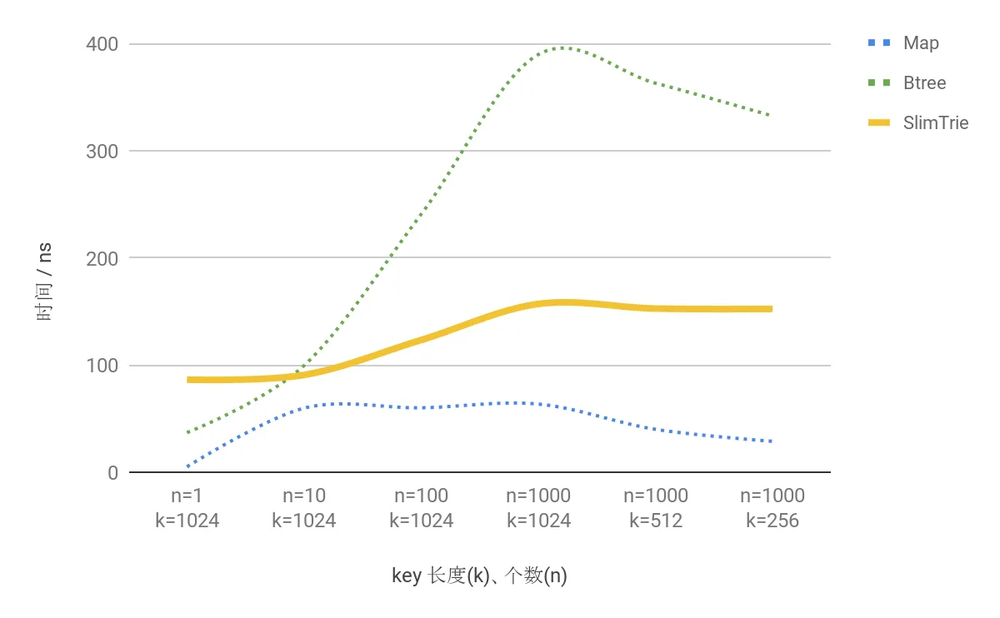

### 不存在的 key 的查询效率对比

越小越优:

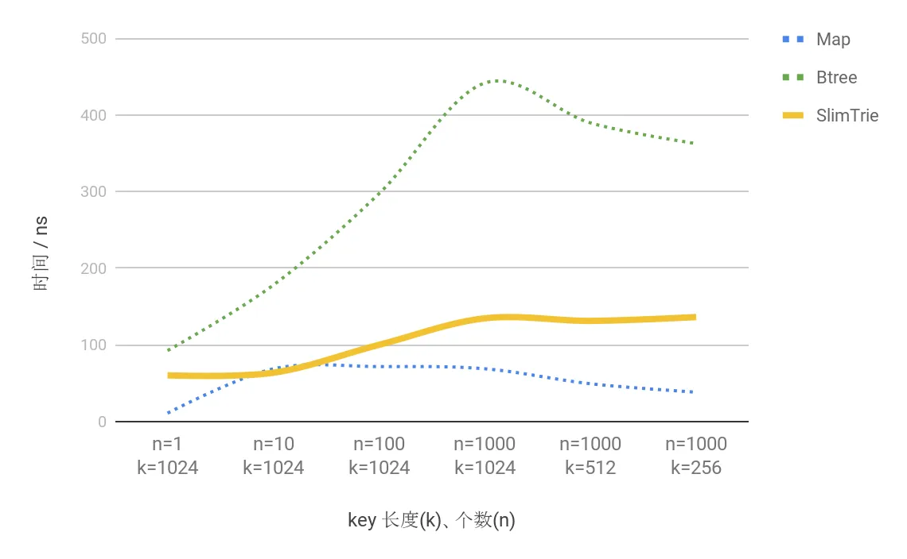

可以看出 SlimTrie 的查询效率与 无序的hash类型的Map 相比有差距, 但对比同样是保持了顺序性的btree相比, 性能是Btree的 2.6倍 左右.

### 查询时间随k和n的变化

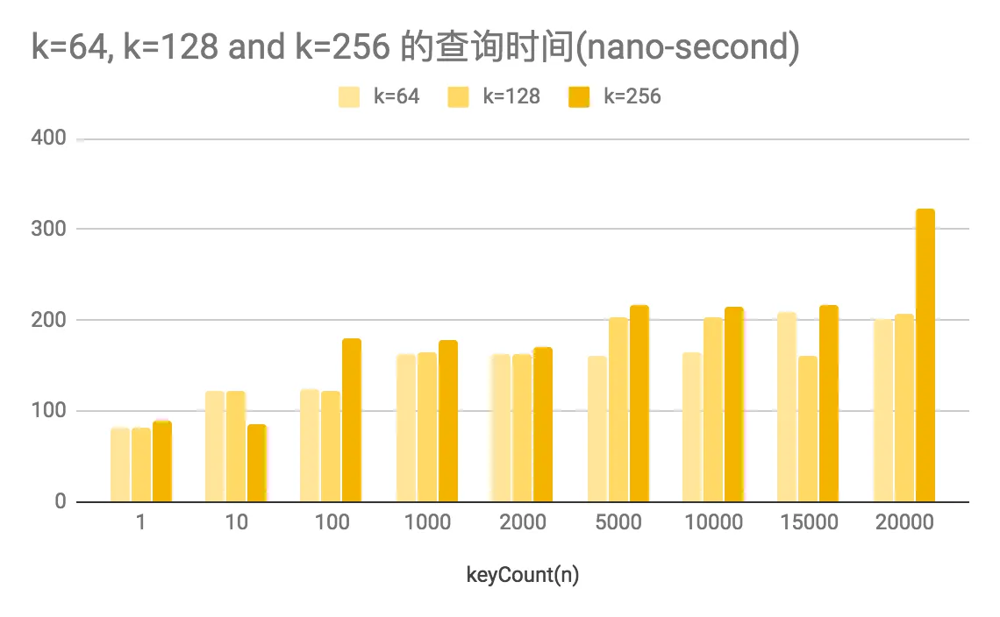

另一方面，在上图中，我们也能够看到，SlimTrie 的实际查询的耗时在 150ns 左右，加上优秀的空间占用优化，作为存储系统的索引依然有非常强的竞争力。

### 内存开销随k和n的变化

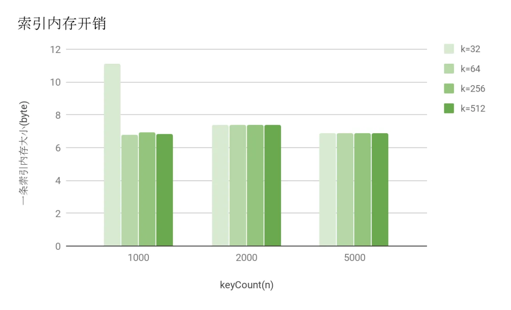

上图中我们可以看出, 不论是随着key的数量增大或是key的长度变长, 单条索引的内存开销都非常稳定地保持在6~7个字节范围内。

## 总结

随着数据规模的持续增长，存储系统的元信息管理面临越来越大的挑战。SlimTrie 尝试从索引结构的角度提供一种新的解决思路。

从测试结果来看，作为索引，SlimTrie 可以在10GB内存中建立1PB数据量的索引，在空间利用率上相比传统索引结构有较大改善；查询性能方面，SlimTrie 的查找速度与 sorted Array 接近，优于经典的B-Tree。即使作为通用的 Key-Value 数据结构使用，SlimTrie 的内存额外开销也明显小于 map 和 Btree。

当然，SlimTrie 目前仅适用于静态数据场景，在适用范围上仍有局限。我们希望在后续工作中继续探索和完善。)
