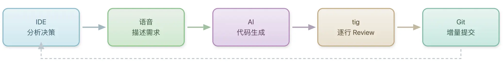
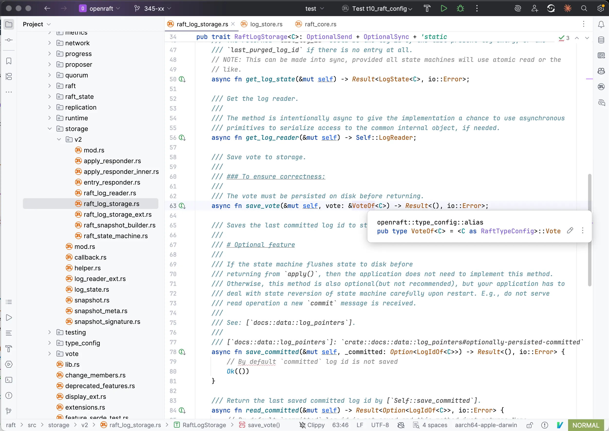
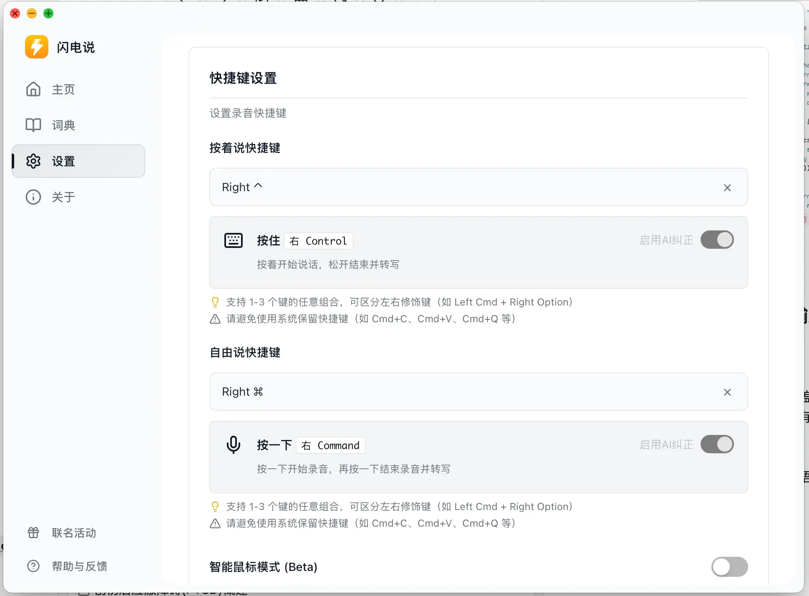
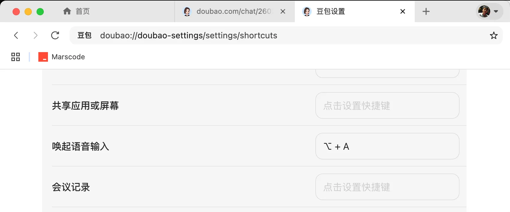
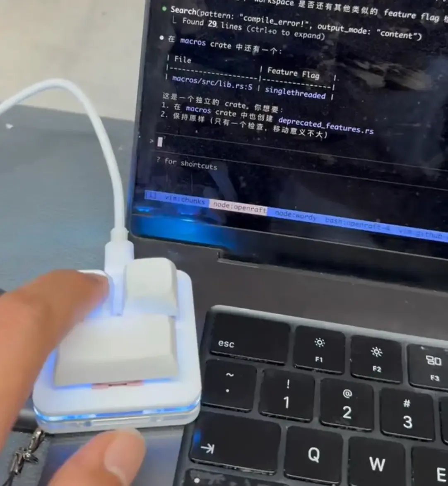
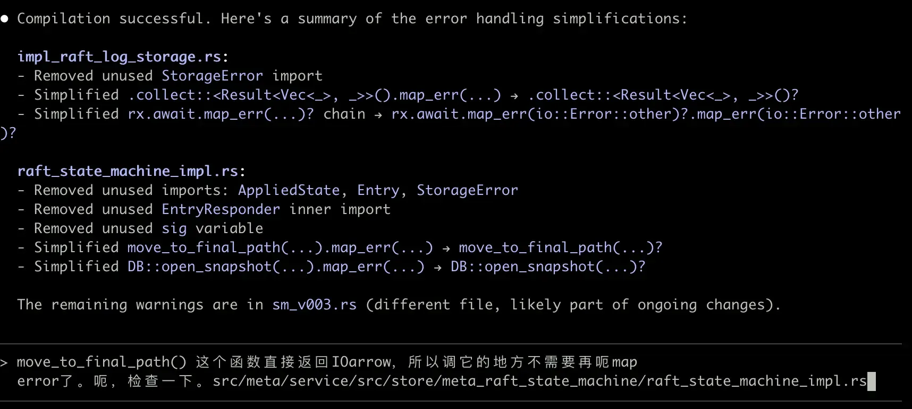
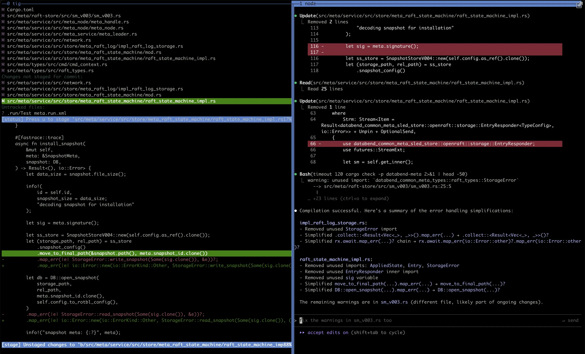

目前我的日常开发基本只需要"动嘴"就能完成。这篇文章分享我在用的工具组合。

**偏见声明**：我更希望把精力放在问题分析上，所以市面上流行的工具并没有一一尝试。只要满足需要就不会替换，除非发现明显的效率瓶颈。

---

## 工作流概览

1. **分析与决策** — 在 IDE 中浏览代码，理解项目，决定要做什么
2. **描述需求** — 用语音输入把想法描述出来
3. **代码生成** — 交给 AI 命令行工具生成代码
4. **审核与提交** — 用 tig 逐行 review，增量提交到 Git

注意上面的几个步骤一般是穿插进行的, 一个这样的修改看做一个 session 的话, 一般我会同时做 2, 3 个工作流 session, 这是因为大模型输出代码比我 review 的速度慢一些, 我自己经常会有 IO 等待, 所以同时开 2,3 个 session 可以把我的 CPU 占满. 但是切换任务也会让自己脑袋里的 context 频繁切换, 降低效率, 所以一般我开 1 个需要我仔细思考的困难任务(例如增加新 feature), 和 1 或 2 个不太需要深度思考的简单任务(例如代码重构), 就不会产生大量颅内 context 切换. 而且忙起来似乎有助于多巴胺分泌.

---

## 第一步：分析与决策 — Rust Rover

[Rust Rover] 是 JetBrains 开发的 Rust IDE。JetBrains 的 IDE 系列（IntelliJ IDEA、PyCharm、WebStorm 等）在 AI 时代之前一直是开发者的首选，以代码跳转、重构、调试等功能著称。

虽然 Rust Rover 在 AI 功能上相对保守，但传统的代码跳转、全局搜索等功能依然扎实，足以快速建立对项目的整体认知。

在这个阶段，我主要根据要做的事情回顾代码结构，确定具体的实现思路；或者在没有具体任务时浏览项目，寻找需要改进的地方。

## 第二步：描述需求 — 语音输入

口述比打字快，语音输入法是重要补充。

语音输入的错误可被大模型理解能力覆盖——只要大致表达清晰，就能完成任务。因此我对语音输入的准确率要求不高，即使口述转文字时有些错误也没关系。只要描述足够详细、提供足够的冗余信息，大模型就能准确理解需求。

以下是几种我尝试过、都能满足需要的语音输入法：

### [闪电说]（本地模型）

- 识别准确率中等
- 离线可用，响应快

### [豆包桌面版][豆包]

- 在线识别更精准
- 网络延迟所以稍慢

### [智谱语音输入法]

- AI 矫正能力强，准确率高
- 网络延迟所以稍慢

---

## 第三步：代码生成 — Claude Code + GLM 4.7

[Claude Code] 是我的主力工具，CLI 框架成熟，即便不用内置模型，作为命令行交互载体也很高效。

日常开发中，我直接口述需求给 Claude Code，全程不需要键盘打字。

为了简化开发流程（也为了好玩），我买了一个只有三个键的小键盘：一个键触发语音输入，一个键是删除，一个键是回车。目前正在尝试只用这三个键完成日常开发。

模型用的是 [GLM 4.7]（[智谱 AI] 发布）。需求描述清晰的话，完成"文字到代码"的转化没问题。与顶尖模型相比，处理抽象需求时有差距，但性价比高，国内网络环境下响应快。

就算说的乱 78 糟, 大模型也知道我说的 `IOarrow` 是 `io::Error`:

我已完全摒弃交互式辅助模式，改用"全量需求描述 + AI 独立实现"。

---

## 第四步：审核与提交 — tig

我发现最高效的工作方式不是等大模型写完 review, 而是：在大模型生成代码的过程中就开始 review 产生的变更，逐段将变更加入版本控制。确认一个变更正确且符合要求后，立即加入 Git stage(git add)。这样后续修改时, review 工作区变化可以忽略已确认(git add)的部分，效率很高。

因此这个阶段最需要的工具，是能够高效的逐段将代码加入 Git 的交互式工具。`git add -p` 是最基本的选择，我使用的是 tig。

> [tig] 是基于 ncurses 的 Git 文本界面工具。

### 为什么用 tig 而非 `git add -p`

`git add -p` 只能显示固定的 2-3 行上下文，有时不够理解修改(我的 context 太小 🤔)。

tig 通过 `tig status` 后进入交互界面, 可以：

- 逐行查看差异，像 Vim 一样导航(`j/k`)
- 快捷键`[` 和 `]` 随时调整 diff 上下文大小
- 逐行(`1`)或逐块(`u`)将修改加入 Git stage(stage 部分也叫 cached 或 index)
- `R`(shift-r) 刷新页面, 显示最新修改

一般我习惯在 tmux 里左右分两屏, 右边 pua 大模型干活, 左边逐行确认修改. 因为有时大模型修改的滚动太快了, 看不清它到底做了什么. `tig` 的逐行交互式 review 容许我异步查看每一行修改, 一旦看到有问题的修改, 就可以及时切到右边叫停努力的大模型, 重新调整:

可以看到 tig 的上下文可以用`[`和`]`任意宽度展开

Vim 的 Git fugitive 插件也可以提供类似功能但需要先启动 Vim，而且操作稍繁琐。

### 增量 Review

确认 OK 的部分立即加入 Git，后续再次让大模型做出修改后只 review not-staged 部分, 不再重复审查上一步已经加入 stage, 确认 OK 的代码。AI 增量修改时只需关注变化的部分。

---

## Vibe Coding 的核心理念

AI 能极大提升效率——前提是: 你了解这个领域。否则无法判断对错，错误会吃掉所有效率提升。用 AI 开发的前提是我比 AI 更了解这个项目。

---

## 工具清单

| 工具                                 | 用途               |
| ------------------------------------ | ------------------ |
| [Rust Rover]                         | 代码分析           |
| [闪电说] / [豆包] / [智谱语音输入法] | 语音输入           |
| [Claude Code]                        | AI 编程            |
| [GLM 4.7]                            | 后端模型           |
| [tig]                                | 代码审核，增量提交 |

---

_这篇文章是口述完成的。_

<!-- 链接定义 -->

[Claude Code]: https://github.com/anthropics/claude-code
[GLM 4.7]: https://open.bigmodel.cn/
[智谱 AI]: https://www.zhipuai.cn/
[Rust Rover]: https://www.jetbrains.com/rust/
[tig]: https://github.com/jonas/tig
[闪电说]: https://shandianshuo.cn/
[豆包]: https://www.doubao.com/
[智谱语音输入法]: https://autoglm.zhipuai.cn/autotyper/
